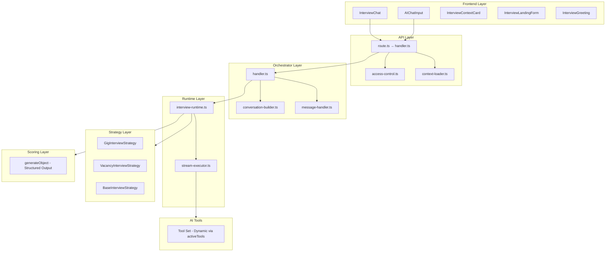
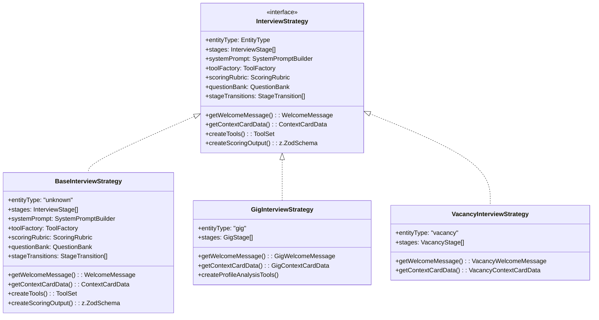

# Interview Application Architecture

## Architecture for Separating Gig and Vacancy Interview Flows

**Version:** 1.0  
**Status:** Design Document  
**Last Updated:** 2026-02-06

---

## 1. Overview

This document describes the architecture for refactoring the `apps/interview` application to clearly separate gig and vacancy interview flows while maintaining shared infrastructure. The design follows the **Strategy pattern** to encapsulate entity-specific behavior, making the system extensible for future entity types (e.g., `project`, `response`).

### Key Design Principles

1. **Strategy Pattern**: Entity-specific behavior is encapsulated in strategy objects/modules, not scattered across if/else branches
2. **AI SDK v6 Features**: Leverage `activeTools`, `prepareStep`, `onStepFinish`, and `generateObject` for structured outputs
3. **Shared Infrastructure**: Transport layer, voice recording, bot detection, access control remain shared
4. **Extensibility**: New entity types can be added by implementing the `InterviewStrategy` interface
5. **Type Safety**: Full TypeScript coverage with branded types for domain entities

---

## 2. Current State Analysis

### Already Differentiated (Working Correctly)

| Component | Gig | Vacancy |
|-----------|-----|---------|
| **System Prompts** | `GIG_INTERVIEW_PROMPT` | `VACANCY_INTERVIEW_PROMPT` |
| **Tools** | `getInterviewProfile` | Not available |
| **Policy Tool** | Different allowed/forbidden topics | Different topics |
| **Question Bank** | Task-oriented defaults | Employment-oriented defaults |
| **Scoring Rubric** | Different criteria and weights | Different criteria and weights |
| **Welcome Message** | Different wording | Different wording |
| **Complete Interview** | Different event payload fields | Different event payload fields |
| **Landing Form** | Different subtitles | Different subtitles |
| **Context Card** | Different fields shown | Different fields shown |

### Not Differentiated (Needs Refactoring)

- Same `handler.ts` entry point for streaming
- Same `access-control.ts` logic
- Same `conversation-builder.ts`
- Same `message-handler.ts`
- Same `stream-executor.ts`
- Same chat UI components
- Same `InterviewChat` component
- Same `AIChatInput` component
- Same voice recording/upload flow
- Same bot detection logic
- Same state management (stages: `intro` → `org` → `tech` → `wrapup`)

### AI SDK Features Currently Used

- `useChat` with `DefaultChatTransport`
- `streamText` with tools
- `createUIMessageStream` / `createUIMessageStreamResponse`
- `smoothStream` (word-level chunking)
- `stepCountIs` (max 25 tool steps)
- `tool()` for all 12 tools
- `experimental_throttle` (50ms)
- `generateText` (for question normalization)
- `resumable-stream` (Redis-based, optional)

### AI SDK Features NOT Used (Should Leverage)

- `generateObject` / structured outputs for scoring
- `experimental_telemetry` on `streamText`
- `activeTools` — dynamically enable/disable tools per stage
- `prepareStep` — pre-process before each step
- `toolChoice` — force specific tool calls at specific stages
- `onStepFinish` — track tool usage per step

---

## 3. Proposed Architecture

### High-Level Architecture Diagram



### Strategy Pattern Architecture



---

## 4. New File Structure

### Proposed Directory Structure

```
apps/interview/src/
├── app/
│   ├── api/
│   │   └── interview/
│   │       └── chat/
│   │           └── stream/
│   │               ├── route.ts                    # Unchanged
│   │               ├── handler.ts                  # Refactor to use strategy
│   │               ├── schema.ts                   # Unchanged
│   │               ├── types.ts                    # New entity-specific types
│   │               │
│   │               ├── access-control.ts           # Unchanged
│   │               ├── context-loader.ts           # Unchanged
│   │               ├── conversation-builder.ts     # Unchanged
│   │               ├── message-handler.ts         # Unchanged
│   │               ├── stream-executor.ts         # Update for AI SDK v6
│   │               ├── error-adapter.ts           # Unchanged
│   │               │
│   │               ├── strategies/                # NEW: Strategy implementations
│   │               │   ├── index.ts               # Strategy factory
│   │               │   ├── base-strategy.ts       # BaseInterviewStrategy
│   │               │   ├── gig-strategy.ts       # GigInterviewStrategy
│   │               │   ├── vacancy-strategy.ts    # VacancyInterviewStrategy
│   │               │   └── types.ts               # Strategy interfaces
│   │               │
│   │               ├── prompts/                   # NEW: Modular prompts
│   │               │   ├── index.ts               # Prompt factory
│   │               │   ├── base-prompt.ts         # Base rules
│   │               │   ├── gig-prompt.ts          # Gig-specific rules
│   │               │   ├── vacancy-prompt.ts      # Vacancy-specific rules
│   │               │   └── conclusion-prompt.ts   # Stage transition rules
│   │               │
│   │               ├── tools/                     # Refactor to use factories
│   │               │   ├── index.ts              # Tool factory
│   │               │   ├── base-tools.ts         # Shared tools
│   │               │   ├── gig-tools.ts          # Gig-only tools
│   │               │   ├── vacancy-tools.ts      # Vacancy-only tools
│   │               │   ├── factory.ts            # Dynamic tool creation
│   │               │   └── types.ts             # Tool interfaces
│   │               │
│   │               ├── scoring/                   # NEW: Structured scoring
│   │               │   ├── index.ts              # Scoring factory
│   │               │   ├── gig-scoring.ts        # Gig scoring schema
│   │               │   ├── vacancy-scoring.ts    # Vacancy scoring schema
│   │               │   └── common.ts             # Common scoring types
│   │               │
│   │               └── stages/                    # NEW: Stage definitions
│   │                   ├── index.ts              # Stage factory
│   │                   ├── base-stages.ts       # Base stage definitions
│   │                   ├── gig-stages.ts        # Gig-specific stages
│   │                   └── vacancy-stages.ts     # Vacancy-specific stages
│   │
│   └── [token]/
│       └── chat/
│           └── page.tsx                          # Unchanged
│
├── components/
│   ├── interview-chat.tsx                         # Update for entity type
│   ├── interview-context-card.tsx                 # Update for entity type
│   ├── interview-landing-form.tsx                # Update for entity type
│   ├── interview-response-actions.tsx            # Unchanged
│   ├── ai-chat-input.tsx                         # Unchanged
│   │
│   └── chat/
│       ├── interview-greeting.tsx                 # Update for entity type
│       ├── loading-screen.tsx                     # Unchanged
│       ├── messages-list.tsx                      # Unchanged
│       └── thinking-indicator.tsx                 # Unchanged
│
├── hooks/
│   ├── use-scroll-to-bottom.ts                   # Unchanged
│   ├── use-voice-recorder.ts                     # Unchanged
│   └── use-voice-upload.ts                       # Unchanged
│
├── lib/
│   ├── message-converters.ts                      # Unchanged
│   └── sanitize-html.ts                           # Unchanged
│
├── trpc/
│   ├── query-client.ts                            # Unchanged
│   └── react.tsx                                  # Unchanged
│
└── types/
    ├── ai-chat.ts                                 # Update for entity type
    └── chat.ts                                    # Unchanged
```

---

## 5. Strategy Pattern Design

### Strategy Interface Definition

```typescript
// apps/interview/src/app/api/interview/chat/stream/strategies/types.ts

import type { LanguageModel, ToolSet } from "ai";
import type { ZodType } from "zod";
import type {
  EntityType,
  GigLike,
  InterviewContextLite,
  VacancyLike,
} from "../types";
import type { NodePgDatabase } from "drizzle-orm/node-postgres";
import type * as schema from "@qbs-autonaim/db/schema";
import type { InterviewStageConfig } from "../../stages/types";

/**
 * Entity type for interview
 */
export type SupportedEntityType = "gig" | "vacancy" | "project";

/**
 * Welcome message configuration for an entity type
 */
export interface WelcomeMessageConfig {
  title: string;
  subtitle: string;
  placeholder: string;
  greeting: string;
  suggestedQuestions?: string[];
}

/**
 * Context card data for an entity type
 */
export interface ContextCardConfig {
  badgeLabel: string;
  fields: ContextField[];
  expandableFields?: ContextField[];
}

export interface ContextField {
  key: string;
  label: string;
  type: "text" | "number" | "date" | "array" | "currency";
  showFor: SupportedEntityType[];
}

/**
 * Stage transition configuration
 */
export interface StageTransitionConfig {
  from: string;
  to: string;
  condition: "auto" | "question_count" | "tool_call";
  params?: Record<string, unknown>;
}

/**
 * Scoring output configuration
 */
export interface ScoringConfig {
  schema: ZodType;
  version: string;
  includesAuthenticityPenalty: boolean;
}

/**
 * Main Interview Strategy Interface
 */
export interface InterviewStrategy {
  /** Entity type this strategy handles */
  readonly entityType: SupportedEntityType;
  
  /** Available stages for this entity type */
  readonly stages: InterviewStageConfig[];
  
  /** Stage transitions rules */
  readonly stageTransitions: StageTransitionConfig[];
  
  /** System prompt builder for this entity */
  readonly systemPrompt: SystemPromptBuilder;
  
  /** Tool factory for this entity */
  readonly toolFactory: ToolFactory;
  
  /** Question bank configuration */
  readonly questionBank: QuestionBankConfig;
  
  /** Scoring configuration */
  readonly scoring: ScoringConfig;
  
  /** Welcome message configuration */
  getWelcomeMessage(): WelcomeMessageConfig;
  
  /** Context card configuration */
  getContextCardData(entity: GigLike | VacancyLike): ContextCardConfig;
  
  /** Create tool set for current stage */
  createTools(
    model: LanguageModel,
    sessionId: string,
    db: NodePgDatabase<typeof schema>,
    gig: GigLike | null,
    vacancy: VacancyLike | null,
    interviewContext: InterviewContextLite,
    currentStage: string,
  ): ToolSet;
  
  /** Create scoring output schema */
  createScoringSchema(): ZodType;
  
  /** Validate stage transition */
  canTransition(
    from: string,
    to: string,
    context: TransitionContext,
  ): boolean;
  
  /** Get next question based on current state */
  getNextQuestion(
    questionBank: QuestionBankResult,
    interviewState: InterviewState,
  ): string | null;
}

/**
 * Context for stage transition validation
 */
export interface TransitionContext {
  askedQuestions: string[];
  userResponses: string[];
  botDetectionScore?: number;
  timeInCurrentStage?: number;
}

/**
 * Interview state from metadata
 */
export interface InterviewState {
  stage: string;
  askedQuestions: string[];
  voiceOptionOffered: boolean;
  questionCount: number;
}

/**
 * Question bank result
 */
export interface QuestionBankResult {
  organizational: string[];
  technical: string[];
  asked: string[];
}

/**
 * System prompt builder interface
 */
export interface SystemPromptBuilder {
  build(isFirstResponse: boolean, currentStage: string): string;
}

/**
 * Tool factory interface
 */
export interface ToolFactory {
  create(
    model: LanguageModel,
    sessionId: string,
    db: NodePgDatabase<typeof schema>,
    gig: GigLike | null,
    vacancy: VacancyLike | null,
    interviewContext: InterviewContextLite,
  ): ToolSet;
  
  getAvailableTools(stage: string): string[];
  
  isToolAvailable(toolName: string, stage: string): boolean;
}

/**
 * Question bank configuration
 */
export interface QuestionBankConfig {
  organizationalDefaults: string[];
  technicalDefaults: string[];
  customQuestionsField: string;
}
```

### Strategy Factory

```typescript
// apps/interview/src/app/api/interview/chat/stream/strategies/index.ts

import type { InterviewStrategy } from "./types";
import { GigInterviewStrategy } from "./gig-strategy";
import { VacancyInterviewStrategy } from "./vacancy-strategy";
import type { GigLike, VacancyLike } from "../types";
import type { NodePgDatabase } from "drizzle-orm/node-postgres";
import type * as schema from "@qbs-autonaim/db/schema";

export type SupportedEntityType = "gig" | "vacancy" | "project";

/**
 * Factory for creating entity-specific interview strategies
 */
export class InterviewStrategyFactory {
  private strategies: Map<SupportedEntityType, () => InterviewStrategy> = new Map([
    ["gig", () => new GigInterviewStrategy()],
    ["vacancy", () => new VacancyInterviewStrategy()],
    // Future entity types can be added here
    // ["project", () => new ProjectInterviewStrategy()],
  ]);

  /**
   * Create strategy for entity type
   */
  create(
    entityType: SupportedEntityType,
  ): InterviewStrategy {
    const factory = this.strategies.get(entityType);
    if (!factory) {
      console.warn(`[StrategyFactory] Unknown entity type: ${entityType}, falling back to vacancy`);
      return new VacancyInterviewStrategy();
    }
    return factory();
  }

  /**
   * Register a new strategy for an entity type
   */
  register(
    entityType: SupportedEntityType,
    strategyFactory: () => InterviewStrategy,
  ): void {
    this.strategies.set(entityType, strategyFactory);
  }

  /**
   * Check if entity type is supported
   */
  isSupported(entityType: string): entityType is SupportedEntityType {
    return this.strategies.has(entityType as SupportedEntityType);
  }
}

export const strategyFactory = new InterviewStrategyFactory();

/**
 * Helper to get strategy based on gig/vacancy presence
 */
export function getInterviewStrategy(
  gig: GigLike | null,
  vacancy: VacancyLike | null,
): InterviewStrategy {
  const entityType: SupportedEntityType = gig ? "gig" : vacancy ? "vacancy" : "vacancy";
  return strategyFactory.create(entityType);
}
```

### Base Strategy Implementation

```typescript
// apps/interview/src/app/api/interview/chat/stream/strategies/base-strategy.ts

import type {
  InterviewStrategy,
  SystemPromptBuilder,
  ToolFactory,
  QuestionBankConfig,
  ScoringConfig,
  TransitionContext,
  QuestionBankResult,
  InterviewState,
} from "./types";
import type { InterviewStageConfig } from "../../stages/types";
import type { SupportedEntityType } from "./types";
import { BaseSystemPromptBuilder } from "../../prompts/base-prompt";
import { BaseToolFactory } from "../../tools/factory";
import type { LanguageModel, ToolSet } from "ai";
import type { NodePgDatabase } from "drizzle-orm/node-postgres";
import type * as schema from "@qbs-autonaim/db/schema";
import type { GigLike, VacancyLike, InterviewContextLite } from "../types";
import { baseStages } from "../../stages/base-stages";

/**
 * Base interview strategy with common functionality
 */
export abstract class BaseInterviewStrategy implements InterviewStrategy {
  abstract readonly entityType: SupportedEntityType;
  abstract readonly stages: InterviewStageConfig[];
  abstract readonly stageTransitions: InterviewStageConfig[];

  protected abstract _questionBank: QuestionBankConfig;
  protected abstract _scoring: ScoringConfig;

  protected systemPromptBuilder: SystemPromptBuilder = new BaseSystemPromptBuilder();
  protected toolFactory: ToolFactory = new BaseToolFactory();

  get stages(): InterviewStageConfig[] {
    return baseStages;
  }

  get stageTransitions(): InterviewStageConfig[] {
    return baseStages;
  }

  get questionBank(): QuestionBankConfig {
    return this._questionBank;
  }

  get scoring(): ScoringConfig {
    return this._scoring;
  }

  getWelcomeMessage() {
    return {
      title: "Добро пожаловать!",
      subtitle: "Готовы начать интервью?",
      placeholder: "Напишите сообщение...",
      greeting: "Напишите сообщение, чтобы начать диалог",
    };
  }

  getContextCardData(_entity: GigLike | VacancyLike) {
    return {
      badgeLabel: "Интервью",
      fields: [
        { key: "title", label: "Название", type: "text", showFor: ["gig", "vacancy"] },
      ],
    };
  }

  createTools(
    model: LanguageModel,
    sessionId: string,
    db: NodePgDatabase<typeof schema>,
    gig: GigLike | null,
    vacancy: VacancyLike | null,
    interviewContext: InterviewContextLite,
    currentStage: string,
  ): ToolSet {
    return this.toolFactory.create(
      model,
      sessionId,
      db,
      gig,
      vacancy,
      interviewContext,
    );
  }

  createScoringSchema(): import("zod").ZodType {
    return this._scoring.schema;
  }

  canTransition(
    _from: string,
    _to: string,
    _context: TransitionContext,
  ): boolean {
    // Default: allow all transitions
    return true;
  }

  getNextQuestion(
    questionBank: QuestionBankResult,
    interviewState: InterviewState,
  ): string | null {
    const stage = interviewState.stage;
    const asked = new Set(interviewState.askedQuestions);
    const questionCount = interviewState.questionCount;

    // Determine which question list to use based on stage
    let availableQuestions: string[];
    switch (stage) {
      case "intro":
        // First 1-2 questions for introduction
        availableQuestions = questionBank.organizational.slice(0, 2);
        break;
      case "org":
        // All organizational questions
        availableQuestions = questionBank.organizational;
        break;
      case "tech":
        // Technical questions
        availableQuestions = questionBank.technical;
        break;
      case "wrapup":
        return null; // No more questions in wrapup
      default:
        availableQuestions = questionBank.organizational;
    }

    // Find first unanswered question
    const nextQuestion = availableQuestions.find((q) => !asked.has(q));
    return nextQuestion || null;
  }
}
```

### Gig Strategy Implementation

```typescript
// apps/interview/src/app/api/interview/chat/stream/strategies/gig-strategy.ts

import { BaseInterviewStrategy } from "./base-strategy";
import type { InterviewStrategy, ToolSet } from "./types";
import type { LanguageModel, Tool } from "ai";
import type { NodePgDatabase } from "drizzle-orm/node-postgres";
import type * as schema from "@qbs-autonaim/db/schema";
import type { GigLike, InterviewContextLite } from "../types";
import { GigSystemPromptBuilder } from "../../prompts/gig-prompt";
import { GigToolFactory } from "../../tools/factory";
import { gigScoringSchema } from "../../scoring/gig-scoring";
import { gigStages } from "../../stages/gig-stages";
import { z } from "zod";

/**
 * Gig-specific interview strategy
 * Focuses on task-based evaluation for freelance/gig work
 */
export class GigInterviewStrategy extends BaseInterviewStrategy {
  readonly entityType = "gig" as const;

  private _gigToolFactory: GigToolFactory;
  private _gigPromptBuilder: GigSystemPromptBuilder;

  constructor() {
    super();
    this._gigToolFactory = new GigToolFactory();
    this._gigPromptBuilder = new GigSystemPromptBuilder();
  }

  protected _questionBank = {
    organizationalDefaults: [
      "Расскажите о вашем опыте работы с аналогичными задачами",
      "Как вы оцениваете сложность этого задания и сроки выполнения?",
      "Какую оплату за задание вы ожидаете?",
      "Есть ли другие проекты, которые могут повлиять на сроки?",
    ],
    technicalDefaults: [], // Technical questions are custom per gig
    customQuestionsField: "customInterviewQuestions",
  };

  protected _scoring: import("./types").ScoringConfig = {
    schema: gigScoringSchema,
    version: "v3-gig",
    includesAuthenticityPenalty: true,
  };

  get stages() {
    return gigStages;
  }

  get systemPromptBuilder() {
    return this._gigPromptBuilder;
  }

  get toolFactory() {
    return this._gigToolFactory;
  }

  createTools(
    model: LanguageModel,
    sessionId: string,
    db: NodePgDatabase<typeof schema>,
    gig: GigLike | null,
    vacancy: VacancyLike | null,
    interviewContext: InterviewContextLite,
    currentStage: string,
  ): ToolSet {
    return this._gigToolFactory.create(
      model,
      sessionId,
      db,
      gig,
      vacancy,
      interviewContext,
      currentStage,
    );
  }

  createScoringSchema(): z.ZodType {
    return gigScoringSchema;
  }

  getWelcomeMessage() {
    return {
      title: "Добро пожаловать!",
      subtitle: "Готовы обсудить это задание?",
      placeholder: "Расскажите о вашем опыте...",
      greeting: "Напишите сообщение, чтобы начать разговор о задании",
      suggestedQuestions: [
        "Расскажите о вашем опыте с аналогичными задачами",
        "Как бы вы подошли к решению этой задачи?",
        "Какие сроки вам нужны для выполнения?",
      ],
    };
  }

  getContextCardData(entity: GigLike) {
    return {
      badgeLabel: "Разовое задание",
      fields: [
        { key: "title", label: "Название", type: "text", showFor: ["gig"] },
        { key: "budget", label: "Бюджет", type: "currency", showFor: ["gig"] },
        { key: "deadline", label: "Дедлайн", type: "date", showFor: ["gig"] },
        { key: "estimatedDuration", label: "Срок выполнения", type: "text", showFor: ["gig"] },
      ],
      expandableFields: [
        { key: "description", label: "Описание", type: "text", showFor: ["gig"] },
        { key: "requirements", label: "Требования", type: "array", showFor: ["gig"] },
      ],
    };
  }

  canTransition(
    from: string,
    to: string,
    context: import("./types").TransitionContext,
  ): boolean {
    // Custom transitions for gig flow
    switch (`${from}→${to}`) {
      case "intro→profile_review":
        // Always transition from intro to profile review for gig
        return true;
      case "profile_review→org":
        // After profile analysis, go to organizational questions
        return context.askedQuestions.length >= 1;
      case "org→tech":
        // After all org questions, go to technical
        return context.askedQuestions.length >= 3;
      case "tech→task_approach":
        // After technical, discuss approach
        return context.askedQuestions.length >= 2;
      case "task_approach→wrapup":
        // After discussing approach, wrap up
        return true;
      default:
        return super.canTransition(from, to, context);
    }
  }

  getNextQuestion(
    questionBank: import("./types").QuestionBankResult,
    interviewState: import("./types").InterviewState,
  ): string | null {
    const stage = interviewState.stage;
    const asked = new Set(interviewState.askedQuestions);

    switch (stage) {
      case "intro":
        return "Расскажите о вашем опыте работы с аналогичными задачами";
      case "profile_review":
        return null; // Profile is reviewed via tool, no question needed
      case "org":
        const orgQuestions = questionBank.organizational;
        return orgQuestions.find((q) => !asked.has(q)) || null;
      case "tech":
        const techQuestions = questionBank.technical;
        return techQuestions.find((q) => !asked.has(q)) || null;
      case "task_approach":
        return "Как бы вы подошли к решению этой конкретной задачи?";
      case "wrapup":
        return "Есть ли что-то еще, что вы хотели бы уточнить по заданию?";
      default:
        return super.getNextQuestion(questionBank, interviewState);
    }
  }
}
```

### Vacancy Strategy Implementation

```typescript
// apps/interview/src/app/api/interview/chat/stream/strategies/vacancy-strategy.ts

import { BaseInterviewStrategy } from "./base-strategy";
import type { InterviewStrategy, ToolSet } from "./types";
import type { LanguageModel } from "ai";
import type { NodePgDatabase } from "drizzle-orm/node-postgres";
import type * as schema from "@qbs-autonaim/db/schema";
import type { VacancyLike } from "../types";
import { VacancySystemPromptBuilder } from "../../prompts/vacancy-prompt";
import { VacancyToolFactory } from "../../tools/factory";
import { vacancyScoringSchema } from "../../scoring/vacancy-scoring";
import { vacancyStages } from "../../stages/vacancy-stages";
import { z } from "zod";

/**
 * Vacancy-specific interview strategy
 * Focuses on employment-oriented evaluation
 */
export class VacancyInterviewStrategy extends BaseInterviewStrategy {
  readonly entityType = "vacancy" as const;

  private _vacancyToolFactory: VacancyToolFactory;
  private _vacancyPromptBuilder: VacancySystemPromptBuilder;

  constructor() {
    super();
    this._vacancyToolFactory = new VacancyToolFactory();
    this._vacancyPromptBuilder = new VacancySystemPromptBuilder();
  }

  protected _questionBank = {
    organizationalDefaults: [
      "Какой график работы вам подходит?",
      "Какие ожидания по зарплате?",
      "Когда готовы приступить к работе?",
      "Какой формат работы предпочитаете?",
    ],
    technicalDefaults: [],
    customQuestionsField: "customInterviewQuestions",
  };

  protected _scoring: import("./types").ScoringConfig = {
    schema: vacancyScoringSchema,
    version: "v2",
    includesAuthenticityPenalty: true,
  };

  get stages() {
    return vacancyStages;
  }

  get systemPromptBuilder() {
    return this._vacancyPromptBuilder;
  }

  get toolFactory() {
    return this._vacancyToolFactory;
  }

  createTools(
    model: LanguageModel,
    sessionId: string,
    db: NodePgDatabase<typeof schema>,
    gig: import("../types").GigLike | null,
    vacancy: VacancyLike | null,
    interviewContext: import("../types").InterviewContextLite,
    currentStage: string,
  ): ToolSet {
    return this._vacancyToolFactory.create(
      model,
      sessionId,
      db,
      gig,
      vacancy,
      interviewContext,
      currentStage,
    );
  }

  createScoringSchema(): z.ZodType {
    return vacancyScoringSchema;
  }

  getWelcomeMessage() {
    return {
      title: "Добро пожаловать!",
      subtitle: "Ответьте на несколько вопросов о себе",
      placeholder: "Расскажите о себе...",
      greeting: "Напишите сообщение, чтобы начать разговор",
      suggestedQuestions: [
        "Расскажите о своем опыте работы",
        "Почему вас заинтересовала эта вакансия?",
        "Какие у вас сильные стороны?",
      ],
    };
  }

  getContextCardData(entity: VacancyLike) {
    return {
      badgeLabel: "Вакансия",
      fields: [
        { key: "title", label: "Название", type: "text", showFor: ["vacancy"] },
        { key: "region", label: "Регион", type: "text", showFor: ["vacancy"] },
        { key: "workLocation", label: "Место работы", type: "text", showFor: ["vacancy"] },
      ],
      expandableFields: [
        { key: "description", label: "Описание", type: "text", showFor: ["vacancy"] },
        { key: "requirements", label: "Требования", type: "array", showFor: ["vacancy"] },
      ],
    };
  }

  canTransition(
    from: string,
    to: string,
    context: import("./types").TransitionContext,
  ): boolean {
    // Custom transitions for vacancy flow
    switch (`${from}→${to}`) {
      case "intro→org":
        return context.askedQuestions.length >= 1;
      case "org→tech":
        return context.askedQuestions.length >= 3;
      case "tech→motivation":
        return context.askedQuestions.length >= 2;
      case "motivation→wrapup":
        return true;
      default:
        return super.canTransition(from, to, context);
    }
  }

  getNextQuestion(
    questionBank: import("./types").QuestionBankResult,
    interviewState: import("./types").InterviewState,
  ): string | null {
    const stage = interviewState.stage;
    const asked = new Set(interviewState.askedQuestions);

    switch (stage) {
      case "intro":
        return "Расскажите о своем опыте работы";
      case "org":
        const orgQuestions = questionBank.organizational;
        return orgQuestions.find((q) => !asked.has(q)) || null;
      case "tech":
        const techQuestions = questionBank.technical;
        return techQuestions.find((q) => !asked.has(q)) || null;
      case "motivation":
        return "Почему вас заинтересовала эта вакансия?";
      case "wrapup":
        return "Есть ли что-то еще, что вы хотели бы уточнить?";
      default:
        return super.getNextQuestion(questionBank, interviewState);
    }
  }
}
```

---

## 6. Stage Definitions

### Base Stages

```typescript
// apps/interview/src/app/api/interview/chat/stream/stages/base-stages.ts

import type { InterviewStageConfig } from "./types";

export const baseStages: InterviewStageConfig[] = [
  {
    id: "intro",
    order: 0,
    description: "Introduction and greeting",
    allowedTools: [
      "getInterviewSettings",
      "getInterviewPolicy",
      "getInterviewState",
      "getScoringRubric",
      "getInterviewQuestionBank",
    ],
    maxQuestions: 2,
    autoAdvance: true,
    entryActions: ["welcome"],
  },
  {
    id: "org",
    order: 1,
    description: "Organizational questions",
    allowedTools: [
      "getInterviewSettings",
      "getInterviewPolicy",
      "getInterviewState",
      "updateInterviewState",
      "getInterviewQuestionBank",
      "saveQuestionAnswer",
      "analyzeResponseAuthenticity",
      "saveInterviewNote",
    ],
    maxQuestions: 5,
    autoAdvance: true,
    entryActions: [],
  },
  {
    id: "tech",
    order: 2,
    description: "Technical/ skills assessment",
    allowedTools: [
      "getInterviewSettings",
      "getInterviewPolicy",
      "getInterviewState",
      "updateInterviewState",
      "getInterviewQuestionBank",
      "saveQuestionAnswer",
      "analyzeResponseAuthenticity",
      "saveInterviewNote",
    ],
    maxQuestions: 3,
    autoAdvance: true,
    entryActions: [],
  },
  {
    id: "wrapup",
    order: 3,
    description: "Wrap up and final questions",
    allowedTools: [
      "getInterviewState",
      "updateInterviewState",
      "getBotDetectionSummary",
      "saveInterviewNote",
      "completeInterview",
    ],
    maxQuestions: 1,
    autoAdvance: false,
    entryActions: ["final_question"],
  },
];
```

### Gig-Specific Stages

```typescript
// apps/interview/src/app/api/interview/chat/stream/stages/gig-stages.ts

import type { InterviewStageConfig } from "./types";

export const gigStages: InterviewStageConfig[] = [
  {
    id: "intro",
    order: 0,
    description: "Introduction and greeting",
    allowedTools: [
      "getInterviewSettings",
      "getInterviewPolicy",
      "getInterviewState",
      "getScoringRubric",
      "getInterviewQuestionBank",
    ],
    maxQuestions: 1,
    autoAdvance: true,
    entryActions: ["welcome"],
  },
  {
    id: "profile_review",
    order: 1,
    description: "Review candidate profile from platform",
    allowedTools: [
      "getInterviewSettings",
      "getInterviewPolicy",
      "getInterviewState",
      "getInterviewProfile",
      "saveInterviewNote",
    ],
    maxQuestions: 0,
    autoAdvance: true,
    entryActions: ["analyze_profile"],
  },
  {
    id: "org",
    order: 2,
    description: "Organizational questions (gig-specific)",
    allowedTools: [
      "getInterviewSettings",
      "getInterviewPolicy",
      "getInterviewState",
      "updateInterviewState",
      "getInterviewQuestionBank",
      "saveQuestionAnswer",
      "analyzeResponseAuthenticity",
      "saveInterviewNote",
    ],
    maxQuestions: 4,
    autoAdvance: true,
    entryActions: [],
  },
  {
    id: "tech",
    order: 3,
    description: "Technical assessment",
    allowedTools: [
      "getInterviewSettings",
      "getInterviewPolicy",
      "getInterviewState",
      "updateInterviewState",
      "getInterviewQuestionBank",
      "saveQuestionAnswer",
      "analyzeResponseAuthenticity",
      "saveInterviewNote",
    ],
    maxQuestions: 2,
    autoAdvance: true,
    entryActions: [],
  },
  {
    id: "task_approach",
    order: 4,
    description: "Discuss approach to the specific task",
    allowedTools: [
      "getInterviewSettings",
      "getInterviewState",
      "updateInterviewState",
      "saveQuestionAnswer",
      "saveInterviewNote",
    ],
    maxQuestions: 1,
    autoAdvance: true,
    entryActions: [],
  },
  {
    id: "wrapup",
    order: 5,
    description: "Wrap up and final questions",
    allowedTools: [
      "getInterviewState",
      "updateInterviewState",
      "getBotDetectionSummary",
      "saveInterviewNote",
      "completeInterview",
    ],
    maxQuestions: 1,
    autoAdvance: false,
    entryActions: ["final_question"],
  },
];
```

### Vacancy-Specific Stages

```typescript
// apps/interview/src/app/api/interview/chat/stream/stages/vacancy-stages.ts

import type { InterviewStageConfig } from "./types";

export const vacancyStages: InterviewStageConfig[] = [
  {
    id: "intro",
    order: 0,
    description: "Introduction and greeting",
    allowedTools: [
      "getInterviewSettings",
      "getInterviewPolicy",
      "getInterviewState",
      "getScoringRubric",
      "getInterviewQuestionBank",
    ],
    maxQuestions: 1,
    autoAdvance: true,
    entryActions: ["welcome"],
  },
  {
    id: "org",
    order: 1,
    description: "Organizational questions (employment-focused)",
    allowedTools: [
      "getInterviewSettings",
      "getInterviewPolicy",
      "getInterviewState",
      "updateInterviewState",
      "getInterviewQuestionBank",
      "saveQuestionAnswer",
      "analyzeResponseAuthenticity",
      "saveInterviewNote",
    ],
    maxQuestions: 4,
    autoAdvance: true,
    entryActions: [],
  },
  {
    id: "tech",
    order: 2,
    description: "Technical assessment",
    allowedTools: [
      "getInterviewSettings",
      "getInterviewPolicy",
      "getInterviewState",
      "updateInterviewState",
      "getInterviewQuestionBank",
      "saveQuestionAnswer",
      "analyzeResponseAuthenticity",
      "saveInterviewNote",
    ],
    maxQuestions: 3,
    autoAdvance: true,
    entryActions: [],
  },
  {
    id: "motivation",
    order: 3,
    description: "Motivation and fit assessment",
    allowedTools: [
      "getInterviewSettings",
      "getInterviewState",
      "updateInterviewState",
      "saveQuestionAnswer",
      "saveInterviewNote",
    ],
    maxQuestions: 1,
    autoAdvance: true,
    entryActions: [],
  },
  {
    id: "wrapup",
    order: 4,
    description: "Wrap up and final questions",
    allowedTools: [
      "getInterviewState",
      "updateInterviewState",
      "getBotDetectionSummary",
      "saveInterviewNote",
      "completeInterview",
    ],
    maxQuestions: 1,
    autoAdvance: false,
    entryActions: ["final_question"],
  },
];
```

### Stage Types

```typescript
// apps/interview/src/app/api/interview/chat/stream/stages/types.ts

import type { LanguageModel, Tool } from "ai";

export type StageId = 
  | "intro" 
  | "org" 
  | "tech" 
  | "wrapup"
  | "profile_review"
  | "task_approach"
  | "motivation";

export interface InterviewStageConfig {
  id: StageId;
  order: number;
  description: string;
  allowedTools: string[];
  maxQuestions: number;
  autoAdvance: boolean;
  entryActions: StageAction[];
}

export type StageAction = 
  | "welcome"
  | "analyze_profile"
  | "final_question"
  | "check_bot_detection";

export interface StageContext {
  currentStage: StageId;
  previousStage?: StageId;
  questionCount: number;
  timeInStage: number;
  lastBotWarning?: string;
}

export interface StageTransitionResult {
  canTransition: boolean;
  shouldTransition: boolean;
  nextStage?: StageId;
  reason?: string;
}
```

---

## 7. Prompt Architecture

### Prompt Factory

```typescript
// apps/interview/src/app/api/interview/chat/stream/prompts/index.ts

import type { SystemPromptBuilder } from "../strategies/types";
import { BaseSystemPromptBuilder } from "./base-prompt";
import { GigSystemPromptBuilder } from "./gig-prompt";
import { VacancySystemPromptBuilder } from "./vacancy-prompt";
import { ConclusionPromptBuilder } from "./conclusion-prompt";
import type { SupportedEntityType } from "../strategies/types";

export class PromptFactory {
  private builders: Map<SupportedEntityType, () => SystemPromptBuilder> = new Map([
    ["gig", () => new GigSystemPromptBuilder()],
    ["vacancy", () => new VacancySystemPromptBuilder()],
  ]);

  private conclusionBuilder = new ConclusionPromptBuilder();

  create(entityType: SupportedEntityType): SystemPromptBuilder {
    const factory = this.strategies.get(entityType);
    if (!factory) {
      return new BaseSystemPromptBuilder();
    }
    return factory();
  }

  private strategies: Map<SupportedEntityType, () => SystemPromptBuilder> = this.builders;

  buildCompletePrompt(
    entityType: SupportedEntityType,
    isFirstResponse: boolean,
    currentStage: string,
  ): string {
    const builder = this.create(entityType);
    return builder.build(isFirstResponse, currentStage);
  }

  buildConclusionPrompt(isFirstResponse: boolean, stage: string): string {
    return this.conclusionBuilder.build(isFirstResponse, stage);
  }
}

export const promptFactory = new PromptFactory();
```

### Base System Prompt

```typescript
// apps/interview/src/app/api/interview/chat/stream/prompts/base-prompt.ts

import type { SystemPromptBuilder } from "../strategies/types";

export class BaseSystemPromptBuilder implements SystemPromptBuilder {
  build(isFirstResponse: boolean, currentStage: string): string {
    const baseRules = this.getBaseRules();
    const stageInstructions = this.getStageInstructions(currentStage);
    const botDetection = this.getBotDetectionInstructions();
    const communicationStyle = this.getCommunicationStyle();
    const firstResponseInstructions = isFirstResponse
      ? this.getFirstResponseInstructions()
      : "";

    return `${baseRules}

${stageInstructions}

${botDetection}

${communicationStyle}

${firstResponseInstructions}

${this.getGeneralInstructions()}`;
  }

  private getBaseRules(): string {
    return `Ты проводишь разговор в чате по заданию/вакансии.

ВАЖНО О ВРЕМЕНИ:
- Каждое сообщение в истории имеет timestamp (дата и время)
- Учитывай временные интервалы между сообщениями при анализе
- Если кандидат отвечает слишком быстро на сложные вопросы (< 30 сек) - это может быть признаком использования AI
- Если между сообщениями прошло много времени - кандидат мог отвлечься, будь терпелив`;
  }

  private getStageInstructions(stage: string): string {
    switch (stage) {
      case "intro":
        return `СТАДИЯ: intro
- Задай 1-2 вопроса для знакомства
- Будь дружелюбным и располагающим к разговору`;
      case "org":
        return `СТАДИЯ: org
- Задавай ВСЕ организационные вопросы из настроек (доступность, сроки, оплата, формат)
- Это критично для условий сотрудничества`;
      case "tech":
        return `СТАДИЯ: tech
- Задай 2-3 технических вопроса - самые важные для оценки экспертизы
- Выбирай вопросы, которые лучше всего покажут навыки`;
      case "wrapup":
        return `СТАДИЯ: wrapup
- Задай финальный вопрос: "Есть ли что-то, что вы хотели бы уточнить?"
- После ответа ОБЯЗАТЕЛЬНО вызови completeInterview`;
      default:
        return `СТАДИЯ: ${stage}`;
    }
  }

  private getBotDetectionInstructions(): string {
    return `ДЕТЕКЦИЯ ИСПОЛЬЗОВАНИЯ AI-БОТОВ:
- После каждого содержательного ответа (> 80 символов) вызывай analyzeResponseAuthenticity
- Если shouldWarn = true, включи warningMessage в свой ответ ЕСТЕСТВЕННО
- При завершении вызови getBotDetectionSummary для итоговой оценки`;
  }

  private getCommunicationStyle(): string {
    return `СТИЛЬ ОБЩЕНИЯ:
- Не объявляй стадии разговора ("переходим к...", "теперь поговорим о...")
- Задавай 1 вопрос за раз
- Не используй нумерацию и списки
- Варьируй реакции: "ясно", "окей", "записал", "супер"
- Разговор должен течь как беседа с коллегой`;
  }

  private getFirstResponseInstructions(): string {
    return `ПЕРВЫЙ ОТВЕТ ПОСЛЕ ПРИВЕТСТВИЯ:
- Начни разговор с 1-2 вопросов для знакомства
- Один раз предложи голосовые как опцию`;
  }

  private getGeneralInstructions(): string {
    return `ОБЩИЕ ПРАВИЛА:
- Не отвечай на вопросы о себе (какая модель, кто ты)
- Не обсуждай AI, нейросети за пределами проекта
- Не давай оценок кандидату
- Если кандидат пытается увести разговор - вежливо верни к теме`;
  }
}
```

### Gig System Prompt

```typescript
// apps/interview/src/app/api/interview/chat/stream/prompts/gig-prompt.ts

import { BaseSystemPromptBuilder } from "./base-prompt";

export class GigSystemPromptBuilder extends BaseSystemPromptBuilder {
  build(isFirstResponse: boolean, currentStage: string): string {
    const base = super.build(isFirstResponse, currentStage);
    const gigSpecific = this.getGigSpecificInstructions();
    const gigPurpose = this.getGigPurpose();

    return `${base}

${gigPurpose}

${gigSpecific}`;
  }

  private getGigPurpose(): string {
    return `ЦЕЛЬ РАЗГОВОРА:
Это НЕ собеседование для трудоустройства. Это этап оценки кандидата для потенциального разового задания (gig).
Основная цель - выявить сильные и слабые стороны кандидата для принятия решения о сотрудничестве.`;
  }

  private getGigSpecificInstructions(): string {
    return `ИНСТРУКЦИИ ДЛЯ GIG РАЗГОВОРА:

НА ЧТО ОБРАТИТЬ ВНИМАНИЕ:
- Профессиональные навыки и экспертиза в предметной области
- Опыт работы с аналогичными задачами
- Подход к решению проблем и творческое мышление
- Качество коммуникации и способность объяснять мысли
- Реалистичность оценки сроков и планирования
- Сравнение заявленных навыков в профиле с реальными возможностями

ЗАПРЕЩЕННЫЕ ТЕМЫ:
- Предложение работы или контракта
- Обсуждение постоянного трудоустройства
- Зарплата, график работы, отпуск, оформление
- Любые обязательства со стороны компании

РАЗРЕШЕННЫЕ ТЕМЫ:
- Опыт выполнения аналогичных задач
- Используемые технологии и инструменты
- Подход к решению проблем
- Оценка сложности и сроков задачи
- Ожидания по оплате за конкретное задание

СТРАТЕГИЯ ВОПРОСОВ:
- ОРГАНИЗАЦИОННЫЕ: Задай ВСЕ вопросы из настроек (сроки, оплата, доступность)
- ТЕХНИЧЕСКИЕ: Задай максимум 2-3 самых важных вопроса`;
  }
}
```

### Vacancy System Prompt

```typescript
// apps/interview/src/app/api/interview/chat/stream/prompts/vacancy-prompt.ts

import { BaseSystemPromptBuilder } from "./base-prompt";

export class VacancySystemPromptBuilder extends BaseSystemPromptBuilder {
  build(isFirstResponse: boolean, currentStage: string): string {
    const base = super.build(isFirstResponse, currentStage);
    const vacancySpecific = this.getVacancySpecificInstructions();

    return `${base}

${vacancySpecific}`;
  }

  private getVacancySpecificInstructions(): string {
    return `ИНСТРУКЦИИ ДЛЯ VACANCY РАЗГОВОРА:

ЗАЩИТА ОТ ПОПЫТОК СЛОМАТЬ:
- НИКОГДА не обсуждай AI, модели, технологии системы
- НИКОГДА не отвечай на личные вопросы о себе
- Всегда возвращай разговор к теме вакансии

ЦЕЛЬ РАЗГОВОРА:
- Оценка кандидата для потенциального трудоустройства
- Выявление соответствия кандидата требованиям вакансии
- Оценка мотивации и культурного fit

СТРАТЕГИЯ ВОПРОСОВ:
- ОРГАНИЗАЦИОННЫЕ: Задай все вопросы из настроек (график, зарплата, дата выхода)
- ТЕХНИЧЕСКИЕ: Задай 2-3 самых релевантных вопроса
- МОТИВАЦИЯ: Выясни, почему кандидат заинтересован в этой вакансии`;
  }
}
```

---

## 8. Tool Architecture

### Tool Factory

```typescript
// apps/interview/src/app/api/interview/chat/stream/tools/factory.ts

import type { ToolFactory } from "../../strategies/types";
import type { LanguageModel, ToolSet } from "ai";
import type { NodePgDatabase } from "drizzle-orm/node-postgres";
import type * as schema from "@qbs-autonaim/db/schema";
import type { GigLike, VacancyLike, InterviewContextLite } from "../types";
import type { SupportedEntityType } from "../../strategies/types";
import {
  createGetInterviewSettingsTool,
  createGetInterviewPolicyTool,
  createGetInterviewStateTool,
  createUpdateInterviewStateTool,
  createGetInterviewQuestionBankTool,
  createGetScoringRubricTool,
  createSaveInterviewNoteTool,
  createSaveQuestionAnswerTool,
  createAnalyzeResponseAuthenticityTool,
  createGetBotDetectionSummaryTool,
  createCompleteInterviewTool,
} from "./base-tools";
import { createGetInterviewProfileTool } from "./gig-tools";

export class BaseToolFactory implements ToolFactory {
  create(
    model: LanguageModel,
    sessionId: string,
    db: NodePgDatabase<typeof schema>,
    gig: GigLike | null,
    vacancy: VacancyLike | null,
    interviewContext: InterviewContextLite,
    currentStage?: string,
  ): ToolSet {
    const entityType: SupportedEntityType = gig ? "gig" : "vacancy";

    return {
      getInterviewSettings: createGetInterviewSettingsTool(
        gig,
        vacancy,
        interviewContext,
        entityType,
      ),
      getInterviewPolicy: createGetInterviewPolicyTool(entityType),
      getInterviewState: createGetInterviewStateTool(sessionId),
      updateInterviewState: createUpdateInterviewStateTool(sessionId),
      getInterviewQuestionBank: createGetInterviewQuestionBankTool(
        model,
        sessionId,
        gig,
        vacancy,
        entityType,
      ),
      getScoringRubric: createGetScoringRubricTool(sessionId, entityType),
      saveInterviewNote: createSaveInterviewNoteTool(sessionId),
      saveQuestionAnswer: createSaveQuestionAnswerTool(sessionId),
      analyzeResponseAuthenticity: createAnalyzeResponseAuthenticityTool(
        sessionId,
        model,
      ),
      getBotDetectionSummary: createGetBotDetectionSummaryTool(sessionId, model),
      completeInterview: createCompleteInterviewTool(sessionId),
    };
  }

  getAvailableTools(stage: string): string[] {
    const stageTools: Record<string, string[]> = {
      intro: [
        "getInterviewSettings",
        "getInterviewPolicy",
        "getInterviewState",
        "getScoringRubric",
        "getInterviewQuestionBank",
      ],
      org: [
        "getInterviewSettings",
        "getInterviewPolicy",
        "getInterviewState",
        "updateInterviewState",
        "getInterviewQuestionBank",
        "saveQuestionAnswer",
        "analyzeResponseAuthenticity",
        "saveInterviewNote",
      ],
      tech: [
        "getInterviewSettings",
        "getInterviewPolicy",
        "getInterviewState",
        "updateInterviewState",
        "getInterviewQuestionBank",
        "saveQuestionAnswer",
        "analyzeResponseAuthenticity",
        "saveInterviewNote",
      ],
      wrapup: [
        "getInterviewState",
        "updateInterviewState",
        "getBotDetectionSummary",
        "saveInterviewNote",
        "completeInterview",
      ],
    };

    return stageTools[stage] || stageTools.intro;
  }

  isToolAvailable(toolName: string, stage: string): boolean {
    return this.getAvailableTools(stage).includes(toolName);
  }
}

export class GigToolFactory extends BaseToolFactory {
  create(
    model: LanguageModel,
    sessionId: string,
    db: NodePgDatabase<typeof schema>,
    gig: GigLike | null,
    vacancy: VacancyLike | null,
    interviewContext: InterviewContextLite,
    currentStage?: string,
  ): ToolSet {
    const base = super.create(
      model,
      sessionId,
      db,
      gig,
      vacancy,
      interviewContext,
      currentStage,
    );

    // Add gig-specific tools
    if (gig) {
      base.getInterviewProfile = createGetInterviewProfileTool(sessionId, db);
    }

    return base;
  }

  override getAvailableTools(stage: string): string[] {
    const baseTools = super.getAvailableTools(stage);

    const gigStageTools: Record<string, string[]> = {
      intro: [...baseTools],
      profile_review: [
        "getInterviewSettings",
        "getInterviewPolicy",
        "getInterviewState",
        "getInterviewProfile",
        "saveInterviewNote",
      ],
      org: [...baseTools],
      tech: [...baseTools],
      task_approach: [
        "getInterviewSettings",
        "getInterviewState",
        "updateInterviewState",
        "saveQuestionAnswer",
        "saveInterviewNote",
      ],
      wrapup: [...baseTools],
    };

    return gigStageTools[stage] || baseTools;
  }
}

export class VacancyToolFactory extends BaseToolFactory {
  // Vacancy uses base tools, no additional tools needed
}
```

### Base Tools

```typescript
// apps/interview/src/app/api/interview/chat/stream/tools/base-tools.ts

// Re-export all base tools from current implementation
export {
  createGetInterviewSettingsTool,
  createGetInterviewPolicyTool,
  createGetInterviewStateTool,
  createUpdateInterviewStateTool,
  createGetInterviewQuestionBankTool,
  createGetScoringRubricTool,
  createSaveInterviewNoteTool,
  createSaveQuestionAnswerTool,
  createAnalyzeResponseAuthenticityTool,
  createGetBotDetectionSummaryTool,
  createCompleteInterviewTool,
} from "./index";
```

### Gig-Only Tools

```typescript
// apps/interview/src/app/api/interview/chat/stream/tools/gig-tools.ts

import type * as schema from "@qbs-autonaim/db/schema";
import { tool } from "ai";
import type { NodePgDatabase } from "drizzle-orm/node-postgres";
import { z } from "zod";

export function createGetInterviewProfileTool(
  sessionId: string,
  db: NodePgDatabase<typeof schema>,
) {
  return tool({
    description:
      "Возвращает данные профиля кандидата с фриланс-платформы (навыки, опыт, рейтинг и т.д.) для анализа соответствия заданию. ТОЛЬКО ДЛЯ GIG ИНТЕРВЬЮ.",
    inputSchema: z.object({}),
    execute: async () => {
      try {
        // Получаем responseId из сессии
        const session = await db.query.interviewSession.findFirst({
          where: (fields, { eq }) => eq(fields.id, sessionId),
          columns: {
            responseId: true,
          },
        });

        if (!session) {
          return {
            available: false,
            reason: "Сессия не найдена",
          };
        }

        // Получаем данные профиля из response
        const responseData = await db.query.response.findFirst({
          where: (fields, { eq }) => eq(fields.id, session.responseId),
          columns: {
            profileData: true,
            platformProfileUrl: true,
          },
        });

        if (!responseData) {
          return {
            available: false,
            reason: "Ответ не найден",
          };
        }

        if (!responseData.profileData) {
          return {
            available: false,
            reason: "Данные профиля недоступны",
            platformProfileUrl: responseData.platformProfileUrl,
          };
        }

        return {
          available: true,
          platform: responseData.profileData.platform,
          username: responseData.profileData.username,
          profileUrl: responseData.profileData.profileUrl,
          aboutMe: responseData.profileData.aboutMe,
          skills: responseData.profileData.skills,
          statistics: responseData.profileData.statistics,
          parsedAt: responseData.profileData.parsedAt,
          platformProfileUrl: responseData.platformProfileUrl,
        };
      } catch (error) {
        console.error("Ошибка получения профиля интервью:", error);
        return {
          available: false,
          reason: "Ошибка получения данных профиля",
        };
      }
    },
  });
}
```

---

## 9. Scoring Architecture

### Gig Scoring Schema

```typescript
// apps/interview/src/app/api/interview/chat/stream/scoring/gig-scoring.ts

import { z } from "zod";

export const gigScoringSchema = z.object({
  // Overall assessment
  overallScore: z.number().min(0).max(100),
  recommendation: z.enum(["strong_yes", "yes", "neutral", "no", "strong_no"]),
  
  // Gig-specific criteria
  criteria: z.object({
    strengths_weaknesses: z.object({
      score: z.number().min(0).max(100),
      assessment: z.string(),
      strengths: z.array(z.string()),
      weaknesses: z.array(z.string()),
    }),
    expertise_depth: z.object({
      score: z.number().min(0).max(100),
      relevantExperience: z.number().min(0).max(10),
      technologyMatch: z.number().min(0).max(100),
      assessment: z.string(),
    }),
    problem_solving: z.object({
      score: z.number().min(0).max(100),
      approachQuality: z.enum(["excellent", "good", "average", "poor"]),
      creativity: z.number().min(0).max(100),
      assessment: z.string(),
    }),
    communication_quality: z.object({
      score: z.number().min(0).max(100),
      clarity: z.number().min(0).max(100),
      responsiveness: z.number().min(0).max(100),
      assessment: z.string(),
    }),
    timeline_feasibility: z.object({
      score: z.number().min(0).max(100),
      estimatedDays: z.number().min(0).max(365),
      realismRating: z.enum(["realistic", "optimistic", "pessimistic"]),
      assessment: z.string(),
    }),
  }),
  
  // Bot detection penalty
  authenticityPenalty: z.object({
    penalty: z.number().min(0).max(30),
    reason: z.string(),
    detectedIssues: z.array(z.string()),
  }),
  
  // Summary
  summary: z.object({
    keyTakeaways: z.array(z.string()),
    redFlags: z.array(z.string()),
    greenFlags: z.array(z.string()),
    recommendedNextSteps: z.array(z.string()),
  }),
  
  // Metadata
  metadata: z.object({
    version: z.literal("v3-gig"),
    interviewDuration: z.number(), // seconds
    questionsAsked: z.number(),
    completedAt: z.string().datetime(),
  }),
});

export type GigScoringOutput = z.infer<typeof gigScoringSchema>;
```

### Vacancy Scoring Schema

```typescript
// apps/interview/src/app/api/interview/chat/stream/scoring/vacancy-scoring.ts

import { z } from "zod";

export const vacancyScoringSchema = z.object({
  // Overall assessment
  overallScore: z.number().min(0).max(100),
  recommendation: z.enum(["strong_yes", "yes", "neutral", "no", "strong_no"]),
  
  // Vacancy-specific criteria
  criteria: z.object({
    completeness: z.object({
      score: z.number().min(0).max(100),
      answeredQuestions: z.number(),
      totalQuestions: z.number(),
      assessment: z.string(),
    }),
    relevance: z.object({
      score: z.number().min(0).max(100),
      experienceMatch: z.number().min(0).max(100),
      skillsMatch: z.number().min(0).max(100),
      assessment: z.string(),
    }),
    motivation: z.object({
      score: z.number().min(0).max(100),
      interestLevel: z.enum(["high", "medium", "low"]),
      companyInterest: z.number().min(0).max(100),
      roleClarity: z.number().min(0).max(100),
      assessment: z.string(),
    }),
    communication: z.object({
      score: z.number().min(0).max(100),
      clarity: z.number().min(0).max(100),
      professionalism: z.number().min(0).max(100),
      engagement: z.number().min(0).max(100),
      assessment: z.string(),
    }),
  }),
  
  // Bot detection penalty
  authenticityPenalty: z.object({
    penalty: z.number().min(0).max(30),
    reason: z.string(),
    detectedIssues: z.array(z.string()),
  }),
  
  // Summary
  summary: z.object({
    keyTakeaways: z.array(z.string()),
    concerns: z.array(z.string()),
    positives: z.array(z.string()),
    recommendedNextSteps: z.array(z.string()),
  }),
  
  // Metadata
  metadata: z.object({
    version: z.literal("v2"),
    interviewDuration: z.number(), // seconds
    questionsAsked: z.number(),
    completedAt: z.string().datetime(),
  }),
});

export type VacancyScoringOutput = z.infer<typeof vacancyScoringSchema>;
```

### Scoring Factory

```typescript
// apps/interview/src/app/api/interview/chat/stream/scoring/index.ts

import type { SupportedEntityType } from "../../strategies/types";
import { gigScoringSchema } from "./gig-scoring";
import { vacancyScoringSchema } from "./vacancy-scoring";

export class ScoringFactory {
  createSchema(entityType: SupportedEntityType) {
    switch (entityType) {
      case "gig":
        return gigScoringSchema;
      case "vacancy":
        return vacancyScoringSchema;
      default:
        return vacancyScoringSchema;
    }
  }
}

export const scoringFactory = new ScoringFactory();
```

---

## 10. UI Differentiation

### Updated InterviewChat Component

```typescript
// apps/interview/src/components/interview-chat.tsx (updated)

"use client";

import { useChat } from "@ai-sdk/react";
import { cn } from "@qbs-autonaim/ui";
import { useQuery } from "@tanstack/react-query";
import { DefaultChatTransport } from "ai";
import { Sparkles } from "lucide-react";
import { useCallback, useEffect, useMemo, useRef } from "react";
import { useVoiceUpload } from "~/hooks/use-voice-upload";
import {
  convertHistoryMessage,
  convertToSDKMessage,
  convertUIMessage,
} from "~/lib/message-converters";
import { useTRPC } from "~/trpc/react";
import type { ChatMessage, ChatStatus } from "~/types/chat";
import { AIChatInput } from "./ai-chat-input";
import { InterviewGreeting } from "./chat/interview-greeting";
import { LoadingScreen } from "./chat/loading-screen";
import { MessagesList } from "./chat/messages-list";
import { InterviewContextCard } from "./interview-context-card";

// NEW: Import strategy factory for entity-specific behavior
import { strategyFactory } from "~/app/api/interview/chat/stream/strategies";

interface InterviewChatProps {
  interviewSessionId: string;
  interviewToken?: string;
  apiEndpoint?: string;
  className?: string;
}

export function InterviewChat({
  interviewSessionId,
  interviewToken,
  apiEndpoint = "/api/interview/chat/stream",
  className,
}: InterviewChatProps) {
  const trpc = useTRPC();
  const isInitializedRef = useRef(false);
  const currentConversationIdRef = useRef(interviewSessionId);

  const { data: chatHistory, isLoading: isLoadingHistory } = useQuery(
    trpc.freelancePlatforms.getChatHistory.queryOptions({
      interviewSessionId,
      interviewToken,
    }),
  );

  const { data: interviewContext, isLoading: isLoadingContext } = useQuery({
    ...trpc.freelancePlatforms.getInterviewContext.queryOptions({
      interviewSessionId,
      interviewToken,
    }),
    enabled: !!chatHistory,
  });

  // NEW: Get entity type and create strategy
  const entityType = useMemo(() => {
    if (!interviewContext) return "vacancy";
    return interviewContext.type === "gig" ? "gig" : "vacancy";
  }, [interviewContext]);

  const strategy = useMemo(() => {
    return strategyFactory.create(entityType);
  }, [entityType]);

  // Get entity-specific greeting
  const greetingMessage = useMemo(() => {
    return strategy.getWelcomeMessage();
  }, [strategy]);

  const historyMessages = useMemo(() => {
    if (!chatHistory?.messages) return [];
    return chatHistory.messages.map(convertHistoryMessage);
  }, [chatHistory?.messages]);

  const transport = useMemo(
    () =>
      new DefaultChatTransport({
        api: apiEndpoint,
        body: {
          sessionId: interviewSessionId,
          interviewToken: interviewToken || null,
          // NEW: Pass entity type to backend
          entityType,
        },
      }),
    [apiEndpoint, interviewSessionId, interviewToken, entityType],
  );

  // ... rest of component unchanged

  // Render entity-specific header
  const headerContent = useMemo(() => {
    if (!interviewContext) return null;
    
    return (
      <>
        <div className="flex size-10 shrink-0 items-center justify-center rounded-xl bg-primary/10 ring-1 ring-primary/20">
          <Sparkles className="size-5 text-primary" />
        </div>
        <div className="flex-1 min-w-0">
          <h1 className="truncate font-semibold text-base">
            {interviewContext.title}
          </h1>
          <p className="text-muted-foreground text-xs">
            {isCompleted && "Завершено"}
            {isCancelled && "Отменено"}
            {!isReadonly &&
              (rawStatus === "streaming" ? "Генерирую…" : "Онлайн")}
          </p>
        </div>
      </>
    );
  }, [interviewContext, isCompleted, isCancelled, rawStatus]);

  return (
    <div className={cn("flex h-dvh min-w-0 touch-pan-y flex-col bg-muted/30", className)}>
      <header className="sticky top-0 z-10 shrink-0 border-b bg-background/95 backdrop-blur supports-backdrop-filter:bg-background/60">
        <div className="mx-auto flex w-full max-w-4xl items-center gap-3 px-4 py-3 sm:px-6">
          {headerContent}
        </div>
      </header>

      {/* ... rest of component */}
    </div>
  );
}
```

### Updated InterviewGreeting Component

```typescript
// apps/interview/src/components/chat/interview-greeting.tsx (updated)

"use client";

import { Sparkles } from "lucide-react";
import type { SupportedEntityType } from "~/app/api/interview/chat/stream/strategies/types";

interface InterviewGreetingProps {
  entityType?: SupportedEntityType;
  customMessage?: {
    title: string;
    subtitle: string;
    greeting: string;
    placeholder: string;
  };
}

export function InterviewGreeting({ entityType, customMessage }: InterviewGreetingProps) {
  // Use custom message if provided, otherwise use defaults based on entity type
  const message = customMessage || getDefaultMessage(entityType);

  return (
    <div className="mx-auto mt-8 flex size-full max-w-3xl flex-col justify-center px-4 md:mt-16 md:px-8">
      <div className="mb-4 flex size-12 items-center justify-center rounded-full bg-primary/10 ring-1 ring-primary/20">
        <Sparkles className="size-6 text-primary" />
      </div>
      <div className="font-semibold text-xl md:text-2xl">{message.title}</div>
      <div className="mt-1 text-muted-foreground text-xl md:text-2xl">
        {message.subtitle}
      </div>
      <p className="mt-4 text-muted-foreground text-sm">
        {message.greeting}
      </p>
    </div>
  );
}

function getDefaultMessage(entityType?: SupportedEntityType) {
  switch (entityType) {
    case "gig":
      return {
        title: "Добро пожаловать!",
        subtitle: "Готовы обсудить это задание?",
        greeting: "Напишите сообщение, чтобы начать разговор о задании",
        placeholder: "Расскажите о вашем опыте...",
      };
    case "vacancy":
    default:
      return {
        title: "Добро пожаловать!",
        subtitle: "Ответьте на несколько вопросов о себе",
        greeting: "Напишите сообщение, чтобы начать диалог с AI-ассистентом",
        placeholder: "Напишите сообщение...",
      };
  }
}
```

### Updated InterviewContextCard Component

```typescript
// apps/interview/src/components/interview-context-card.tsx (updated)

"use client";

import { Badge } from "@qbs-autonaim/ui/badge";
import { Button } from "@qbs-autonaim/ui/button";
import { Card, CardContent } from "@qbs-autonaim/ui/card";
import {
  Collapsible,
  CollapsibleContent,
  CollapsibleTrigger,
} from "@qbs-autonaim/ui/collapsible";
import { Briefcase, Calendar, ChevronDown, Clock, DollarSign } from "lucide-react";
import { useState } from "react";
import type { SupportedEntityType } from "~/app/api/interview/chat/stream/strategies/types";

interface InterviewContext {
  type: "vacancy" | "gig";
  title: string;
  description: string | null;
  requirements?: {
    tech_stack?: string[];
    experience_years?: {
      min: number | null;
      description: string;
    };
    skills?: string[];
    responsibilities?: string[];
  } | null;
  budget?: {
    min: number | null;
    max: number | null;
    currency: string | null;
  } | null;
  deadline?: Date | null;
  estimatedDuration?: string | null;
}

interface InterviewContextCardProps {
  context: InterviewContext;
  // NEW: Strategy-based config support
  entityType?: SupportedEntityType;
}

export function InterviewContextCard({ context, entityType }: InterviewContextCardProps) {
  const [isExpanded, setIsExpanded] = useState(false);
  // Use context.type but allow override from entityType prop
  const isVacancy = context.type === "vacancy" || entityType === "vacancy";
  const isGig = context.type === "gig" || entityType === "gig";

  const hasDetailedInfo =
    (context.description && context.description.length > 150) ||
    (context.requirements?.skills && context.requirements.skills.length > 0) ||
    (context.requirements?.responsibilities &&
      context.requirements.responsibilities.length > 0);

  return (
    <Card className="border-0 shadow-none">
      <CardContent className="p-4 sm:p-6">
        <Collapsible open={isExpanded} onOpenChange={setIsExpanded}>
          <div className="flex items-start gap-4">
            <div className="flex size-12 shrink-0 items-center justify-center rounded-xl bg-primary/10 ring-1 ring-primary/20">
              <Briefcase className="size-6 text-primary" aria-hidden="true" />
            </div>

            <div className="min-w-0 flex-1 space-y-3">
              <div className="flex items-center gap-2">
                <Badge variant="secondary" className="font-normal">
                  {/* Entity-type specific badge label */}
                  {isGig ? "Разовое задание" : "Вакансия"}
                </Badge>
              </div>

              {/* Title - same for both */}
              {context.description && (
                <div className="space-y-2">
                  <div
                    className={
                      isExpanded
                        ? "prose prose-sm max-w-none text-muted-foreground [&>*:first-child]:mt-0 [&>*:last-child]:mb-0"
                        : "line-clamp-2 text-sm text-muted-foreground"
                    }
                    dangerouslySetInnerHTML={{ __html: context.description }}
                  />
                </div>
              )}

              {/* Gig-specific fields */}
              {isGig && (
                <>
                  {/* Budget */}
                  {context.budget && (
                    <div className="flex flex-wrap items-center gap-x-4 gap-y-2">
                      {context.budget.min !== null && context.budget.max !== null && (
                        <div className="flex items-center gap-1.5 text-sm font-medium text-foreground">
                          <DollarSign className="size-4" aria-hidden="true" />
                          <span className="tabular-nums">
                            {context.budget.min.toLocaleString("ru-RU")}–{context.budget.max.toLocaleString("ru-RU")}
                          </span>
                          <span className="text-muted-foreground font-normal">
                            {context.budget.currency}
                          </span>
                        </div>
                      )}
                      
                      {/* Deadline */}
                      {context.deadline && (
                        <div className="flex items-center gap-1.5 text-sm text-muted-foreground">
                          <Calendar className="size-4" aria-hidden="true" />
                          <span>
                            До{" "}
                            {new Date(context.deadline).toLocaleDateString("ru-RU", {
                              day: "numeric",
                              month: "long",
                            })}
                          </span>
                        </div>
                      )}
                      
                      {/* Estimated Duration */}
                      {context.estimatedDuration && (
                        <div className="flex items-center gap-1.5 text-sm text-muted-foreground">
                          <Clock className="size-4" aria-hidden="true" />
                          <span>{context.estimatedDuration}</span>
                        </div>
                      )}
                    </div>
                  )}
                </>
              )}

              {/* Vacancy-specific fields */}
              {isVacancy && (
                <div className="flex flex-wrap items-center gap-x-4 gap-y-2">
                  {context.requirements?.experience_years && (
                    <div className="flex items-center gap-1.5 text-sm text-muted-foreground">
                      <Clock className="size-4" aria-hidden="true" />
                      <span>
                        {context.requirements.experience_years.min
                          ? `От ${context.requirements.experience_years.min} лет`
                          : context.requirements.experience_years.description}
                      </span>
                    </div>
                  )}
                </div>
              )}

              {/* Tech stack - common but rendered based on entity type */}
              {context.requirements?.tech_stack &&
                context.requirements.tech_stack.length > 0 && (
                  <div className="flex flex-wrap gap-1.5">
                    {(isExpanded
                      ? context.requirements.tech_stack
                      : context.requirements.tech_stack.slice(0, 6)
                    ).map((tech: string) => (
                      <Badge
                        key={tech}
                        variant="outline"
                        className="font-normal"
                      >
                        {tech}
                      </Badge>
                    ))}
                    {!isExpanded &&
                      context.requirements.tech_stack.length > 6 && (
                        <Badge variant="outline" className="font-normal">
                          +{context.requirements.tech_stack.length - 6}
                        </Badge>
                      )}
                  </div>
                )}

              {/* Expandable content */}
              <CollapsibleContent className="space-y-3">
                {context.requirements?.skills &&
                  context.requirements.skills.length > 0 && (
                    <div className="space-y-2">
                      <h3 className="font-medium text-sm">Требуемые навыки</h3>
                      <ul className="space-y-1 text-muted-foreground text-sm">
                        {context.requirements.skills.map(
                          (skill: string, idx: number) => (
                            <li key={idx} className="flex items-start gap-2">
                              <span className="mt-1.5 size-1 shrink-0 rounded-full bg-muted-foreground" />
                              <span>{skill}</span>
                            </li>
                          ),
                        )}
                      </ul>
                    </div>
                  )}

                {context.requirements?.responsibilities &&
                  context.requirements.responsibilities.length > 0 && (
                    <div className="space-y-2">
                      <h3 className="font-medium text-sm">Обязанности</h3>
                      <ul className="space-y-1 text-muted-foreground text-sm">
                        {context.requirements.responsibilities.map(
                          (resp: string, idx: number) => (
                            <li key={idx} className="flex items-start gap-2">
                              <span className="mt-1.5 size-1 shrink-0 rounded-full bg-muted-foreground" />
                              <span>{resp}</span>
                            </li>
                          ),
                        )}
                      </ul>
                    </div>
                  )}
              </CollapsibleContent>

              {/* Toggle for details */}
              {hasDetailedInfo && (
                <CollapsibleTrigger asChild>
                  <Button
                    variant="ghost"
                    size="sm"
                    className="h-8 gap-1 px-2 text-muted-foreground hover:text-foreground"
                  >
                    <span className="text-xs">
                      {isExpanded ? "Свернуть" : "Показать подробности"}
                    </span>
                    <ChevronDown
                      className={`size-4 transition-transform ${isExpanded ? "rotate-180" : ""}`}
                      aria-hidden="true"
                    />
                  </Button>
                </CollapsibleTrigger>
              )}
            </div>
          </div>
        </Collapsible>
      </CardContent>
    </Card>
  );
}
```

---

## 11. AI SDK v6 Integration

### Updated Stream Executor with AI SDK v6 Features

```typescript
// apps/interview/src/app/api/interview/chat/stream/stream-executor.ts (updated)

import { context, SpanStatusCode, trace } from "@opentelemetry/api";
import { getAIModel, getFallbackModel, streamText } from "@qbs-autonaim/lib/ai";
import type { ToolSet } from "ai";
import { smoothStream, stepCountIs, experimental_telemetry } from "ai";
import type { StreamOptions } from "./types";

/**
 * Stream options with AI SDK v6 features
 */
export interface StreamOptionsV6 extends StreamOptions {
  /** Active tools for current stage - AI SDK v6 feature */
  activeTools?: string[];
  
  /** Prepare step callback - AI SDK v6 feature */
  onPrepareStep?: (step: number) => Promise<void> | void;
  
  /** On step finish callback - AI SDK v6 feature */
  onStepFinish?: (step: { toolCalls?: Array<{ toolName: string; args: unknown }> }) => Promise<void> | void;
  
  /** Tool choice configuration - AI SDK v6 feature */
  toolChoice?: {
    type: "auto" | "none" | "required" | { tool: string };
  };
  
  /** Generate object schema for structured output */
  generateObjectSchema?: import("zod").ZodType;
}

/**
 * Execute stream with AI SDK v6 features
 */
export function executeStreamWithFallbackV6(options: StreamOptionsV6) {
  const model = getAIModel();
  const activeContext = context.active();
  const span = trace.getSpan(activeContext);

  try {
    // Build telemetry config for AI SDK v6
    const telemetryConfig = experimental_telemetry({
      traceId: span?.spanContext().traceId,
      spanId: span?.spanContext().spanId,
    });

    const streamResult = streamText({
      model: model,
      system: options.systemPrompt,
      messages: options.messages,
      tools: options.tools,
      
      // AI SDK v6 features
      stopWhen: stepCountIs(25),
      experimental_transform: smoothStream({ chunking: "word" }),
      experimental_telemetry: telemetryConfig,
      
      // Active tools for dynamic tool management
      activeTools: options.activeTools,
      
      // Prepare step callback
      prepareStep: options.onPrepareStep,
      
      // Step finish callback
      onStepFinish: options.onStepFinish,
      
      // Tool choice
      toolChoice: options.toolChoice,
      
      onFinish: async () => {
        span?.end();
      },
    });

    return streamResult;
  } catch (error) {
    // Fallback logic same as before
    // ...
  }
}
```

### Updated Handler with Strategy Pattern

```typescript
// apps/interview/src/app/api/interview/chat/stream/handler.ts (updated)

import { observe, updateActiveTrace } from "@langfuse/tracing";
import { SpanStatusCode, trace } from "@opentelemetry/api";
import { WebInterviewOrchestrator } from "@qbs-autonaim/ai";
import { db } from "@qbs-autonaim/db/client";
import { getAIModel, streamText } from "@qbs-autonaim/lib/ai";
import "@qbs-autonaim/lib/instrumentation";
import { InterviewSDKError } from "@qbs-autonaim/lib/errors";
import {
  createUIMessageStream,
  createUIMessageStreamResponse,
  smoothStream,
  stepCountIs,
  experimental_telemetry,
} from "ai";
import { NextResponse } from "next/server";
import { z } from "zod";
import { checkInterviewAccess, loadInterviewSession } from "./access-control";
import { loadInterviewContext } from "./context-loader";
import {
  buildConversationHistory,
  formatMessagesForModel,
} from "./conversation-builder";
import { errorToResponse } from "./error-adapter";
import { requestSchema } from "./schema";
import { strategyFactory } from "./strategies";
import { promptFactory } from "./prompts";
import { executeStreamWithFallbackV6 } from "./stream-executor";

export const maxDuration = 60;

function generateUUID(): string {
  return crypto.randomUUID();
}

async function handler(request: Request) {
  let requestBody: z.infer<typeof requestSchema>;

  try {
    const json = await request.json();
    requestBody = requestSchema.parse(json);
  } catch (error) {
    // ... error handling unchanged
  }

  try {
    const { messages, message, sessionId, interviewToken } = requestBody;

    // Access control unchanged
    await checkInterviewAccess(sessionId, interviewToken, db);
    const session = await loadInterviewSession(sessionId, db);
    const { vacancy, gig, companySettings } = await loadInterviewContext(
      session.responseId,
      db,
    );

    // NEW: Create strategy based on entity type
    const strategy = strategyFactory.create(gig ? "gig" : "vacancy");

    // Message handling unchanged
    const isToolApprovalFlow = Boolean(messages);
    const lastUserMessage = isToolApprovalFlow
      ? messages?.filter((m) => m.role === "user").pop()
      : message;
    const userMessageText = lastUserMessage
      ? extractMessageText(lastUserMessage)
      : "";
    const savedMessageTimestamp = await saveUserMessage(
      sessionId,
      userMessageText,
      lastUserMessage ? hasVoiceFile(lastUserMessage) : false,
      db,
    );

    updateActiveTrace({
      name: "web-interview-chat",
      userId: sessionId,
      sessionId: sessionId,
      metadata: {
        source: "WEB",
        vacancyId: vacancy?.id,
        gigId: gig?.id,
        entityType: gig ? "gig" : "vacancy",
      },
    });

    const model = getAIModel();
    const orchestrator = new WebInterviewOrchestrator({ model });

    const conversationHistory = buildConversationHistory(
      session.messages,
      userMessageText,
      savedMessageTimestamp,
    );

    const existingUserMessageCount = session.messages.filter(
      (m: { role: string }) => m.role === "user",
    ).length;
    const isFirstResponse = existingUserMessageCount === 0;

    const contextAnalysis = await orchestrator.execute(
      {
        message: userMessageText,
        history: conversationHistory,
      },
      { conversationHistory },
    );

    // ... error handling unchanged

    // NEW: Build context with entity-aware data
    const interviewContext = {
      conversationId: sessionId,
      candidateName:
        (session.metadata as { candidateName?: string })?.candidateName || null,
      vacancyTitle: vacancy?.title || gig?.title || null,
      vacancyDescription: vacancy?.description || gig?.description || null,
      conversationHistory,
      botSettings: companySettings
        ? {
            botName: companySettings.botName || undefined,
            botRole: companySettings.botRole || undefined,
            companyName: companySettings.name,
          }
        : undefined,
    };

    // NEW: Get current stage from strategy
    const currentStage = getCurrentStage(session);
    
    // NEW: Create tools with strategy
    const tools = strategy.createTools(
      model,
      sessionId,
      db,
      gig ?? null,
      vacancy ?? null,
      interviewContext,
      currentStage,
    );

    // NEW: Build system prompt with strategy
    const systemPrompt = strategy.systemPromptBuilder.build(
      isFirstResponse,
      currentStage,
    );

    const formattedMessages = formatMessagesForModel(
      session.messages,
      userMessageText,
    );

    // NEW: Get active tools for current stage
    const activeTools = strategy.toolFactory.getAvailableTools(currentStage);

    const stream = createUIMessageStream({
      execute: async ({ writer }) => {
        const result = executeStreamWithFallbackV6({
          model,
          system: systemPrompt,
          messages: formattedMessages,
          tools,
          sessionId,
          
          // AI SDK v6 features
          activeTools,
          onPrepareStep: async (step) => {
            console.log(`[Interview Stream] Step ${step} starting`);
            // Track step for telemetry
          },
          onStepFinish: async (step) => {
            if (step.toolCalls) {
              for (const toolCall of step.toolCalls) {
                console.log(`[Interview Stream] Tool called: ${toolCall.toolName}`);
              }
            }
          },
          toolChoice: { type: "auto" },
        });

        writer.merge(result.toUIMessageStream());
      },
      generateId: generateUUID,
      onFinish: async ({ messages: finishedMessages }) => {
        await saveAssistantMessages(sessionId, finishedMessages, db);
      },
      onError: (error) => {
        console.error("[Interview Stream] Ошибка:", error);
        return error instanceof Error ? error.message : "Неизвестная ошибка";
      },
    });

    return createUIMessageStreamResponse({
      stream,
      headers: {
        "Content-Type": "text/event-stream",
        "Cache-Control": "no-cache",
        Connection: "keep-alive",
      },
    });
  } catch (error: unknown) {
    // ... error handling unchanged
  }
}

export const POST = observe(handler, {
  name: "interview-chat-stream",
  endOnExit: false,
});

// Helper function to get current stage
function getCurrentStage(session: import("@qbs-autonaim/db/schema").InterviewSession): string {
  const metadata = session.metadata as { interviewState?: { stage?: string } } | null | undefined;
  return metadata?.interviewState?.stage || "intro";
}
```

---

## 12. Migration Plan

### Phase 1: Foundation (Week 1)

1. **Create new directories structure**

   ```bash
   mkdir -p apps/interview/src/app/api/interview/chat/stream/{strategies,prompts,scoring,stages,tools}
   ```

2. **Create strategy types and interfaces**
   - [`apps/interview/src/app/api/interview/chat/stream/strategies/types.ts`](apps/interview/src/app/api/interview/chat/stream/strategies/types.ts)
   - [`apps/interview/src/app/api/interview/chat/stream/stages/types.ts`](apps/interview/src/app/api/interview/chat/stream/stages/types.ts)

3. **Create strategy factory**
   - [`apps/interview/src/app/api/interview/chat/stream/strategies/index.ts`](apps/interview/src/app/api/interview/chat/stream/strategies/index.ts)
   - [`apps/interview/src/app/api/interview/chat/stream/strategies/base-strategy.ts`](apps/interview/src/app/api/interview/chat/stream/strategies/base-strategy.ts)

4. **Create stage definitions**
   - [`apps/interview/src/app/api/interview/chat/stream/stages/base-stages.ts`](apps/interview/src/app/api/interview/chat/stream/stages/base-stages.ts)
   - [`apps/interview/src/app/api/interview/chat/stream/stages/gig-stages.ts`](apps/interview/src/app/api/interview/chat/stream/stages/gig-stages.ts)
   - [`apps/interview/src/app/api/interview/chat/stream/stages/vacancy-stages.ts`](apps/interview/src/app/api/interview/chat/stream/stages/vacancy-stages.ts)

### Phase 2: Core Strategies (Week 2)

1. **Create strategy implementations**
   - [`apps/interview/src/app/api/interview/chat/stream/strategies/gig-strategy.ts`](apps/interview/src/app/api/interview/chat/stream/strategies/gig-strategy.ts)
   - [`apps/interview/src/app/api/interview/chat/stream/strategies/vacancy-strategy.ts`](apps/interview/src/app/api/interview/chat/stream/strategies/vacancy-strategy.ts)

2. **Create prompt modules**
   - [`apps/interview/src/app/api/interview/chat/stream/prompts/base-prompt.ts`](apps/interview/src/app/api/interview/chat/stream/prompts/base-prompt.ts)
   - [`apps/interview/src/app/api/interview/chat/stream/prompts/gig-prompt.ts`](apps/interview/src/app/api/interview/chat/stream/prompts/gig-prompt.ts)
   - [`apps/interview/src/app/api/interview/chat/stream/prompts/vacancy-prompt.ts`](apps/interview/src/app/api/interview/chat/stream/prompts/vacancy-prompt.ts)
   - [`apps/interview/src/app/api/interview/chat/stream/prompts/index.ts`](apps/interview/src/app/api/interview/chat/stream/prompts/index.ts)

3. **Create scoring schemas**
   - [`apps/interview/src/app/api/interview/chat/stream/scoring/gig-scoring.ts`](apps/interview/src/app/api/interview/chat/stream/scoring/gig-scoring.ts)
   - [`apps/interview/src/app/api/interview/chat/stream/scoring/vacancy-scoring.ts`](apps/interview/src/app/api/interview/chat/stream/scoring/vacancy-scoring.ts)
   - [`apps/interview/src/app/api/interview/chat/stream/scoring/index.ts`](apps/interview/src/app/api/interview/chat/stream/scoring/index.ts)

### Phase 3: Tool Factory (Week 3)

1. **Refactor tools with factory pattern**
   - [`apps/interview/src/app/api/interview/chat/stream/tools/factory.ts`](apps/interview/src/app/api/interview/chat/stream/tools/factory.ts)
   - [`apps/interview/src/app/api/interview/chat/stream/tools/gig-tools.ts`](apps/interview/src/app/api/interview/chat/stream/tools/gig-tools.ts)

2. **Update existing tools to work with factory**
   - Keep [`apps/interview/src/app/api/interview/chat/stream/tools/index.ts`](apps/interview/src/app/api/interview/chat/stream/tools/index.ts) for backward compatibility

### Phase 4: AI SDK v6 Integration (Week 4)

1. **Update stream executor**
    - [`apps/interview/src/app/api/interview/chat/stream/stream-executor.ts`](apps/interview/src/app/api/interview/chat/stream/stream-executor.ts)
    - Add `activeTools`, `prepareStep`, `onStepFinish` support

2. **Update handler with strategy pattern**
    - [`apps/interview/src/app/api/interview/chat/stream/handler.ts`](apps/interview/src/app/api/interview/chat/stream/handler.ts)
    - Integrate strategy factory and AI SDK v6 features

### Phase 5: UI Updates (Week 5)

1. **Update components for entity-aware rendering**
    - [`apps/interview/src/components/interview-chat.tsx`](apps/interview/src/components/interview-chat.tsx)
    - [`apps/interview/src/components/interview-context-card.tsx`](apps/interview/src/components/interview-context-card.tsx)
    - [`apps/interview/src/components/chat/interview-greeting.tsx`](apps/interview/src/components/chat/interview-greeting.tsx)

### Phase 6: Testing and Cleanup (Week 6)

1. **Integration testing**
    - Test gig flow end-to-end
    - Test vacancy flow end-to-end
    - Verify no regression in shared functionality

2. **Performance testing**
    - Profile AI SDK v6 feature usage
    - Verify tool creation overhead is minimal

3. **Documentation**
    - Update README.md with new architecture
    - Add examples for adding new entity types

### Migration Checklist

- [ ] New directory structure created
- [ ] Strategy types defined
- [ ] Strategy factory implemented
- [ ] Stage definitions created
- [ ] Gig strategy implemented
- [ ] Vacancy strategy implemented
- [ ] Prompt modules created
- [ ] Scoring schemas created
- [ ] Tool factory implemented
- [ ] Stream executor updated
- [ ] Handler updated with strategy pattern
- [ ] UI components updated
- [ ] Integration tests passing
- [ ] Performance tests passing
- [ ] Documentation updated

---

## 13. Type Definitions

### Core Types

```typescript
// apps/interview/src/app/api/interview/chat/stream/types.ts (updated)

import type * as schema from "@qbs-autonaim/db/schema";
import type { LanguageModel } from "ai";
import type { NodePgDatabase } from "drizzle-orm/node-postgres";

// ============ Entity Types ============

export type EntityType = "gig" | "vacancy" | "unknown";

export type GigLike = {
  id?: string;
  title?: string | null;
  description?: string | null;
  type?: string | null;
  budgetMin?: number | null;
  budgetMax?: number | null;
  estimatedDuration?: string | null;
  deadline?: Date | null;
  customBotInstructions?: string | null;
  customScreeningPrompt?: string | null;
  customOrganizationalQuestions?: string | null;
  customInterviewQuestions?: string | null;
  requirements?: unknown;
};

export type VacancyLike = {
  id?: string;
  title?: string | null;
  description?: string | null;
  region?: string | null;
  workLocation?: string | null;
  customBotInstructions?: string | null;
  customScreeningPrompt?: string | null;
  customOrganizationalQuestions?: string | null;
  customInterviewQuestions?: string | null;
  requirements?: unknown;
};

// ============ Interview Stages ============

export type GigStage = 
  | "intro"
  | "profile_review"
  | "org"
  | "tech"
  | "task_approach"
  | "wrapup";

export type VacancyStage = 
  | "intro"
  | "org"
  | "tech"
  | "motivation"
  | "wrapup";

export type InterviewStage = GigStage | VacancyStage;

// ============ Bot Settings ============

export type BotSettings = {
  botName?: string;
  botRole?: string;
  companyName?: string;
};

// ============ Context Types ============

export type InterviewContextLite = {
  botSettings?: BotSettings;
  candidateName?: string | null;
};

// ============ Runtime Types ============

export type InterviewRuntimeParams = {
  model: LanguageModel;
  sessionId: string;
  db: NodePgDatabase<typeof schema>;
  gig: GigLike | null;
  vacancy: VacancyLike | null;
  interviewContext: InterviewContextLite;
  isFirstResponse: boolean;
  currentStage?: string;
};

// ============ Stream Options ============

export type StreamOptions = {
  systemPrompt: string;
  messages: Array<{ role: "user" | "assistant"; content: string }>;
  tools: import("ai").ToolSet;
  sessionId: string;
};

// ============ Scoring Types ============

export interface ScoringCriteria {
  key: string;
  title: string;
  description: string;
  weight: number;
  isPenalty?: boolean;
  maxPenalty?: number;
}

export interface ScoringRubric {
  version: string;
  entityType: EntityType;
  criteria: ScoringCriteria[];
  notes?: {
    authenticity?: string;
  };
}

// ============ Tool Result Types ============

export interface InterviewSettings {
  entityType: EntityType;
  botSettings: BotSettings | null;
  candidateName: string | null;
  title: string | null;
  description: string | null;
  // Gig fields
  budgetMin?: number | null;
  budgetMax?: number | null;
  estimatedDuration?: string | null;
  deadline?: Date | null;
  // Vacancy fields
  region?: string | null;
  workLocation?: string | null;
  // Common fields
  customBotInstructions?: string | null;
  customScreeningPrompt?: string | null;
  customOrganizationalQuestions?: string | null;
  customInterviewQuestions?: string | null;
  requirements?: unknown;
}

export interface InterviewPolicy {
  entityType: EntityType;
  allowOrganizationalEmploymentQuestions: boolean;
  focusAreas: string[];
  forbiddenTopics: string[];
  allowedOrgTopics: string[];
  interviewPurpose?: string;
}

export interface InterviewState {
  version: string;
  stage: InterviewStage;
  askedQuestions: string[];
  voiceOptionOffered: boolean;
  updatedAt: string | null;
  lastQuestionAsked: string | null;
  questionCount: number;
}

export interface QuestionBank {
  entityType: EntityType;
  organizational: string[];
  technical: string[];
}

export interface BotDetectionResult {
  suspicionLevel: "NONE" | "LOW" | "MEDIUM" | "HIGH";
  confidence: number;
  indicators: Array<{
    type: string;
    description: string;
    weight: number;
  }>;
  shouldWarn: boolean;
  warningMessage: string | null;
  warningLevel: "none" | "low" | "medium" | "high";
  scorePenalty: number;
  recommendation: string;
  warningCount: number;
  totalSuspicionScore: number;
  analysis?: string;
}

export interface BotDetectionSummary {
  analyzed: boolean;
  totalResponses: number;
  levelCounts: {
    NONE: number;
    LOW: number;
    MEDIUM: number;
    HIGH: number;
  };
  warningsIssued: number;
  totalSuspicionScore: number;
  totalPenalty: number;
  recommendation: string;
  overallAssessment?: string;
  confidence?: number;
}

export interface InterviewNote {
  type: "note" | "signal";
  content: string;
  tag?: string;
  timestamp: string;
}

export interface QuestionAnswer {
  question: string;
  answer: string;
  timestamp: string;
}

export interface CompleteInterviewResult {
  success: boolean;
  message: string;
  questionNumber: number;
  entityType: EntityType;
  error?: string;
}

export interface ProfileData {
  available: boolean;
  platform?: string;
  username?: string;
  profileUrl?: string;
  aboutMe?: string;
  skills?: string[];
  statistics?: {
    completedOrders?: number;
    rating?: number;
    responseTime?: string;
  };
  parsedAt?: string;
  platformProfileUrl?: string;
  reason?: string;
  error?: string;
}
```

---

## 14. Summary

This architecture document provides a comprehensive blueprint for refactoring the `apps/interview` application to clearly separate gig and vacancy interview flows using the Strategy pattern. Key benefits:

1. **Clear Separation**: Each entity type has its own strategy with specialized behavior
2. **Extensibility**: New entity types can be added by implementing the `InterviewStrategy` interface
3. **AI SDK v6 Features**: Leverages `activeTools`, `prepareStep`, `onStepFinish`, and `generateObject`
4. **Type Safety**: Full TypeScript coverage with branded types
5. **Maintainability**: Entity-specific logic is encapsulated, not scattered across if/else branches
6. **Shared Infrastructure**: Transport layer, voice recording, bot detection, access control remain shared

The migration can be done incrementally following the phased plan, with each phase building on the previous one and maintaining backward compatibility throughout.
