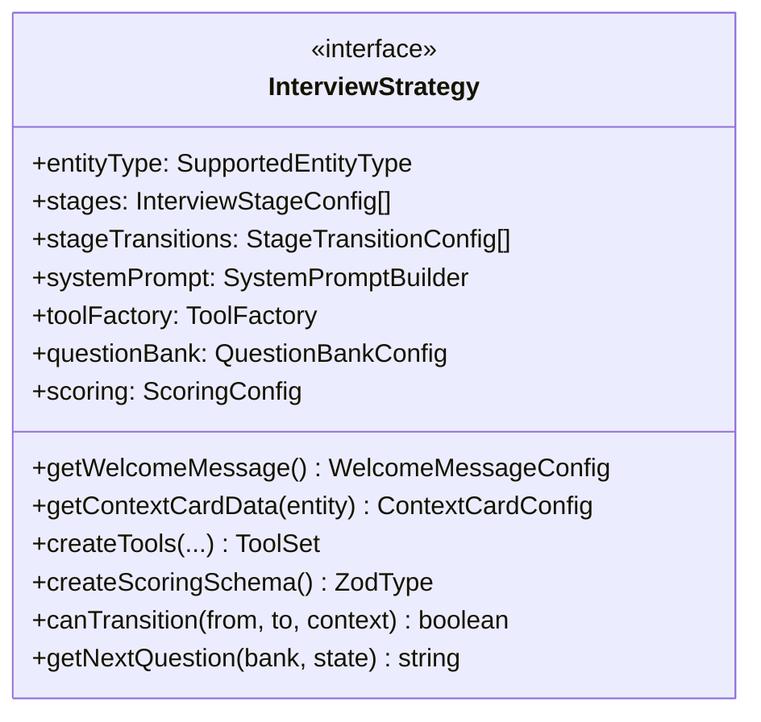
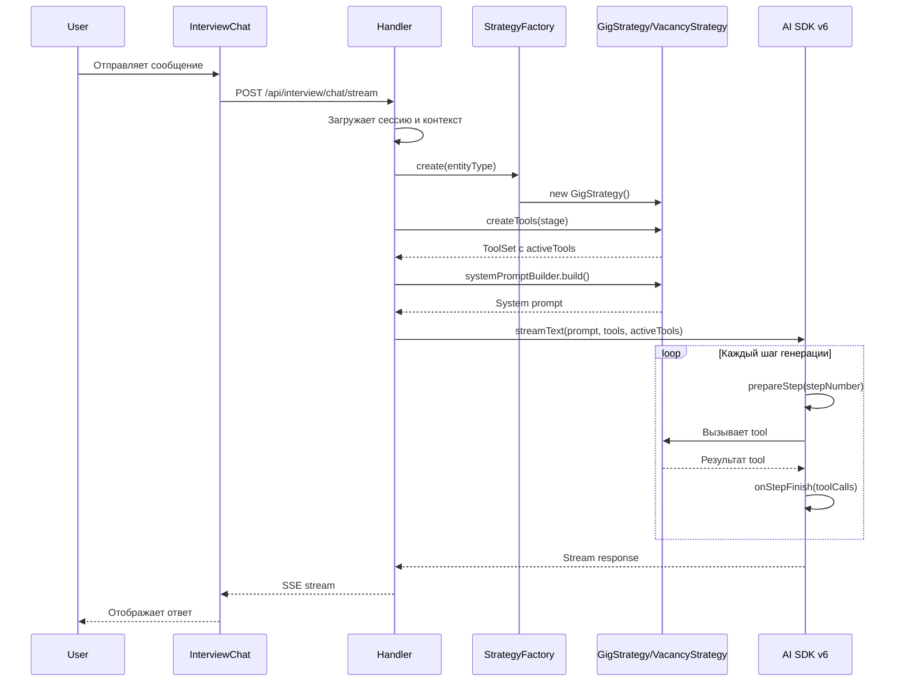

# Дизайн системы разделения потоков интервью

## Обзор

Данный документ описывает техническое проектирование рефакторинга приложения `apps/interview` для разделения потоков интервью для разовых заданий (gig) и вакансий (vacancy) с использованием паттерна Strategy. Дизайн основан на принципах SOLID, обеспечивает расширяемость для будущих типов сущностей и интегрирует новые возможности AI SDK v6.

### Ключевые принципы дизайна

1. **Strategy Pattern**: Инкапсуляция специфичного для типа сущности поведения в отдельные стратегии
2. **Open/Closed Principle**: Система открыта для расширения (новые типы сущностей) но закрыта для модификации
3. **Dependency Injection**: Стратегии и фабрики внедряются через конструкторы
4. **Type Safety**: Полное покрытие TypeScript типами с использованием branded types и discriminated unions
5. **Separation of Concerns**: Четкое разделение между транспортным слоем, оркестрацией, стратегиями и UI

### Архитектурные слои

```
┌─────────────────────────────────────────────────────────────┐
│                      Frontend Layer                          │
│  InterviewChat → InterviewContextCard → InterviewGreeting   │
└─────────────────────────────────────────────────────────────┘
                            ↓
┌─────────────────────────────────────────────────────────────┐
│                       API Layer                              │
│         route.ts → handler.ts → access-control.ts           │
└─────────────────────────────────────────────────────────────┘
                            ↓
┌─────────────────────────────────────────────────────────────┐
│                   Orchestrator Layer                         │
│    conversation-builder → message-handler → context-loader  │
└─────────────────────────────────────────────────────────────┘
                            ↓
┌─────────────────────────────────────────────────────────────┐
│                     Strategy Layer                           │
│  StrategyFactory → GigStrategy / VacancyStrategy            │
│       ↓              ↓              ↓              ↓         │
│   Prompts        Tools         Scoring        Stages        │
└─────────────────────────────────────────────────────────────┘
                            ↓
┌─────────────────────────────────────────────────────────────┐
│                     Runtime Layer                            │
│         stream-executor → AI SDK v6 → Model                 │
└─────────────────────────────────────────────────────────────┘
```

## Архитектура

### Диаграмма классов стратегий



    
    class BaseInterviewStrategy {
        <<abstract>>
        +entityType: SupportedEntityType
        #_questionBank: QuestionBankConfig
        #_scoring: ScoringConfig
        #systemPromptBuilder: SystemPromptBuilder
        #toolFactory: ToolFactory
        +getWelcomeMessage() WelcomeMessageConfig
        +getContextCardData(entity) ContextCardConfig
        +createTools(...) ToolSet
        +createScoringSchema() ZodType
        +canTransition(from, to, context) boolean
        +getNextQuestion(bank, state) string
    }
    
    class GigInterviewStrategy {
        +entityType: "gig"
        -_gigToolFactory: GigToolFactory
        -_gigPromptBuilder: GigSystemPromptBuilder
        +getWelcomeMessage() WelcomeMessageConfig
        +getContextCardData(gig) ContextCardConfig
        +createTools(...) ToolSet
        +canTransition(from, to, context) boolean
        +getNextQuestion(bank, state) string
    }
    
    class VacancyInterviewStrategy {
        +entityType: "vacancy"
        -_vacancyToolFactory: VacancyToolFactory
        -_vacancyPromptBuilder: VacancySystemPromptBuilder
        +getWelcomeMessage() WelcomeMessageConfig
        +getContextCardData(vacancy) ContextCardConfig
        +createTools(...) ToolSet
        +canTransition(from, to, context) boolean
        +getNextQuestion(bank, state) string
    }
    
    class InterviewStrategyFactory {
        -strategies: Map~SupportedEntityType, Function~
        +create(entityType) InterviewStrategy
        +register(entityType, factory) void
        +isSupported(entityType) boolean
    }
    
    InterviewStrategy <|.. BaseInterviewStrategy
    BaseInterviewStrategy <|-- GigInterviewStrategy
    BaseInterviewStrategy <|-- VacancyInterviewStrategy
    InterviewStrategyFactory ..> InterviewStrategy : creates
```

### Диаграмма потока данных



## Компоненты и интерфейсы

### 1. Интерфейс InterviewStrategy

Центральный интерфейс для всех стратегий интервью.

```typescript
// apps/interview/src/app/api/interview/chat/stream/strategies/types.ts

export type SupportedEntityType = "gig" | "vacancy" | "project";

export interface InterviewStrategy {
  readonly entityType: SupportedEntityType;
  readonly stages: InterviewStageConfig[];
  readonly stageTransitions: StageTransitionConfig[];
  readonly systemPrompt: SystemPromptBuilder;
  readonly toolFactory: ToolFactory;
  readonly questionBank: QuestionBankConfig;
  readonly scoring: ScoringConfig;
  
  getWelcomeMessage(): WelcomeMessageConfig;
  getContextCardData(entity: GigLike | VacancyLike): ContextCardConfig;
  createTools(
    model: LanguageModel,
    sessionId: string,
    db: NodePgDatabase<typeof schema>,
    gig: GigLike | null,
    vacancy: VacancyLike | null,
    interviewContext: InterviewContextLite,
    currentStage: string,
  ): ToolSet;
  createScoringSchema(): ZodType;
  canTransition(from: string, to: string, context: TransitionContext): boolean;
  getNextQuestion(bank: QuestionBankResult, state: InterviewState): string | null;
}
```

**Обоснование дизайна:**
- Readonly поля для неизменяемых свойств стратегии
- Методы для динамического поведения (создание tools, проверка переходов)
- Типобезопасность через generic типы и branded types


### 2. Фабрика стратегий

```typescript
// apps/interview/src/app/api/interview/chat/stream/strategies/index.ts

export class InterviewStrategyFactory {
  private strategies: Map<SupportedEntityType, () => InterviewStrategy> = new Map([
    ["gig", () => new GigInterviewStrategy()],
    ["vacancy", () => new VacancyInterviewStrategy()],
  ]);

  create(entityType: SupportedEntityType): InterviewStrategy {
    const factory = this.strategies.get(entityType);
    if (!factory) {
      console.warn(`Unknown entity type: ${entityType}, using vacancy`);
      return new VacancyInterviewStrategy();
    }
    return factory();
  }

  register(entityType: SupportedEntityType, factory: () => InterviewStrategy): void {
    this.strategies.set(entityType, factory);
  }

  isSupported(entityType: string): entityType is SupportedEntityType {
    return this.strategies.has(entityType as SupportedEntityType);
  }
}

export const strategyFactory = new InterviewStrategyFactory();

export function getInterviewStrategy(
  gig: GigLike | null,
  vacancy: VacancyLike | null,
): InterviewStrategy {
  const entityType: SupportedEntityType = gig ? "gig" : "vacancy";
  return strategyFactory.create(entityType);
}
```

**Обоснование дизайна:**
- Singleton фабрика для глобального доступа
- Map для O(1) поиска стратегий
- Метод register для расширяемости
- Type guard isSupported для безопасности типов
- Fallback на vacancy для обратной совместимости

### 3. Базовая стратегия

```typescript
// apps/interview/src/app/api/interview/chat/stream/strategies/base-strategy.ts

export abstract class BaseInterviewStrategy implements InterviewStrategy {
  abstract readonly entityType: SupportedEntityType;
  
  protected abstract _questionBank: QuestionBankConfig;
  protected abstract _scoring: ScoringConfig;
  
  protected systemPromptBuilder: SystemPromptBuilder = new BaseSystemPromptBuilder();
  protected toolFactory: ToolFactory = new BaseToolFactory();

  get stages(): InterviewStageConfig[] {
    return baseStages;
  }

  get stageTransitions(): StageTransitionConfig[] {
    return baseStages;
  }

  get questionBank(): QuestionBankConfig {
    return this._questionBank;
  }

  get scoring(): ScoringConfig {
    return this._scoring;
  }

  getWelcomeMessage(): WelcomeMessageConfig {
    return {
      title: "Добро пожаловать!",
      subtitle: "Готовы начать интервью?",
      placeholder: "Напишите сообщение...",
      greeting: "Напишите сообщение, чтобы начать диалог",
    };
  }

  getContextCardData(_entity: GigLike | VacancyLike): ContextCardConfig {
    return {
      badgeLabel: "Интервью",
      fields: [
        { key: "title", label: "Название", type: "text", showFor: ["gig", "vacancy"] },
      ],
    };
  }

  createTools(
    model: LanguageModel,
    sessionId: string,
    db: NodePgDatabase<typeof schema>,
    gig: GigLike | null,
    vacancy: VacancyLike | null,
    interviewContext: InterviewContextLite,
    currentStage: string,
  ): ToolSet {
    return this.toolFactory.create(
      model,
      sessionId,
      db,
      gig,
      vacancy,
      interviewContext,
    );
  }

  createScoringSchema(): ZodType {
    return this._scoring.schema;
  }

  canTransition(_from: string, _to: string, _context: TransitionContext): boolean {
    return true; // По умолчанию разрешаем все переходы
  }

  getNextQuestion(
    questionBank: QuestionBankResult,
    interviewState: InterviewState,
  ): string | null {
    const stage = interviewState.stage;
    const asked = new Set(interviewState.askedQuestions);

    let availableQuestions: string[];
    switch (stage) {
      case "intro":
        availableQuestions = questionBank.organizational.slice(0, 2);
        break;
      case "org":
        availableQuestions = questionBank.organizational;
        break;
      case "tech":
        availableQuestions = questionBank.technical;
        break;
      case "wrapup":
        return null;
      default:
        availableQuestions = questionBank.organizational;
    }

    return availableQuestions.find((q) => !asked.has(q)) || null;
  }
}
```

**Обоснование дизайна:**
- Abstract class для переиспользования общей логики
- Protected поля для доступа в наследниках
- Template Method pattern для getNextQuestion
- Разумные значения по умолчанию


### 4. Стратегия для Gig

```typescript
// apps/interview/src/app/api/interview/chat/stream/strategies/gig-strategy.ts

export class GigInterviewStrategy extends BaseInterviewStrategy {
  readonly entityType = "gig" as const;

  private _gigToolFactory: GigToolFactory;
  private _gigPromptBuilder: GigSystemPromptBuilder;

  constructor() {
    super();
    this._gigToolFactory = new GigToolFactory();
    this._gigPromptBuilder = new GigSystemPromptBuilder();
  }

  protected _questionBank: QuestionBankConfig = {
    organizationalDefaults: [
      "Расскажите о вашем опыте работы с аналогичными задачами",
      "Как вы оцениваете сложность этого задания и сроки выполнения?",
      "Какую оплату за задание вы ожидаете?",
      "Есть ли другие проекты, которые могут повлиять на сроки?",
    ],
    technicalDefaults: [],
    customQuestionsField: "customInterviewQuestions",
  };

  protected _scoring: ScoringConfig = {
    schema: gigScoringSchema,
    version: "v3-gig",
    includesAuthenticityPenalty: true,
  };

  get stages(): InterviewStageConfig[] {
    return gigStages;
  }

  get systemPromptBuilder(): SystemPromptBuilder {
    return this._gigPromptBuilder;
  }

  get toolFactory(): ToolFactory {
    return this._gigToolFactory;
  }

  getWelcomeMessage(): WelcomeMessageConfig {
    return {
      title: "Добро пожаловать!",
      subtitle: "Готовы обсудить это задание?",
      placeholder: "Расскажите о вашем опыте...",
      greeting: "Напишите сообщение, чтобы начать разговор о задании",
      suggestedQuestions: [
        "Расскажите о вашем опыте с аналогичными задачами",
        "Как бы вы подошли к решению этой задачи?",
        "Какие сроки вам нужны для выполнения?",
      ],
    };
  }

  getContextCardData(entity: GigLike): ContextCardConfig {
    return {
      badgeLabel: "Разовое задание",
      fields: [
        { key: "title", label: "Название", type: "text", showFor: ["gig"] },
        { key: "budget", label: "Бюджет", type: "currency", showFor: ["gig"] },
        { key: "deadline", label: "Дедлайн", type: "date", showFor: ["gig"] },
        { key: "estimatedDuration", label: "Срок выполнения", type: "text", showFor: ["gig"] },
      ],
      expandableFields: [
        { key: "description", label: "Описание", type: "text", showFor: ["gig"] },
        { key: "requirements", label: "Требования", type: "array", showFor: ["gig"] },
      ],
    };
  }

  canTransition(from: string, to: string, context: TransitionContext): boolean {
    switch (`${from}→${to}`) {
      case "intro→profile_review":
        return true;
      case "profile_review→org":
        return context.askedQuestions.length >= 1;
      case "org→tech":
        return context.askedQuestions.length >= 3;
      case "tech→task_approach":
        return context.askedQuestions.length >= 2;
      case "task_approach→wrapup":
        return true;
      default:
        return super.canTransition(from, to, context);
    }
  }

  getNextQuestion(
    questionBank: QuestionBankResult,
    interviewState: InterviewState,
  ): string | null {
    const stage = interviewState.stage;
    const asked = new Set(interviewState.askedQuestions);

    switch (stage) {
      case "intro":
        return "Расскажите о вашем опыте работы с аналогичными задачами";
      case "profile_review":
        return null; // Профиль анализируется через tool
      case "org":
        return questionBank.organizational.find((q) => !asked.has(q)) || null;
      case "tech":
        return questionBank.technical.find((q) => !asked.has(q)) || null;
      case "task_approach":
        return "Как бы вы подошли к решению этой конкретной задачи?";
      case "wrapup":
        return "Есть ли что-то еще, что вы хотели бы уточнить по заданию?";
      default:
        return super.getNextQuestion(questionBank, interviewState);
    }
  }
}
```

**Обоснование дизайна:**
- Специфичные для gig стадии (profile_review, task_approach)
- Вопросы фокусируются на опыте с задачами и сроках
- Переходы учитывают анализ профиля
- UI тексты адаптированы под контекст разового задания


### 5. Стратегия для Vacancy

```typescript
// apps/interview/src/app/api/interview/chat/stream/strategies/vacancy-strategy.ts

export class VacancyInterviewStrategy extends BaseInterviewStrategy {
  readonly entityType = "vacancy" as const;

  private _vacancyToolFactory: VacancyToolFactory;
  private _vacancyPromptBuilder: VacancySystemPromptBuilder;

  constructor() {
    super();
    this._vacancyToolFactory = new VacancyToolFactory();
    this._vacancyPromptBuilder = new VacancySystemPromptBuilder();
  }

  protected _questionBank: QuestionBankConfig = {
    organizationalDefaults: [
      "Какой график работы вам подходит?",
      "Какие ожидания по зарплате?",
      "Когда готовы приступить к работе?",
      "Какой формат работы предпочитаете?",
    ],
    technicalDefaults: [],
    customQuestionsField: "customInterviewQuestions",
  };

  protected _scoring: ScoringConfig = {
    schema: vacancyScoringSchema,
    version: "v2",
    includesAuthenticityPenalty: true,
  };

  get stages(): InterviewStageConfig[] {
    return vacancyStages;
  }

  get systemPromptBuilder(): SystemPromptBuilder {
    return this._vacancyPromptBuilder;
  }

  get toolFactory(): ToolFactory {
    return this._vacancyToolFactory;
  }

  getWelcomeMessage(): WelcomeMessageConfig {
    return {
      title: "Добро пожаловать!",
      subtitle: "Ответьте на несколько вопросов о себе",
      placeholder: "Расскажите о себе...",
      greeting: "Напишите сообщение, чтобы начать разговор",
      suggestedQuestions: [
        "Почему вас заинтересовала эта вакансия?",
        "Какие у вас сильные стороны?",
      ],
    };
  }

  getContextCardData(entity: VacancyLike): ContextCardConfig {
    return {
      badgeLabel: "Вакансия",
      fields: [
        { key: "title", label: "Название", type: "text", showFor: ["vacancy"] },
        { key: "region", label: "Регион", type: "text", showFor: ["vacancy"] },
        { key: "workLocation", label: "Место работы", type: "text", showFor: ["vacancy"] },
      ],
      expandableFields: [
        { key: "description", label: "Описание", type: "text", showFor: ["vacancy"] },
        { key: "requirements", label: "Требования", type: "array", showFor: ["vacancy"] },
      ],
    };
  }

  canTransition(from: string, to: string, context: TransitionContext): boolean {
    switch (`${from}→${to}`) {
      case "intro→org":
        return context.askedQuestions.length >= 1;
      case "org→tech":
        return context.askedQuestions.length >= 3;
      case "tech→motivation":
        return context.askedQuestions.length >= 2;
      case "motivation→wrapup":
        return true;
      default:
        return super.canTransition(from, to, context);
    }
  }

  getNextQuestion(
    questionBank: QuestionBankResult,
    interviewState: InterviewState,
  ): string | null {
    const stage = interviewState.stage;
    const asked = new Set(interviewState.askedQuestions);

    switch (stage) {
      case "intro":
        return "Расскажите о своем опыте работы";
      case "org":
        return questionBank.organizational.find((q) => !asked.has(q)) || null;
      case "tech":
        return questionBank.technical.find((q) => !asked.has(q)) || null;
      case "motivation":
        return "Почему вас заинтересовала эта вакансия?";
      case "wrapup":
        return "Есть ли что-то еще, что вы хотели бы уточнить?";
      default:
        return super.getNextQuestion(questionBank, interviewState);
    }
  }
}
```

**Обоснование дизайна:**
- Специфичная для vacancy стадия motivation
- Вопросы фокусируются на трудоустройстве (график, зарплата)
- Переходы учитывают оценку мотивации
- UI тексты адаптированы под контекст вакансии

## Модели данных

### Типы сущностей

```typescript
// apps/interview/src/app/api/interview/chat/stream/types.ts

export type EntityType = "gig" | "vacancy" | "project" | "unknown";
export type SupportedEntityType = "gig" | "vacancy" | "project";

// Branded types для типобезопасности
export type GigLike = {
  id: string;
  title: string;
  description: string | null;
  budget?: {
    min: number | null;
    max: number | null;
    currency: string | null;
  } | null;
  deadline?: Date | null;
  estimatedDuration?: string | null;
  customInterviewQuestions?: string | null;
  requirements?: unknown;
} & { __brand: "gig" };

export type VacancyLike = {
  id: string;
  title: string;
  description: string | null;
  region?: string | null;
  workLocation?: string | null;
  customInterviewQuestions?: string | null;
  requirements?: unknown;
} & { __brand: "vacancy" };
```

**Обоснование дизайна:**
- Branded types предотвращают случайное смешивание типов
- Опциональные поля для гибкости
- Общие поля (id, title, description) для полиморфизма


### Конфигурация стадий

```typescript
// apps/interview/src/app/api/interview/chat/stream/stages/types.ts

export type StageId = 
  | "intro" 
  | "org" 
  | "tech" 
  | "wrapup"
  | "profile_review"  // Только для gig
  | "task_approach"   // Только для gig
  | "motivation";     // Только для vacancy

export interface InterviewStageConfig {
  id: StageId;
  order: number;
  description: string;
  allowedTools: string[];
  maxQuestions: number;
  autoAdvance: boolean;
  entryActions: StageAction[];
}

export type StageAction = 
  | "welcome"
  | "analyze_profile"
  | "final_question"
  | "check_bot_detection";

export interface StageTransitionConfig {
  from: string;
  to: string;
  condition: "auto" | "question_count" | "tool_call";
  params?: Record<string, unknown>;
}

export interface TransitionContext {
  askedQuestions: string[];
  userResponses: string[];
  botDetectionScore?: number;
  timeInCurrentStage?: number;
}
```

**Обоснование дизайна:**
- Union type для StageId обеспечивает типобезопасность
- allowedTools для динамического управления инструментами
- autoAdvance для автоматических переходов
- entryActions для выполнения действий при входе в стадию

### Схемы оценки

```typescript
// apps/interview/src/app/api/interview/chat/stream/scoring/gig-scoring.ts

import { z } from "zod";

export const gigScoringSchema = z.object({
  overallScore: z.number().min(0).max(100),
  recommendation: z.enum(["strong_yes", "yes", "neutral", "no", "strong_no"]),
  
  criteria: z.object({
    strengths_weaknesses: z.object({
      score: z.number().min(0).max(100),
      assessment: z.string(),
      strengths: z.array(z.string()),
      weaknesses: z.array(z.string()),
    }),
    expertise_depth: z.object({
      score: z.number().min(0).max(100),
      relevantExperience: z.number().min(0).max(10),
      technologyMatch: z.number().min(0).max(100),
      assessment: z.string(),
    }),
    problem_solving: z.object({
      score: z.number().min(0).max(100),
      approachQuality: z.enum(["excellent", "good", "average", "poor"]),
      creativity: z.number().min(0).max(100),
      assessment: z.string(),
    }),
    communication_quality: z.object({
      score: z.number().min(0).max(100),
      clarity: z.number().min(0).max(100),
      responsiveness: z.number().min(0).max(100),
      assessment: z.string(),
    }),
    timeline_feasibility: z.object({
      score: z.number().min(0).max(100),
      estimatedDays: z.number().min(0).max(365),
      realismRating: z.enum(["realistic", "optimistic", "pessimistic"]),
      assessment: z.string(),
    }),
  }),
  
  authenticityPenalty: z.object({
    penalty: z.number().min(0).max(30),
    reason: z.string(),
    detectedIssues: z.array(z.string()),
  }),
  
  summary: z.object({
    keyTakeaways: z.array(z.string()),
    redFlags: z.array(z.string()),
    greenFlags: z.array(z.string()),
    recommendedNextSteps: z.array(z.string()),
  }),
  
  metadata: z.object({
    version: z.literal("v3-gig"),
    interviewDuration: z.number(),
    questionsAsked: z.number(),
    completedAt: z.string().datetime(),
  }),
});

export type GigScoringOutput = z.infer<typeof gigScoringSchema>;
```

```typescript
// apps/interview/src/app/api/interview/chat/stream/scoring/vacancy-scoring.ts

export const vacancyScoringSchema = z.object({
  overallScore: z.number().min(0).max(100),
  recommendation: z.enum(["strong_yes", "yes", "neutral", "no", "strong_no"]),
  
  criteria: z.object({
    completeness: z.object({
      score: z.number().min(0).max(100),
      answeredQuestions: z.number(),
      totalQuestions: z.number(),
      assessment: z.string(),
    }),
    relevance: z.object({
      score: z.number().min(0).max(100),
      experienceMatch: z.number().min(0).max(100),
      skillsMatch: z.number().min(0).max(100),
      assessment: z.string(),
    }),
    motivation: z.object({
      score: z.number().min(0).max(100),
      interestLevel: z.enum(["high", "medium", "low"]),
      companyInterest: z.number().min(0).max(100),
      roleClarity: z.number().min(0).max(100),
      assessment: z.string(),
    }),
    communication: z.object({
      score: z.number().min(0).max(100),
      clarity: z.number().min(0).max(100),
      professionalism: z.number().min(0).max(100),
      engagement: z.number().min(0).max(100),
      assessment: z.string(),
    }),
  }),
  
  authenticityPenalty: z.object({
    penalty: z.number().min(0).max(30),
    reason: z.string(),
    detectedIssues: z.array(z.string()),
  }),
  
  summary: z.object({
    keyTakeaways: z.array(z.string()),
    concerns: z.array(z.string()),
    positives: z.array(z.string()),
    recommendedNextSteps: z.array(z.string()),
  }),
  
  metadata: z.object({
    version: z.literal("v2"),
    interviewDuration: z.number(),
    questionsAsked: z.number(),
    completedAt: z.string().datetime(),
  }),
});

export type VacancyScoringOutput = z.infer<typeof vacancyScoringSchema>;
```

**Обоснование дизайна:**
- Zod для runtime валидации и type inference
- Разные критерии для gig (expertise, problem_solving) и vacancy (motivation, completeness)
- Общая структура (overallScore, authenticityPenalty, summary) для консистентности
- Версионирование схем для миграций


## Correctness Properties

*Свойство (property) — это характеристика или поведение, которое должно выполняться для всех валидных выполнений системы. По сути, это формальное утверждение о том, что система должна делать. Свойства служат мостом между человекочитаемыми спецификациями и машинно-проверяемыми гарантиями корректности.*

### Property 1: Консистентность фабрик стратегий

*Для любого* поддерживаемого типа сущности (gig, vacancy), все фабрики (стратегий, промптов, схем оценки) должны возвращать объекты соответствующие этому типу сущности.

**Validates: Requirements 1.5, 2.5, 5.5**

### Property 2: Fallback на vacancy для неизвестных типов

*Для любого* неизвестного или null типа сущности, фабрика стратегий должна возвращать VacancyInterviewStrategy.

**Validates: Requirements 1.6, 10.7**

### Property 3: Промпты содержат инструкции для стадии

*Для любой* валидной стадии интервью, построенный системный промпт должен содержать инструкции специфичные для этой стадии.

**Validates: Requirements 2.6**

### Property 4: Консистентность доступности инструментов

*Для любой* стадии и любого инструмента, если `getAvailableTools(stage)` содержит инструмент, то `isToolAvailable(toolName, stage)` должен вернуть true, и наоборот.

**Validates: Requirements 3.6, 3.7**

### Property 5: Фильтрация инструментов по стадии

*Для любой* стадии интервью, набор созданных инструментов должен содержать только те инструменты, которые разрешены для этой стадии согласно конфигурации.

**Validates: Requirements 3.5**

### Property 6: Автоматический переход при достижении лимита вопросов

*Для любой* стадии с `autoAdvance = true`, когда количество заданных вопросов достигает `maxQuestions`, система должна разрешить переход к следующей стадии.

**Validates: Requirements 4.5**

### Property 7: Выполнение действий при входе в стадию

*Для любой* стадии с непустым массивом `entryActions`, при переходе в эту стадию все указанные действия должны быть выполнены.

**Validates: Requirements 4.6**

### Property 8: UI компоненты отображают entity-specific контент

*Для любого* типа сущности (gig, vacancy), UI компоненты (InterviewGreeting, InterviewContextCard) должны отображать контент специфичный для этого типа сущности (правильные тексты, поля, badges).

**Validates: Requirements 7.1, 7.2, 7.3, 7.4, 7.5, 7.6**

### Property 9: getNextQuestion возвращает незаданный вопрос

*Для любой* стадии (org, tech) и любого набора уже заданных вопросов, метод `getNextQuestion` должен возвращать вопрос который не входит в набор заданных, или null если все вопросы заданы.

**Validates: Requirements 9.6, 9.7**

### Property 10: Zod схемы отклоняют невалидные данные

*Для любых* невалидных входных данных (отсутствующие обязательные поля, неправильные типы, значения вне диапазона), Zod схемы должны отклонять эти данные с ошибкой валидации.

**Validates: Requirements 11.4**

### Property 11: Полный цикл регистрации новой стратегии

*Для любой* новой стратегии реализующей интерфейс `InterviewStrategy`, после регистрации через `strategyFactory.register(entityType, factory)`:
- `strategyFactory.isSupported(entityType)` должен вернуть true
- `strategyFactory.create(entityType)` должен вернуть экземпляр зарегистрированной стратегии

**Validates: Requirements 12.1, 12.2, 12.4**

## Обработка ошибок

### Стратегия обработки ошибок

1. **Неизвестный тип сущности**: Fallback на VacancyInterviewStrategy с предупреждением в логах
2. **Отсутствие данных gig/vacancy**: Использование значений по умолчанию из стратегии
3. **Ошибка создания инструментов**: Логирование ошибки и возврат базового набора инструментов
4. **Ошибка валидации Zod**: Возврат детальной ошибки с указанием невалидных полей
5. **Ошибка AI SDK**: Fallback на резервную модель с сохранением контекста

### Обработка edge cases

```typescript
// Пример обработки неизвестного типа сущности
export function getInterviewStrategy(
  gig: GigLike | null,
  vacancy: VacancyLike | null,
): InterviewStrategy {
  if (!gig && !vacancy) {
    console.warn("[Strategy] No entity provided, using vacancy strategy");
    return strategyFactory.create("vacancy");
  }
  
  const entityType: SupportedEntityType = gig ? "gig" : "vacancy";
  return strategyFactory.create(entityType);
}

// Пример обработки ошибки создания инструментов
export class BaseToolFactory implements ToolFactory {
  create(...args): ToolSet {
    try {
      return this.createToolsInternal(...args);
    } catch (error) {
      console.error("[ToolFactory] Error creating tools:", error);
      return this.createMinimalToolSet();
    }
  }
  
  private createMinimalToolSet(): ToolSet {
    // Возвращаем минимальный набор инструментов для продолжения работы
    return {
      getInterviewSettings: createGetInterviewSettingsTool(...),
      getInterviewState: createGetInterviewStateTool(...),
    };
  }
}
```

### Валидация входных данных

```typescript
// Валидация типа сущности
const entityTypeSchema = z.enum(["gig", "vacancy", "project"]);

export function validateEntityType(type: unknown): SupportedEntityType {
  const result = entityTypeSchema.safeParse(type);
  if (!result.success) {
    console.warn(`[Validation] Invalid entity type: ${type}, using vacancy`);
    return "vacancy";
  }
  return result.data;
}

// Валидация конфигурации стадии
const stageConfigSchema = z.object({
  id: z.string(),
  order: z.number().min(0),
  description: z.string(),
  allowedTools: z.array(z.string()),
  maxQuestions: z.number().min(0),
  autoAdvance: z.boolean(),
  entryActions: z.array(z.string()),
});

export function validateStageConfig(config: unknown): InterviewStageConfig {
  return stageConfigSchema.parse(config);
}
```


## Стратегия тестирования

### Двойной подход к тестированию

Система использует комбинацию unit тестов и property-based тестов для комплексного покрытия:

**Unit тесты** проверяют:
- Конкретные примеры и edge cases
- Интеграцию между компонентами
- Специфичные сценарии для gig и vacancy

**Property-based тесты** проверяют:
- Универсальные свойства для всех входных данных
- Инварианты системы
- Корректность через рандомизацию

### Конфигурация property-based тестов

Используем библиотеку **fast-check** для TypeScript:

```typescript
import fc from "fast-check";

// Минимум 100 итераций на property test
const testConfig = { numRuns: 100 };

// Генераторы для типов сущностей
const entityTypeArb = fc.constantFrom("gig", "vacancy");
const stageIdArb = fc.constantFrom("intro", "org", "tech", "wrapup");

// Пример property теста
describe("Property 1: Консистентность фабрик стратегий", () => {
  it("для любого поддерживаемого типа сущности все фабрики возвращают соответствующие объекты", () => {
    fc.assert(
      fc.property(entityTypeArb, (entityType) => {
        // Feature: interview-flow-separation, Property 1: Консистентность фабрик стратегий
        const strategy = strategyFactory.create(entityType);
        const promptBuilder = promptFactory.create(entityType);
        const scoringSchema = scoringFactory.createSchema(entityType);
        
        expect(strategy.entityType).toBe(entityType);
        expect(promptBuilder).toBeDefined();
        expect(scoringSchema).toBeDefined();
      }),
      testConfig
    );
  });
});
```

### Unit тесты для конкретных сценариев

```typescript
describe("GigInterviewStrategy", () => {
  it("должна включать инструмент getInterviewProfile", () => {
    const strategy = new GigInterviewStrategy();
    const tools = strategy.createTools(/* ... */);
    
    expect(tools.getInterviewProfile).toBeDefined();
  });
  
  it("должна разрешать переход intro→profile_review без условий", () => {
    const strategy = new GigInterviewStrategy();
    const context: TransitionContext = {
      askedQuestions: [],
      userResponses: [],
    };
    
    const canTransition = strategy.canTransition("intro", "profile_review", context);
    expect(canTransition).toBe(true);
  });
  
  it("должна требовать минимум 1 вопрос для перехода profile_review→org", () => {
    const strategy = new GigInterviewStrategy();
    
    const contextWithoutQuestions: TransitionContext = {
      askedQuestions: [],
      userResponses: [],
    };
    expect(strategy.canTransition("profile_review", "org", contextWithoutQuestions)).toBe(false);
    
    const contextWithQuestions: TransitionContext = {
      askedQuestions: ["Вопрос 1"],
      userResponses: ["Ответ 1"],
    };
    expect(strategy.canTransition("profile_review", "org", contextWithQuestions)).toBe(true);
  });
});

describe("VacancyInterviewStrategy", () => {
  it("не должна включать инструмент getInterviewProfile", () => {
    const strategy = new VacancyInterviewStrategy();
    const tools = strategy.createTools(/* ... */);
    
    expect(tools.getInterviewProfile).toBeUndefined();
  });
  
  it("должна включать стадию motivation", () => {
    const strategy = new VacancyInterviewStrategy();
    const stages = strategy.stages;
    
    const hasMotivationStage = stages.some(s => s.id === "motivation");
    expect(hasMotivationStage).toBe(true);
  });
});
```

### Integration тесты

```typescript
describe("Полный поток интервью для gig", () => {
  it("должен пройти все стадии от intro до wrapup", async () => {
    const sessionId = "test-session-id";
    const gig = createMockGig();
    
    // Создаем стратегию
    const strategy = getInterviewStrategy(gig, null);
    expect(strategy.entityType).toBe("gig");
    
    // Проходим через все стадии
    const stages = strategy.stages;
    for (const stage of stages) {
      // Создаем инструменты для стадии
      const tools = strategy.createTools(/* ... */, stage.id);
      
      // Проверяем что только разрешенные инструменты доступны
      const availableTools = strategy.toolFactory.getAvailableTools(stage.id);
      expect(Object.keys(tools).sort()).toEqual(availableTools.sort());
      
      // Получаем следующий вопрос
      const question = strategy.getNextQuestion(/* ... */);
      
      if (stage.id !== "wrapup") {
        expect(question).toBeTruthy();
      }
    }
  });
});

describe("UI компоненты с разными типами сущностей", () => {
  it("InterviewGreeting должен показывать разные тексты для gig и vacancy", () => {
    const gigStrategy = new GigInterviewStrategy();
    const vacancyStrategy = new VacancyInterviewStrategy();
    
    const gigMessage = gigStrategy.getWelcomeMessage();
    const vacancyMessage = vacancyStrategy.getWelcomeMessage();
    
    expect(gigMessage.subtitle).toContain("задание");
    expect(vacancyMessage.subtitle).toContain("вопросы");
    expect(gigMessage.subtitle).not.toBe(vacancyMessage.subtitle);
  });
  
  it("InterviewContextCard должен показывать разные поля для gig и vacancy", () => {
    const gigStrategy = new GigInterviewStrategy();
    const vacancyStrategy = new VacancyInterviewStrategy();
    
    const gigCard = gigStrategy.getContextCardData(createMockGig());
    const vacancyCard = vacancyStrategy.getContextCardData(createMockVacancy());
    
    const gigFieldKeys = gigCard.fields.map(f => f.key);
    const vacancyFieldKeys = vacancyCard.fields.map(f => f.key);
    
    expect(gigFieldKeys).toContain("budget");
    expect(gigFieldKeys).toContain("deadline");
    expect(vacancyFieldKeys).toContain("region");
    expect(vacancyFieldKeys).toContain("workLocation");
  });
});
```

### Тестирование AI SDK v6 интеграции

```typescript
describe("AI SDK v6 features", () => {
  it("должен передавать activeTools в streamText", async () => {
    const strategy = new GigInterviewStrategy();
    const currentStage = "org";
    const activeTools = strategy.toolFactory.getAvailableTools(currentStage);
    
    const streamTextSpy = jest.spyOn(aiModule, "streamText");
    
    await executeStreamWithFallbackV6({
      /* ... */,
      activeTools,
    });
    
    expect(streamTextSpy).toHaveBeenCalledWith(
      expect.objectContaining({
        activeTools: expect.arrayContaining(activeTools),
      })
    );
  });
  
  it("должен вызывать onStepFinish для каждого шага", async () => {
    const onStepFinishMock = jest.fn();
    
    await executeStreamWithFallbackV6({
      /* ... */,
      onStepFinish: onStepFinishMock,
    });
    
    expect(onStepFinishMock).toHaveBeenCalled();
  });
  
  it("должен генерировать структурированную оценку с generateObject", async () => {
    const strategy = new GigInterviewStrategy();
    const scoringSchema = strategy.createScoringSchema();
    
    const result = await generateObject({
      model: getAIModel(),
      schema: scoringSchema,
      prompt: "Оцени кандидата...",
    });
    
    // Проверяем что результат соответствует схеме
    expect(() => scoringSchema.parse(result.object)).not.toThrow();
    expect(result.object.metadata.version).toBe("v3-gig");
  });
});
```

### Покрытие тестами

Целевые метрики:
- **Общее покрытие кода**: минимум 80%
- **Покрытие стратегий**: минимум 90%
- **Покрытие фабрик**: минимум 90%
- **Покрытие UI компонентов**: минимум 70%

Инструменты:
- **Jest** для unit и integration тестов
- **fast-check** для property-based тестов
- **React Testing Library** для тестирования компонентов
- **Istanbul/nyc** для измерения покрытия

### Тестирование производительности

```typescript
describe("Performance tests", () => {
  it("создание стратегии должно занимать < 10ms", () => {
    const start = performance.now();
    
    for (let i = 0; i < 1000; i++) {
      strategyFactory.create("gig");
    }
    
    const end = performance.now();
    const avgTime = (end - start) / 1000;
    
    expect(avgTime).toBeLessThan(10);
  });
  
  it("создание инструментов должно занимать < 50ms", () => {
    const strategy = new GigInterviewStrategy();
    const start = performance.now();
    
    strategy.createTools(/* ... */);
    
    const end = performance.now();
    expect(end - start).toBeLessThan(50);
  });
});
```

## План миграции

### Фаза 1: Подготовка (1-2 дня)

1. Создать структуру директорий:
```bash
mkdir -p apps/interview/src/app/api/interview/chat/stream/{strategies,prompts,scoring,stages,tools}
```

2. Создать базовые типы и интерфейсы:
   - `strategies/types.ts` - интерфейс InterviewStrategy
   - `stages/types.ts` - типы стадий
   - `types.ts` - branded типы для GigLike и VacancyLike

3. Настроить тестовое окружение:
   - Установить fast-check: `bun add -d fast-check`
   - Настроить Jest для property-based тестов

### Фаза 2: Базовая инфраструктура (2-3 дня)

4. Реализовать базовые классы:
   - `strategies/base-strategy.ts`
   - `prompts/base-prompt.ts`
   - `tools/factory.ts` (BaseToolFactory)

5. Создать фабрики:
   - `strategies/index.ts` (InterviewStrategyFactory)
   - `prompts/index.ts` (PromptFactory)
   - `scoring/index.ts` (ScoringFactory)

6. Определить стадии:
   - `stages/base-stages.ts`
   - `stages/gig-stages.ts`
   - `stages/vacancy-stages.ts`

7. Написать unit тесты для базовой инфраструктуры

### Фаза 3: Реализация стратегий (3-4 дня)

8. Реализовать GigInterviewStrategy:
   - `strategies/gig-strategy.ts`
   - `prompts/gig-prompt.ts`
   - `tools/gig-tools.ts`
   - `scoring/gig-scoring.ts`

9. Реализовать VacancyInterviewStrategy:
   - `strategies/vacancy-strategy.ts`
   - `prompts/vacancy-prompt.ts`
   - `tools/vacancy-tools.ts`
   - `scoring/vacancy-scoring.ts`

10. Написать unit тесты для каждой стратегии

11. Написать property-based тесты для свойств 1-11

### Фаза 4: Интеграция с handler (2-3 дня)

12. Обновить `handler.ts`:
    - Добавить создание стратегии на основе gig/vacancy
    - Использовать стратегию для создания промптов и инструментов
    - Передавать activeTools в streamText

13. Обновить `stream-executor.ts`:
    - Добавить поддержку AI SDK v6 features
    - Добавить prepareStep и onStepFinish callbacks
    - Добавить experimental_telemetry

14. Написать integration тесты для полного потока

### Фаза 5: Обновление UI (2-3 дня)

15. Обновить компоненты:
    - `components/interview-chat.tsx`
    - `components/interview-greeting.tsx`
    - `components/interview-context-card.tsx`

16. Добавить передачу entityType через props

17. Написать тесты для UI компонентов с React Testing Library

### Фаза 6: Тестирование и оптимизация (2-3 дня)

18. Запустить все тесты и достичь 80% покрытия

19. Провести performance тестирование

20. Оптимизировать узкие места

21. Провести code review

### Фаза 7: Развертывание (1-2 дня)

22. Создать feature flag для постепенного раскатывания

23. Развернуть на staging окружение

24. Провести smoke тесты

25. Развернуть на production с мониторингом

26. Мониторить метрики и логи

### Критерии успеха миграции

- ✅ Все существующие интервью продолжают работать
- ✅ Новые интервью используют стратегии
- ✅ Покрытие тестами >= 80%
- ✅ Нет регрессий в производительности
- ✅ Логи показывают корректное использование стратегий
- ✅ UI корректно отображает entity-specific контент

### Rollback план

Если возникнут критические проблемы:

1. Отключить feature flag
2. Вернуться к предыдущей версии handler.ts
3. Сохранить новый код в отдельной ветке
4. Провести дополнительное тестирование
5. Исправить проблемы
6. Повторить развертывание

## Зависимости

### Внешние библиотеки

- **AI SDK v6** (`ai@^6.0.0`) - для streamText, generateObject, activeTools
- **Zod v4** (`zod@^4.0.0`) - для схем валидации и type inference
- **fast-check** (`fast-check@^3.0.0`) - для property-based тестирования
- **OpenTelemetry** - для трассировки и телеметрии

### Внутренние зависимости

- `@qbs-autonaim/db` - для доступа к базе данных
- `@qbs-autonaim/lib/ai` - для AI моделей и утилит
- `@qbs-autonaim/ui` - для UI компонентов

### Совместимость

- **Node.js**: >= 20.0.0
- **TypeScript**: >= 5.0.0
- **React**: >= 18.0.0
- **Next.js**: >= 14.0.0

## Метрики успеха

### Технические метрики

- **Время создания стратегии**: < 10ms
- **Время создания инструментов**: < 50ms
- **Время построения промпта**: < 5ms
- **Покрытие тестами**: >= 80%
- **Количество типов TypeScript ошибок**: 0

### Бизнес метрики

- **Время до первого ответа**: без изменений (< 2s)
- **Успешность завершения интервью**: >= 95%
- **Количество ошибок в production**: < 0.1%
- **Удовлетворенность пользователей**: >= 4.5/5

### Метрики расширяемости

- **Время добавления нового типа сущности**: < 4 часов
- **Количество файлов для изменения**: <= 5
- **Количество строк кода для нового типа**: <= 500

## Заключение

Данный дизайн обеспечивает:

1. **Четкое разделение** логики gig и vacancy интервью через Strategy Pattern
2. **Расширяемость** для добавления новых типов сущностей (project, response)
3. **Типобезопасность** через branded types и Zod схемы
4. **Тестируемость** через property-based и unit тесты
5. **Обратную совместимость** с существующими интервью
6. **Интеграцию AI SDK v6** для улучшенного контроля и телеметрии
7. **Поддерживаемость** через модульную архитектуру и четкие интерфейсы

Архитектура следует принципам SOLID и позволяет системе расти без необходимости масштабных рефакторингов в будущем.
