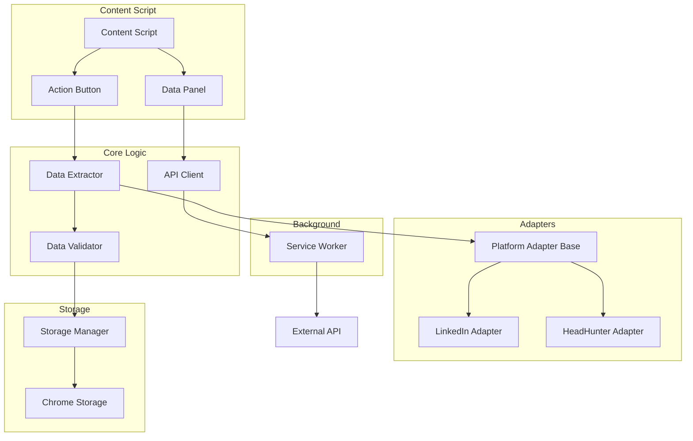

# Документ проектирования: Recruitment Assistant Extension

## Обзор

Recruitment Assistant Extension — это Chrome-расширение для автоматизации работы рекрутеров с профилями кандидатов на различных платформах (LinkedIn, HeadHunter и др.). Расширение использует расширяемую архитектуру с адаптерами для каждой платформы, что позволяет легко добавлять поддержку новых сайтов.

### Ключевые особенности

- Универсальная архитектура с поддержкой множества платформ
- Извлечение структурированных данных о кандидатах
- Интуитивный интерфейс на русском языке
- Экспорт данных в JSON и интеграция с внешними API
- Локальное хранение данных для обеспечения конфиденциальности
- Валидация данных с использованием Zod v4

## Архитектура

### Общая структура

Расширение состоит из следующих основных компонентов:

```
recruitment-assistant-extension/
├── manifest.json                 # Манифест Chrome-расширения
├── src/
│   ├── background/              # Background service worker
│   │   └── service-worker.ts
│   ├── content/                 # Content scripts
│   │   ├── content-script.ts    # Главный content script
│   │   └── ui/                  # UI компоненты для инъекции
│   │       ├── action-button.tsx
│   │       └── data-panel.tsx
│   ├── popup/                   # Popup интерфейс
│   │   ├── popup.tsx
│   │   └── popup.html
│   ├── options/                 # Страница настроек
│   │   ├── options.tsx
│   │   └── options.html
│   ├── adapters/                # Адаптеры для платформ
│   │   ├── base/
│   │   │   └── platform-adapter.ts
│   │   ├── linkedin/
│   │   │   └── linkedin-adapter.ts
│   │   └── headhunter/
│   │       └── headhunter-adapter.ts
│   ├── core/                    # Основная бизнес-логика
│   │   ├── auth-service.ts
│   │   ├── data-extractor.ts
│   │   ├── data-validator.ts
│   │   └── api-client.ts
│   ├── storage/                 # Работа с хранилищем
│   │   └── storage-manager.ts
│   └── shared/                  # Общие утилиты и типы
│       ├── types.ts
│       ├── schemas.ts           # Zod схемы
│       ├── utils.ts
│       ├── error-handler.ts
│       └── logger.ts
└── package.json
```

### Диаграмма компонентов



## Компоненты и интерфейсы

### 0. Authentication Service

Сервис для управления авторизацией пользователя.

```typescript
interface AuthCredentials {
  email: string;
  password: string;
}

interface AuthResponse {
  success: boolean;
  token?: string;
  user?: {
    id: string;
    email: string;
    organizationId: string;
  };
  message?: string;
}

class AuthService {
  private apiUrl: string;
  
  constructor(apiUrl: string) {
    this.apiUrl = apiUrl;
  }
  
  /**
   * Авторизация пользователя
   */
  async login(credentials: AuthCredentials): Promise<AuthResponse> {
    try {
      const response = await fetch(`${this.apiUrl}/api/auth/login`, {
        method: 'POST',
        headers: {
          'Content-Type': 'application/json'
        },
        body: JSON.stringify(credentials)
      });
      
      if (!response.ok) {
        const error = await response.json();
        return {
          success: false,
          message: error.message || 'Ошибка авторизации'
        };
      }
      
      const data = await response.json();
      
      // Сохраняем токен и данные пользователя
      await this.saveAuthData(data.token, data.user);
      
      return {
        success: true,
        token: data.token,
        user: data.user
      };
    } catch (error) {
      console.error('Ошибка авторизации:', error);
      return {
        success: false,
        message: 'Не удалось подключиться к серверу'
      };
    }
  }
  
  /**
   * Выход из учетной записи
   */
  async logout(): Promise<void> {
    await chrome.storage.local.remove(['authToken', 'userData']);
  }
  
  /**
   * Проверка авторизации
   */
  async isAuthenticated(): Promise<boolean> {
    const result = await chrome.storage.local.get('authToken');
    return !!result.authToken;
  }
  
  /**
   * Получение токена
   */
  async getToken(): Promise<string | null> {
    const result = await chrome.storage.local.get('authToken');
    return result.authToken || null;
  }
  
  /**
   * Получение данных пользователя
   */
  async getUserData(): Promise<any | null> {
    const result = await chrome.storage.local.get('userData');
    return result.userData || null;
  }
  
  /**
   * Проверка валидности токена
   */
  async validateToken(): Promise<boolean> {
    const token = await this.getToken();
    if (!token) return false;
    
    try {
      const response = await fetch(`${this.apiUrl}/api/auth/validate`, {
        headers: {
          'Authorization': `Bearer ${token}`
        }
      });
      
      return response.ok;
    } catch {
      return false;
    }
  }
  
  private async saveAuthData(token: string, user: any): Promise<void> {
    await chrome.storage.local.set({
      authToken: token,
      userData: user
    });
  }
}
```

### 1. Platform Adapter (Базовый адаптер)

Абстрактный класс, определяющий интерфейс для адаптеров платформ.

```typescript
interface CandidateData {
  platform: string;
  profileUrl: string;
  basicInfo: {
    fullName: string;
    currentPosition: string;
    location: string;
    photoUrl: string | null;
  };
  experience: ExperienceEntry[];
  education: EducationEntry[];
  skills: string[];
  contacts: ContactInfo;
  extractedAt: Date;
}

interface ExperienceEntry {
  position: string;
  company: string;
  startDate: string;
  endDate: string | null; // null означает "по настоящее время"
  description: string;
}

interface EducationEntry {
  institution: string;
  degree: string;
  fieldOfStudy: string;
  startDate: string;
  endDate: string;
}

interface ContactInfo {
  email: string | null;
  phone: string | null;
  socialLinks: string[];
}

abstract class PlatformAdapter {
  abstract platformName: string;
  abstract isProfilePage(): boolean;
  abstract extractBasicInfo(): BasicInfo;
  abstract extractExperience(): ExperienceEntry[];
  abstract extractEducation(): EducationEntry[];
  abstract extractSkills(): string[];
  abstract extractContacts(): ContactInfo;
  
  extractAll(): CandidateData {
    return {
      platform: this.platformName,
      profileUrl: window.location.href,
      basicInfo: this.extractBasicInfo(),
      experience: this.extractExperience(),
      education: this.extractEducation(),
      skills: this.extractSkills(),
      contacts: this.extractContacts(),
      extractedAt: new Date()
    };
  }
}
```

### 2. LinkedIn Adapter

Реализация адаптера для LinkedIn.

```typescript
class LinkedInAdapter extends PlatformAdapter {
  platformName = 'LinkedIn';
  
  isProfilePage(): boolean {
    return window.location.pathname.startsWith('/in/');
  }
  
  extractBasicInfo(): BasicInfo {
    const nameElement = document.querySelector('h1.text-heading-xlarge');
    const positionElement = document.querySelector('div.text-body-medium');
    const locationElement = document.querySelector('span.text-body-small.inline');
    const photoElement = document.querySelector('img.pv-top-card-profile-picture__image');
    
    return {
      fullName: nameElement?.textContent?.trim() || '',
      currentPosition: positionElement?.textContent?.trim() || '',
      location: locationElement?.textContent?.trim() || '',
      photoUrl: photoElement?.getAttribute('src') || null
    };
  }
  
  extractExperience(): ExperienceEntry[] {
    const experienceSection = document.querySelector('#experience');
    if (!experienceSection) return [];
    
    const entries: ExperienceEntry[] = [];
    const experienceItems = experienceSection.querySelectorAll('li.artdeco-list__item');
    
    experienceItems.forEach(item => {
      const position = item.querySelector('div.display-flex span[aria-hidden="true"]')?.textContent?.trim() || '';
      const company = item.querySelector('span.t-14.t-normal span[aria-hidden="true"]')?.textContent?.trim() || '';
      const dateRange = item.querySelector('span.t-14.t-normal.t-black--light span[aria-hidden="true"]')?.textContent?.trim() || '';
      const description = item.querySelector('div.display-flex.full-width span[aria-hidden="true"]')?.textContent?.trim() || '';
      
      const [startDate, endDate] = this.parseDateRange(dateRange);
      
      entries.push({
        position,
        company,
        startDate,
        endDate,
        description
      });
    });
    
    return entries;
  }
  
  extractEducation(): EducationEntry[] {
    const educationSection = document.querySelector('#education');
    if (!educationSection) return [];
    
    const entries: EducationEntry[] = [];
    const educationItems = educationSection.querySelectorAll('li.artdeco-list__item');
    
    educationItems.forEach(item => {
      const institution = item.querySelector('div.display-flex span[aria-hidden="true"]')?.textContent?.trim() || '';
      const degree = item.querySelector('span.t-14.t-normal span[aria-hidden="true"]')?.textContent?.trim() || '';
      const fieldOfStudy = item.querySelector('span.t-14.t-normal.t-black--light span[aria-hidden="true"]')?.textContent?.trim() || '';
      const dateRange = item.querySelector('span.t-14.t-normal.t-black--light:nth-of-type(2) span[aria-hidden="true"]')?.textContent?.trim() || '';
      
      const [startDate, endDate] = this.parseDateRange(dateRange);
      
      entries.push({
        institution,
        degree,
        fieldOfStudy,
        startDate,
        endDate: endDate || ''
      });
    });
    
    return entries;
  }
  
  extractSkills(): string[] {
    const skillsSection = document.querySelector('#skills');
    if (!skillsSection) return [];
    
    const skills: string[] = [];
    const skillItems = skillsSection.querySelectorAll('span[aria-hidden="true"]');
    
    skillItems.forEach(item => {
      const skill = item.textContent?.trim();
      if (skill) skills.push(skill);
    });
    
    return skills;
  }
  
  extractContacts(): ContactInfo {
    const contactSection = document.querySelector('section.pv-contact-info');
    
    const emailElement = contactSection?.querySelector('a[href^="mailto:"]');
    const phoneElement = contactSection?.querySelector('span.t-14.t-black.t-normal');
    const socialLinks: string[] = [];
    
    contactSection?.querySelectorAll('a[href^="http"]').forEach(link => {
      const href = link.getAttribute('href');
      if (href && !href.includes('linkedin.com')) {
        socialLinks.push(href);
      }
    });
    
    return {
      email: emailElement?.getAttribute('href')?.replace('mailto:', '') || null,
      phone: phoneElement?.textContent?.trim() || null,
      socialLinks
    };
  }
  
  private parseDateRange(dateRange: string): [string, string | null] {
    const parts = dateRange.split('–').map(p => p.trim());
    const startDate = parts[0] || '';
    const endDate = parts[1]?.toLowerCase().includes('настоящ') ? null : (parts[1] || null);
    return [startDate, endDate];
  }
}


### 3. HeadHunter Adapter

Реализация адаптера для HeadHunter (hh.ru).

```typescript
class HeadHunterAdapter extends PlatformAdapter {
  platformName = 'HeadHunter';
  
  isProfilePage(): boolean {
    return window.location.hostname.includes('hh.ru') && 
           window.location.pathname.startsWith('/resume/');
  }
  
  extractBasicInfo(): BasicInfo {
    const nameElement = document.querySelector('[data-qa="resume-personal-name"]');
    const positionElement = document.querySelector('[data-qa="resume-block-title-position"]');
    const locationElement = document.querySelector('[data-qa="resume-personal-address"]');
    const photoElement = document.querySelector('[data-qa="resume-photo"] img');
    
    return {
      fullName: nameElement?.textContent?.trim() || '',
      currentPosition: positionElement?.textContent?.trim() || '',
      location: locationElement?.textContent?.trim() || '',
      photoUrl: photoElement?.getAttribute('src') || null
    };
  }
  
  extractExperience(): ExperienceEntry[] {
    const experienceItems = document.querySelectorAll('[data-qa="resume-block-experience-item"]');
    const entries: ExperienceEntry[] = [];
    
    experienceItems.forEach(item => {
      const position = item.querySelector('[data-qa="resume-block-experience-position"]')?.textContent?.trim() || '';
      const company = item.querySelector('[data-qa="resume-block-experience-company"]')?.textContent?.trim() || '';
      const dateRange = item.querySelector('[data-qa="resume-block-experience-date"]')?.textContent?.trim() || '';
      const description = item.querySelector('[data-qa="resume-block-experience-description"]')?.textContent?.trim() || '';
      
      const [startDate, endDate] = this.parseDateRange(dateRange);
      
      entries.push({
        position,
        company,
        startDate,
        endDate,
        description
      });
    });
    
    return entries;
  }

  
  extractEducation(): EducationEntry[] {
    const educationItems = document.querySelectorAll('[data-qa="resume-block-education-item"]');
    const entries: EducationEntry[] = [];
    
    educationItems.forEach(item => {
      const institution = item.querySelector('[data-qa="resume-block-education-name"]')?.textContent?.trim() || '';
      const degree = item.querySelector('[data-qa="resume-block-education-organization"]')?.textContent?.trim() || '';
      const fieldOfStudy = item.querySelector('[data-qa="resume-block-education-description"]')?.textContent?.trim() || '';
      const year = item.querySelector('[data-qa="resume-block-education-year"]')?.textContent?.trim() || '';
      
      entries.push({
        institution,
        degree,
        fieldOfStudy,
        startDate: '',
        endDate: year
      });
    });
    
    return entries;
  }
  
  extractSkills(): string[] {
    const skillsContainer = document.querySelector('[data-qa="skills-table"]');
    if (!skillsContainer) return [];
    
    const skills: string[] = [];
    const skillElements = skillsContainer.querySelectorAll('[data-qa="bloko-tag__text"]');
    
    skillElements.forEach(element => {
      const skill = element.textContent?.trim();
      if (skill) skills.push(skill);
    });
    
    return skills;
  }
  
  extractContacts(): ContactInfo {
    const email = document.querySelector('[data-qa="resume-contact-email"]')?.textContent?.trim() || null;
    const phone = document.querySelector('[data-qa="resume-contact-phone"]')?.textContent?.trim() || null;
    
    const socialLinks: string[] = [];
    document.querySelectorAll('[data-qa="resume-contact-site"] a').forEach(link => {
      const href = link.getAttribute('href');
      if (href) socialLinks.push(href);
    });
    
    return {
      email,
      phone,
      socialLinks
    };
  }
  
  private parseDateRange(dateRange: string): [string, string | null] {
    const parts = dateRange.split('—').map(p => p.trim());
    const startDate = parts[0] || '';
    const endDate = parts[1]?.toLowerCase().includes('настоящ') ? null : (parts[1] || null);
    return [startDate, endDate];
  }
}
```


### 4. Data Extractor

Координирует процесс извлечения данных, выбирая подходящий адаптер.

```typescript
class DataExtractor {
  private adapters: Map<string, PlatformAdapter>;
  
  constructor() {
    this.adapters = new Map([
      ['linkedin', new LinkedInAdapter()],
      ['headhunter', new HeadHunterAdapter()]
    ]);
  }
  
  detectPlatform(): PlatformAdapter | null {
    for (const adapter of this.adapters.values()) {
      if (adapter.isProfilePage()) {
        return adapter;
      }
    }
    return null;
  }
  
  async extract(): Promise<CandidateData | null> {
    const adapter = this.detectPlatform();
    if (!adapter) {
      throw new Error('Неподдерживаемая платформа или страница не является профилем кандидата');
    }
    
    try {
      const data = adapter.extractAll();
      return data;
    } catch (error) {
      console.error('Ошибка при извлечении данных:', error);
      throw new Error('Не удалось извлечь данные профиля');
    }
  }
}
```

### 5. Data Validator

Валидирует извлеченные данные с использованием Zod v4.

```typescript
import { z } from 'zod';

const ExperienceEntrySchema = z.object({
  position: z.string(),
  company: z.string(),
  startDate: z.string(),
  endDate: z.string().nullable(),
  description: z.string()
});

const EducationEntrySchema = z.object({
  institution: z.string(),
  degree: z.string(),
  fieldOfStudy: z.string(),
  startDate: z.string(),
  endDate: z.string()
});

const ContactInfoSchema = z.object({
  email: z.string().email().nullable(),
  phone: z.string().nullable(),
  socialLinks: z.array(z.string().url())
});

const CandidateDataSchema = z.object({
  platform: z.string(),
  profileUrl: z.string().url(),
  basicInfo: z.object({
    fullName: z.string().min(1, 'Имя обязательно'),
    currentPosition: z.string(),
    location: z.string(),
    photoUrl: z.string().url().nullable()
  }),
  experience: z.array(ExperienceEntrySchema),
  education: z.array(EducationEntrySchema),
  skills: z.array(z.string()),
  contacts: ContactInfoSchema,
  extractedAt: z.date()
});

class DataValidator {
  validate(data: unknown): CandidateData {
    return CandidateDataSchema.parse(data);
  }
  
  validatePartial(data: unknown): Partial<CandidateData> {
    const result = CandidateDataSchema.safeParse(data);
    if (result.success) {
      return result.data;
    }
    
    // Возвращаем частично валидные данные
    return data as Partial<CandidateData>;
  }
}
```


### 6. Storage Manager

Управляет локальным хранилищем данных в Chrome.

```typescript
class StorageManager {
  async saveCandidate(data: CandidateData): Promise<void> {
    const key = `candidate_${Date.now()}`;
    await chrome.storage.local.set({ [key]: data });
  }
  
  async getSettings(): Promise<Settings> {
    const result = await chrome.storage.local.get('settings');
    return result.settings || this.getDefaultSettings();
  }
  
  async saveSettings(settings: Settings): Promise<void> {
    await chrome.storage.local.set({ settings });
  }
  
  async clearTemporaryData(): Promise<void> {
    const keys = await chrome.storage.local.get(null);
    const tempKeys = Object.keys(keys).filter(k => k.startsWith('temp_'));
    await chrome.storage.local.remove(tempKeys);
  }
  
  private getDefaultSettings(): Settings {
    return {
      apiUrl: '',
      apiToken: '',
      organizationId: '',
      fieldsToExtract: {
        basicInfo: true,
        experience: true,
        education: true,
        skills: true,
        contacts: true
      }
    };
  }
}

interface Settings {
  apiUrl: string;
  apiToken: string;
  fieldsToExtract: {
    basicInfo: boolean;
    experience: boolean;
    education: boolean;
    skills: boolean;
    contacts: boolean;
  };
}
```

### 7. API Client

Отправляет данные в систему управления кандидатами.

```typescript
interface ImportCandidateRequest {
  candidate: {
    fullName: string;
    firstName?: string;
    lastName?: string;
    email?: string;
    phone?: string;
    location?: string;
    headline?: string;
    photoUrl?: string;
    skills?: string[];
    experienceYears?: number;
    profileData?: {
      experience: Array<{
        position: string;
        company: string;
        startDate: string;
        endDate: string | null;
        description: string;
      }>;
      education: Array<{
        institution: string;
        degree: string;
        fieldOfStudy: string;
        startDate: string;
        endDate: string;
      }>;
    };
    source: 'SOURCING';
    originalSource: 'LINKEDIN' | 'HEADHUNTER';
    parsingStatus: 'COMPLETED';
  };
  organizationId: string;
}

interface ImportCandidateResponse {
  success: boolean;
  candidateId?: string;
  candidateOrganizationId?: string;
  message?: string;
}

class ApiClient {
  private settings: Settings;
  
  constructor(settings: Settings) {
    this.settings = settings;
  }
  
  /**
   * Импортирует кандидата в глобальную базу с привязкой к организации
   */
  async importCandidate(
    data: CandidateData,
    organizationId: string
  ): Promise<ImportCandidateResponse> {
    if (!this.settings.apiUrl || !this.settings.apiToken) {
      throw new Error('API не настроен');
    }
    
    // Преобразуем данные в формат для импорта
    const request: ImportCandidateRequest = {
      candidate: {
        fullName: data.basicInfo.fullName,
        firstName: this.extractFirstName(data.basicInfo.fullName),
        lastName: this.extractLastName(data.basicInfo.fullName),
        email: data.contacts.email || undefined,
        phone: data.contacts.phone || undefined,
        location: data.basicInfo.location,
        headline: data.basicInfo.currentPosition,
        photoUrl: data.basicInfo.photoUrl || undefined,
        skills: data.skills,
        experienceYears: this.calculateExperienceYears(data.experience),
        profileData: {
          experience: data.experience,
          education: data.education
        },
        source: 'SOURCING',
        originalSource: this.mapPlatformToSource(data.platform),
        parsingStatus: 'COMPLETED'
      },
      organizationId
    };
    
    const response = await fetch(`${this.settings.apiUrl}/api/candidates/import`, {
      method: 'POST',
      headers: {
        'Content-Type': 'application/json',
        'Authorization': `Bearer ${this.settings.apiToken}`
      },
      body: JSON.stringify(request)
    });
    
    if (!response.ok) {
      const error = await response.json();
      throw new Error(`Ошибка импорта кандидата: ${error.message || response.statusText}`);
    }
    
    return await response.json();
  }
  
  async testConnection(): Promise<boolean> {
    try {
      const response = await fetch(`${this.settings.apiUrl}/api/health`, {
        headers: {
          'Authorization': `Bearer ${this.settings.apiToken}`
        }
      });
      return response.ok;
    } catch {
      return false;
    }
  }
  
  private extractFirstName(fullName: string): string {
    const parts = fullName.trim().split(/\s+/);
    return parts[0] || '';
  }
  
  private extractLastName(fullName: string): string {
    const parts = fullName.trim().split(/\s+/);
    return parts.length > 1 ? parts[parts.length - 1] : '';
  }
  
  private calculateExperienceYears(experience: ExperienceEntry[]): number {
    if (experience.length === 0) return 0;
    
    const totalMonths = experience.reduce((sum, entry) => {
      const start = new Date(entry.startDate);
      const end = entry.endDate ? new Date(entry.endDate) : new Date();
      const months = (end.getFullYear() - start.getFullYear()) * 12 + 
                     (end.getMonth() - start.getMonth());
      return sum + Math.max(0, months);
    }, 0);
    
    return Math.floor(totalMonths / 12);
  }
  
  private mapPlatformToSource(platform: string): 'LINKEDIN' | 'HEADHUNTER' {
    const platformLower = platform.toLowerCase();
    if (platformLower.includes('linkedin')) return 'LINKEDIN';
    if (platformLower.includes('headhunter') || platformLower.includes('hh')) return 'HEADHUNTER';
    return 'LINKEDIN'; // По умолчанию
  }
}
```


### 8. UI Components

#### Login Form

Форма авторизации для входа в систему.

```typescript
interface LoginFormProps {
  onLogin: (credentials: AuthCredentials) => Promise<void>;
  isLoading: boolean;
  error: string | null;
}

function LoginForm({ onLogin, isLoading, error }: LoginFormProps) {
  const [email, setEmail] = useState('');
  const [password, setPassword] = useState('');
  
  const handleSubmit = async (e: React.FormEvent) => {
    e.preventDefault();
    await onLogin({ email, password });
  };
  
  return (
    <form onSubmit={handleSubmit} aria-label="Форма входа">
      <div>
        <label htmlFor="email">Электронная почта</label>
        <input
          id="email"
          type="email"
          name="email"
          autoComplete="email"
          value={email}
          onChange={(e) => setEmail(e.target.value)}
          disabled={isLoading}
          required
          style={{ fontSize: '16px' }}
          placeholder="example@company.com"
        />
      </div>
      
      <div>
        <label htmlFor="password">Пароль</label>
        <input
          id="password"
          type="password"
          name="password"
          autoComplete="current-password"
          value={password}
          onChange={(e) => setPassword(e.target.value)}
          disabled={isLoading}
          required
          style={{ fontSize: '16px' }}
        />
      </div>
      
      {error && (
        <div role="alert" aria-live="polite" style={{ color: 'red' }}>
          {error}
        </div>
      )}
      
      <button
        type="submit"
        disabled={isLoading}
        style={{
          minWidth: '44px',
          minHeight: '44px',
          touchAction: 'manipulation'
        }}
      >
        {isLoading ? 'Вход в систему…' : 'Войти'}
      </button>
    </form>
  );
}
```

#### Action Button

Кнопка для запуска процесса извлечения данных.

```typescript
interface ActionButtonProps {
  onExtract: () => void;
  isLoading: boolean;
}

function ActionButton({ onExtract, isLoading }: ActionButtonProps) {
  return (
    <button
      onClick={onExtract}
      disabled={isLoading}
      aria-label="Извлечь данные профиля"
      style={{
        minWidth: '44px',
        minHeight: '44px',
        touchAction: 'manipulation'
      }}
    >
      {isLoading ? 'Извлечение данных…' : 'Извлечь данные'}
    </button>
  );
}
```

#### Data Panel

Панель для отображения и редактирования извлеченных данных.

```typescript
interface DataPanelProps {
  data: CandidateData | null;
  onEdit: (field: string, value: any) => void;
  onExport: (format: 'json' | 'clipboard') => void;
  onImportToSystem: () => void;
  apiConfigured: boolean;
}

function DataPanel({ data, onEdit, onExport, onImportToSystem, apiConfigured }: DataPanelProps) {
  if (!data) return null;
  
  return (
    <div role="region" aria-label="Данные кандидата">
      <section>
        <h2>Основная информация</h2>
        <EditableField
          label="Полное имя"
          value={data.basicInfo.fullName}
          onChange={(v) => onEdit('basicInfo.fullName', v)}
        />
        <EditableField
          label="Текущая должность"
          value={data.basicInfo.currentPosition}
          onChange={(v) => onEdit('basicInfo.currentPosition', v)}
        />
        <EditableField
          label="Местоположение"
          value={data.basicInfo.location}
          onChange={(v) => onEdit('basicInfo.location', v)}
        />
      </section>
      
      <section>
        <h2>Опыт работы</h2>
        {data.experience.map((exp, idx) => (
          <ExperienceCard
            key={idx}
            experience={exp}
            onEdit={(field, value) => onEdit(`experience.${idx}.${field}`, value)}
          />
        ))}
      </section>
      
      <section>
        <h2>Образование</h2>
        {data.education.map((edu, idx) => (
          <EducationCard
            key={idx}
            education={edu}
            onEdit={(field, value) => onEdit(`education.${idx}.${field}`, value)}
          />
        ))}
      </section>
      
      <section>
        <h2>Навыки</h2>
        <SkillsList
          skills={data.skills}
          onEdit={(skills) => onEdit('skills', skills)}
        />
      </section>
      
      <section>
        <h2>Контакты</h2>
        <ContactInfo
          contacts={data.contacts}
          onEdit={(field, value) => onEdit(`contacts.${field}`, value)}
        />
      </section>
      
      <footer>
        <button onClick={() => onExport('json')}>
          Экспортировать в JSON
        </button>
        <button onClick={() => onExport('clipboard')}>
          Скопировать в буфер обмена
        </button>
        {apiConfigured && (
          <button onClick={onImportToSystem}>
            Импортировать в систему
          </button>
        )}
      </footer>
    </div>
  );
}
```


## Модели данных

### CandidateData

Полная структура данных кандидата:

```typescript
interface CandidateData {
  platform: string;              // Название платформы (LinkedIn, HeadHunter)
  profileUrl: string;            // URL профиля
  basicInfo: BasicInfo;          // Базовая информация
  experience: ExperienceEntry[]; // Опыт работы
  education: EducationEntry[];   // Образование
  skills: string[];              // Навыки
  contacts: ContactInfo;         // Контактная информация
  extractedAt: Date;             // Время извлечения
}

interface BasicInfo {
  fullName: string;              // Полное имя
  currentPosition: string;       // Текущая должность
  location: string;              // Местоположение
  photoUrl: string | null;       // URL фотографии профиля
}

interface ExperienceEntry {
  position: string;              // Должность
  company: string;               // Название компании
  startDate: string;             // Дата начала работы
  endDate: string | null;        // Дата окончания (null = по настоящее время)
  description: string;           // Описание обязанностей
}

interface EducationEntry {
  institution: string;           // Учебное заведение
  degree: string;                // Степень/квалификация
  fieldOfStudy: string;          // Специальность
  startDate: string;             // Дата начала обучения
  endDate: string;               // Дата окончания обучения
}

interface ContactInfo {
  email: string | null;          // Электронная почта
  phone: string | null;          // Номер телефона
  socialLinks: string[];         // Ссылки на социальные сети
}
```

### Settings

Настройки расширения:

```typescript
interface Settings {
  apiUrl: string;                // URL внешнего API
  apiToken: string;              // Токен аутентификации
  organizationId: string;        // ID организации для привязки кандидатов
  fieldsToExtract: {             // Какие поля извлекать
    basicInfo: boolean;
    experience: boolean;
    education: boolean;
    skills: boolean;
    contacts: boolean;
  };
}
```


## Свойства корректности

Свойство — это характеристика или поведение, которое должно выполняться во всех валидных сценариях работы системы. Свойства служат мостом между человекочитаемыми спецификациями и машинно-проверяемыми гарантиями корректности.

### Свойство 1: Определение платформы профиля

*Для любого* URL страницы, если это страница профиля на поддерживаемой платформе (LinkedIn, HeadHunter), то метод `isProfilePage()` соответствующего адаптера должен вернуть `true`, а для всех остальных URL должен вернуть `false`.

**Валидирует: Требования 1.1, 1.2**

### Свойство 2: Извлечение базовой информации

*Для любого* профиля кандидата на поддерживаемой платформе, извлечение данных должно вернуть объект с заполненными полями `fullName`, `currentPosition`, `location` и `photoUrl` (или `null` для `photoUrl`, если фото отсутствует).

**Валидирует: Требования 2.1, 2.2, 2.3, 2.4**

### Свойство 3: Извлечение всех записей опыта работы

*Для любого* профиля кандидата, количество извлеченных записей об опыте работы должно соответствовать количеству записей, отображаемых на странице профиля, и каждая запись должна содержать поля `position`, `company`, `startDate`, `endDate` и `description`.

**Валидирует: Требования 3.1, 3.2**

### Свойство 4: Извлечение всех записей образования

*Для любого* профиля кандидата, количество извлеченных записей об образовании должно соответствовать количеству записей, отображаемых на странице профиля, и каждая запись должна содержать поля `institution`, `degree`, `fieldOfStudy`, `startDate` и `endDate`.

**Валидирует: Требования 4.1, 4.2**

### Свойство 5: Сохранение хронологического порядка

*Для любого* профиля кандидата, порядок записей в извлеченных данных (опыт работы, образование, навыки) должен соответствовать порядку их отображения на странице профиля.

**Валидирует: Требования 3.4, 4.3, 5.2**

### Свойство 6: Извлечение навыков

*Для любого* профиля кандидата, все навыки, отображаемые в разделе навыков на странице, должны быть извлечены и включены в результирующий массив `skills`.

**Валидирует: Требования 5.1**

### Свойство 7: Извлечение контактной информации

*Для любого* профиля кандидата, если контактная информация (email, телефон, социальные ссылки) доступна на странице, она должна быть извлечена и включена в объект `contacts`.

**Валидирует: Требования 6.1, 6.2, 6.3**

### Свойство 8: Валидность экспортируемых данных

*Для любых* извлеченных данных кандидата, экспорт в JSON должен производить валидный JSON, который можно распарсить обратно в эквивалентный объект `CandidateData`.

**Валидирует: Требования 8.1, 8.3**

### Свойство 9: Включение токена аутентификации

*Для любого* запроса к внешнему API, если интеграция настроена, заголовок `Authorization` должен содержать токен в формате `Bearer {token}`.

**Валидирует: Требования 9.2**

### Свойство 10: Корректность импорта кандидата

*Для любых* извлеченных данных кандидата, импорт в систему должен создать запись в `global_candidates` и связать её с организацией через `candidate_organizations`.

**Валидирует: Требования 9.1**

### Свойство 11: Сохранение частичных данных при ошибке

*Для любого* профиля, если во время извлечения данных происходит ошибка, все успешно извлеченные до момента ошибки данные должны быть сохранены и доступны пользователю.

**Валидирует: Требования 10.3**

### Свойство 12: Использование HTTPS для API

*Для любого* запроса к внешнему API, URL должен использовать протокол HTTPS.

**Валидирует: Требования 12.3**

### Свойство 13: Очистка временных данных

*Для любой* сессии работы с расширением, после закрытия панели данных все временные данные (с префиксом `temp_`) должны быть удалены из хранилища Chrome.

**Валидирует: Требования 12.5**

### Свойство 14: Round-trip сохранения настроек

*Для любых* валидных настроек, сохранение настроек в хранилище Chrome и последующее их чтение должно вернуть эквивалентный объект настроек.

**Валидирует: Требования 13.4**

### Свойство 15: Валидация настроек

*Для любых* настроек API, перед сохранением они должны пройти валидацию через Zod-схему, и только валидные настройки должны быть сохранены.

**Валидирует: Требования 13.5**

### Свойство 16: Форматирование дат по русским стандартам

*Для любой* даты в извлеченных данных, при отображении в UI она должна быть отформатирована согласно русским локальным стандартам (например, "01.12.2023" вместо "12/01/2023").

**Валидирует: Требования 14.5**


## Обработка ошибок

### Типы ошибок

1. **Ошибки парсинга DOM**
   - Причина: Изменение структуры страницы платформой
   - Обработка: Сохранение частично извлеченных данных, отображение сообщения об ошибке
   - Сообщение: "Не удалось извлечь некоторые данные. Структура страницы могла измениться."

2. **Ошибки валидации**
   - Причина: Извлеченные данные не соответствуют схеме
   - Обработка: Логирование ошибки, попытка сохранить валидные части данных
   - Сообщение: "Данные не прошли проверку. Некоторые поля могут быть недоступны."

3. **Сетевые ошибки**
   - Причина: Проблемы с подключением к внешнему API
   - Обработка: Отображение сообщения об ошибке, предложение повторить попытку
   - Сообщение: "Не удалось подключиться к системе. Проверьте подключение к интернету."

4. **Ошибки аутентификации API**
   - Причина: Неверный или истекший токен
   - Обработка: Отображение сообщения об ошибке, предложение проверить настройки
   - Сообщение: "Ошибка аутентификации. Проверьте настройки API в параметрах расширения."

5. **Ошибки конфигурации**
   - Причина: Отсутствие или неверные настройки
   - Обработка: Отображение сообщения с инструкциями
   - Сообщение: "API не настроен. Перейдите в настройки расширения для конфигурации."

### Стратегия обработки

```typescript
class ErrorHandler {
  handleExtractionError(error: Error, partialData: Partial<CandidateData>): void {
    console.error('Ошибка извлечения данных:', error);
    
    // Сохраняем частичные данные
    if (Object.keys(partialData).length > 0) {
      this.savePartialData(partialData);
    }
    
    // Показываем уведомление пользователю
    this.showNotification({
      type: 'error',
      message: 'Не удалось извлечь некоторые данные. Структура страницы могла измениться.',
      action: {
        label: 'Повторить',
        callback: () => this.retryExtraction()
      }
    });
  }
  
  handleApiError(error: Error): void {
    console.error('Ошибка API:', error);
    
    if (error.message.includes('401') || error.message.includes('403')) {
      this.showNotification({
        type: 'error',
        message: 'Ошибка аутентификации. Проверьте настройки API в параметрах расширения.',
        action: {
          label: 'Открыть настройки',
          callback: () => chrome.runtime.openOptionsPage()
        }
      });
    } else if (error.message.includes('network')) {
      this.showNotification({
        type: 'error',
        message: 'Не удалось подключиться к системе. Проверьте подключение к интернету.',
        action: {
          label: 'Повторить',
          callback: () => this.retryApiCall()
        }
      });
    } else {
      this.showNotification({
        type: 'error',
        message: `Ошибка отправки данных: ${error.message}`
      });
    }
  }
  
  handleValidationError(error: z.ZodError): void {
    console.error('Ошибка валидации:', error);
    
    this.showNotification({
      type: 'warning',
      message: 'Данные не прошли проверку. Некоторые поля могут быть недоступны.'
    });
  }
}
```

### Логирование

Все ошибки логируются в консоль браузера с подробной информацией для отладки:

```typescript
interface ErrorLog {
  timestamp: Date;
  type: 'extraction' | 'validation' | 'network' | 'api' | 'config';
  message: string;
  stack?: string;
  context?: any;
}

class Logger {
  log(error: Error, type: ErrorLog['type'], context?: any): void {
    const log: ErrorLog = {
      timestamp: new Date(),
      type,
      message: error.message,
      stack: error.stack,
      context
    };
    
    console.error('[Recruitment Assistant]', log);
    
    // Опционально: отправка логов в систему мониторинга
    if (this.isMonitoringEnabled()) {
      this.sendToMonitoring(log);
    }
  }
}
```


## Стратегия тестирования

### Подход к тестированию

Расширение использует двойной подход к тестированию:

1. **Unit-тесты**: Проверяют конкретные примеры, граничные случаи и условия ошибок
2. **Property-based тесты**: Проверяют универсальные свойства на множестве сгенерированных входных данных

Оба типа тестов дополняют друг друга и необходимы для комплексного покрытия.

### Библиотека для property-based тестирования

Для TypeScript будет использоваться библиотека **fast-check**.

### Конфигурация тестов

- Каждый property-based тест должен выполнять минимум 100 итераций
- Каждый тест должен ссылаться на свойство из документа проектирования
- Формат тега: `Feature: linkedin-parser-extension, Property {номер}: {текст свойства}`

### Примеры тестов

#### Unit-тесты

```typescript
describe('LinkedInAdapter', () => {
  describe('isProfilePage', () => {
    it('должен вернуть true для URL профиля LinkedIn', () => {
      // Arrange
      Object.defineProperty(window, 'location', {
        value: { pathname: '/in/john-doe/' }
      });
      const adapter = new LinkedInAdapter();
      
      // Act
      const result = adapter.isProfilePage();
      
      // Assert
      expect(result).toBe(true);
    });
    
    it('должен вернуть false для URL не-профиля', () => {
      Object.defineProperty(window, 'location', {
        value: { pathname: '/feed/' }
      });
      const adapter = new LinkedInAdapter();
      
      const result = adapter.isProfilePage();
      
      expect(result).toBe(false);
    });
  });
  
  describe('extractBasicInfo', () => {
    it('должен извлечь базовую информацию из профиля', () => {
      // Arrange
      document.body.innerHTML = `
        <h1 class="text-heading-xlarge">Иван Иванов</h1>
        <div class="text-body-medium">Senior Developer</div>
        <span class="text-body-small inline">Москва, Россия</span>
        
      `;
      const adapter = new LinkedInAdapter();
      
      // Act
      const result = adapter.extractBasicInfo();
      
      // Assert
      expect(result.fullName).toBe('Иван Иванов');
      expect(result.currentPosition).toBe('Senior Developer');
      expect(result.location).toBe('Москва, Россия');
      expect(result.photoUrl).toBe('https://example.com/photo.jpg');
    });
    
    it('должен обработать отсутствие фотографии', () => {
      document.body.innerHTML = `
        <h1 class="text-heading-xlarge">Иван Иванов</h1>
        <div class="text-body-medium">Senior Developer</div>
        <span class="text-body-small inline">Москва, Россия</span>
      `;
      const adapter = new LinkedInAdapter();
      
      const result = adapter.extractBasicInfo();
      
      expect(result.photoUrl).toBeNull();
    });
  });
});
```

#### Property-based тесты

```typescript
import fc from 'fast-check';

describe('Property-based tests', () => {
  // Feature: linkedin-parser-extension, Property 8: Валидность экспортируемых данных
  it('экспорт в JSON должен производить валидный JSON для любых данных', () => {
    fc.assert(
      fc.property(
        candidateDataArbitrary(),
        (data) => {
          // Arrange
          const exporter = new DataExporter();
          
          // Act
          const json = exporter.exportToJSON(data);
          const parsed = JSON.parse(json);
          
          // Assert
          expect(parsed).toEqual(data);
        }
      ),
      { numRuns: 100 }
    );
  });
  
  // Feature: linkedin-parser-extension, Property 13: Round-trip сохранения настроек
  it('сохранение и чтение настроек должно вернуть эквивалентный объект', async () => {
    fc.assert(
      fc.asyncProperty(
        settingsArbitrary(),
        async (settings) => {
          // Arrange
          const storage = new StorageManager();
          
          // Act
          await storage.saveSettings(settings);
          const retrieved = await storage.getSettings();
          
          // Assert
          expect(retrieved).toEqual(settings);
        }
      ),
      { numRuns: 100 }
    );
  });
  
  // Feature: linkedin-parser-extension, Property 14: Валидация настроек
  it('только валидные настройки должны проходить валидацию', () => {
    fc.assert(
      fc.property(
        fc.record({
          apiUrl: fc.webUrl(),
          apiToken: fc.string({ minLength: 10 }),
          fieldsToExtract: fc.record({
            basicInfo: fc.boolean(),
            experience: fc.boolean(),
            education: fc.boolean(),
            skills: fc.boolean(),
            contacts: fc.boolean()
          })
        }),
        (settings) => {
          // Arrange
          const validator = new DataValidator();
          
          // Act & Assert
          expect(() => validator.validateSettings(settings)).not.toThrow();
        }
      ),
      { numRuns: 100 }
    );
  });
});

// Генераторы для property-based тестов
function candidateDataArbitrary() {
  return fc.record({
    platform: fc.constantFrom('LinkedIn', 'HeadHunter'),
    profileUrl: fc.webUrl(),
    basicInfo: fc.record({
      fullName: fc.string({ minLength: 1 }),
      currentPosition: fc.string(),
      location: fc.string(),
      photoUrl: fc.option(fc.webUrl())
    }),
    experience: fc.array(experienceEntryArbitrary()),
    education: fc.array(educationEntryArbitrary()),
    skills: fc.array(fc.string()),
    contacts: contactInfoArbitrary(),
    extractedAt: fc.date()
  });
}

function experienceEntryArbitrary() {
  return fc.record({
    position: fc.string({ minLength: 1 }),
    company: fc.string({ minLength: 1 }),
    startDate: fc.string(),
    endDate: fc.option(fc.string()),
    description: fc.string()
  });
}

function educationEntryArbitrary() {
  return fc.record({
    institution: fc.string({ minLength: 1 }),
    degree: fc.string(),
    fieldOfStudy: fc.string(),
    startDate: fc.string(),
    endDate: fc.string()
  });
}

function contactInfoArbitrary() {
  return fc.record({
    email: fc.option(fc.emailAddress()),
    phone: fc.option(fc.string()),
    socialLinks: fc.array(fc.webUrl())
  });
}

function settingsArbitrary() {
  return fc.record({
    apiUrl: fc.webUrl(),
    apiToken: fc.string({ minLength: 10 }),
    fieldsToExtract: fc.record({
      basicInfo: fc.boolean(),
      experience: fc.boolean(),
      education: fc.boolean(),
      skills: fc.boolean(),
      contacts: fc.boolean()
    })
  });
}
```

### Покрытие тестами

- **Адаптеры платформ**: Unit-тесты для каждого метода извлечения, property-based тесты для проверки инвариантов
- **Валидация данных**: Property-based тесты для проверки схем Zod
- **Хранилище**: Property-based тесты для round-trip операций
- **API клиент**: Unit-тесты для обработки ошибок, integration тесты для реальных запросов
- **UI компоненты**: Unit-тесты для рендеринга и взаимодействия

### Граничные случаи

Следующие граничные случаи должны быть покрыты unit-тестами:

1. Профиль без фотографии
2. Профиль без контактной информации
3. Профиль с текущей работой (endDate = null)
4. Профиль с пустым списком навыков
5. Профиль с отсутствующими описаниями в опыте работы
6. Профиль с неполными данными об образовании
7. Пустой ответ от API
8. Невалидный токен API
9. Сетевые ошибки при отправке данных
10. Изменение структуры DOM страницы
