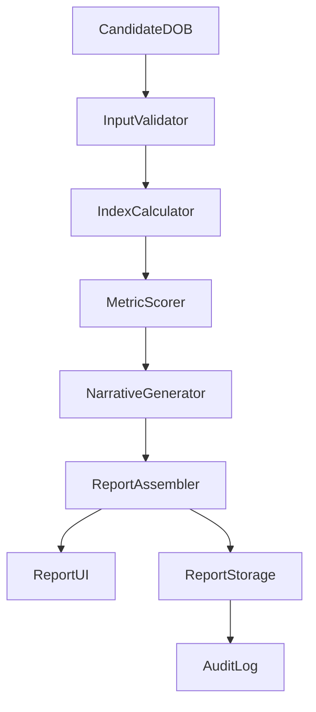

# Requirements Document: Meta-Match — Multi-Factor Forecasting

## Introduction

Meta-Match — рекомендательный модуль оценки кандидата по трем уровням: Hard Skills, Soft Skills и Chronobiological Fit. Модуль не заменяет решение рекрутера, а добавляет дополнительный слой сигналов и аккуратно объясняет, как они интерпретируются в контексте найма.

Главная задача — повысить уверенность в решениях и создать дифференциацию продукта на рынке без прямого принуждения к автоматическим отказам.

## Goals and Scope

- Повысить качество и скорость принятия решений о найме за счет дополнительного «прогностического» слоя.
- Дать HR и руководителю простые метрики совместимости и рисков на языке бизнеса.
- Сохранить рекомендательный статус и избежать дискриминационных выводов.

### Out of Scope (v1)
- Автоматические решения о найме на основе Chronobiological Fit.
- Расчет конфликтов с датой регистрации компании и датой рождения руководителя.
- Командный биоритмический баланс, если нет агрегированных данных по команде.

## Target Users

- HRD / Head of Talent: принимает решения о включении кандидата в шортлист.
- Руководитель подразделения: получает объяснения рисков и «окна эффективности».
- Рекрутер: использует как дополнительный аргумент в коммуникации с руководителем.

## Inputs and Data Constraints

### Required Inputs (v1)
- Дата рождения кандидата (из анкеты или документов).

### Optional Inputs (v2+)
- Дата регистрации компании.
- Дата рождения руководителя.
- Агрегированные данные по команде (сезон рождения, профильные индексы).

## Outputs and Artifacts

- **Card Summary** с ключевыми метриками (0–10):
  - Коэффициент синергии
  - Темпоральный резонанс
  - Риск конфликтных циклов
  - Прогноз «денежного потока»
- **Narrative Explanation**: 2–4 абзаца на языке бизнеса.
- **Recommendation Box**: «Когда лучше выходить на работу», «какой режим задач предпочтителен».
- **Risk Flags**: перечисление вероятных рисков (без запрета на найм).

## Functional Requirements

### Requirement 1: Hard Skills Layer

**User Story:** Как рекрутер, я хочу видеть краткий итог по Hard Skills, чтобы понимать базовую пригодность кандидата до интерпретации дополнительных сигналов.

#### Acceptance Criteria
1. WHEN модуль получает входные данные кандидата THEN он SHALL показывать краткий Hard Skills итог (если доступен из основной системы).
2. WHEN Hard Skills данных нет THEN модуль SHALL показывать нейтральное состояние «нет данных».
3. THE модуль SHALL отделять Hard Skills от Chronobiological выводов визуально и текстово.

### Requirement 2: Soft Skills Layer

**User Story:** Как руководитель, я хочу видеть индикаторы Soft Skills, чтобы понять стиль коммуникации кандидата.

#### Acceptance Criteria
1. WHEN Soft Skills анализ доступен THEN система SHALL отображать его как отдельный блок.
2. WHEN Soft Skills анализ недоступен THEN система SHALL не компенсировать это Chronobiological метриками.
3. THE блок Soft Skills SHALL содержать краткую интерпретацию без психодиагностики.

### Requirement 3: Chronobiological Fit Core

**User Story:** Как HRD, я хочу видеть прогнозные индексы на основе даты рождения, чтобы оценить риски и окна эффективности.

#### Acceptance Criteria
1. WHEN система получает дату рождения кандидата THEN она SHALL вычислять «темпоральный код» и базовые индексы профиля.
2. WHEN индекс рассчитан THEN система SHALL нормализовать его в шкалу 0–10 и присваивать интерпретацию (низкий/средний/высокий).
3. THE система SHALL генерировать рекомендации как текстовые выводы, а не как запретительные решения.

#### Chronobiological Algorithm (v1, без внешних дат)
1. Нормализовать дату рождения `DD.MM.YYYY` в последовательность цифр `D1..Dn`.
2. Рассчитать агрегированные индексы:
   - `coreIndex = digitalRoot(sum(D1..Dn))` → диапазон 1–9
   - `stabilityIndex = digitalRoot(sum(DD, MM))` → 1–9
   - `changeIndex = digitalRoot(sum(YY))` → 1–9
3. Определить текущую фазу:
   - `cycleIndex = (currentYear - birthYear) mod 9` → 0–8
   - Маппинг фаз: 0–2 «фаза стабилизации», 3–5 «фаза роста», 6–8 «фаза перемен»
4. Преобразовать индексы в метрики:
   - **Темпоральный резонанс** = функция(coreIndex, cycleIndex)
   - **Риск конфликтных циклов** = функция(changeIndex, cycleIndex)
   - **Прогноз денежного потока** = функция(coreIndex, cycleIndex)

### Requirement 4: Conflict Cycles (v2+)

**User Story:** Как CEO, я хочу понимать, совпадает ли фаза кандидата с фазой компании, чтобы прогнозировать стабильность.

#### Acceptance Criteria
1. WHEN доступны даты компании и руководителя THEN система SHALL вычислять «синхронизацию циклов».
2. WHEN синхронизация низкая THEN система SHALL показывать риск как рекомендацию, а не запрет.

### Requirement 5: Team Biorythmic Balancing (v2+)

**User Story:** Как HR, я хочу знать баланс профилей в команде, чтобы снизить риск конфликтов.

#### Acceptance Criteria
1. WHEN доступны агрегированные данные команды THEN система SHALL рассчитывать «профиль команды».
2. WHEN профиль команды перекошен THEN система SHALL рекомендовать балансирующий тип.
3. WHEN данных нет THEN система SHALL явно указывать, что блок недоступен.

## User Scenarios and Report Structure

## Design and Architecture

### High-Level Flow

### Components

- **InputValidator**: проверка формата даты, нормализация `DD.MM.YYYY`.
- **IndexCalculator**: вычисляет базовые индексы (`coreIndex`, `stabilityIndex`, `changeIndex`, `cycleIndex`).
- **MetricScorer**: переводит индексы в шкалы 0–10 и теги интерпретации.
- **NarrativeGenerator**: формирует 2–4 абзаца объяснения на языке бизнеса.
- **ReportAssembler**: собирает карточки, рекомендации и дисклеймеры в единый отчет.
- **ReportStorage**: хранит результаты и версию алгоритма для воспроизводимости.
- **AuditLog**: фиксирует факт расчета и согласие на обработку данных.

### Data Contracts (v1)

- **Input**: `candidateId`, `birthDate`, `consentGranted`, `requestedBy`.
- **Output**:
  - `summaryMetrics`: `{ synergy, temporalResonance, conflictRisk, moneyFlow }`
  - `narrative`: `string[]`
  - `recommendations`: `string[]`
  - `disclaimer`: `string`
  - `algorithmVersion`: `string`

### Integration Points (proposed)

- **API**: `metaMatch.evaluateCandidate` (tRPC) — запускает расчет и возвращает отчет.
- **Storage**: `meta_match_reports` — сохраняет результаты, метрики, версию алгоритма.
- **Audit**: `audit_log` — фиксирует факт расчета и consent.
- **UI**: карточка отчета в профиле кандидата + экспорт в PDF.

### Persistence Model (conceptual)

- `meta_match_reports`
  - `id`, `candidateId`, `birthDate`, `createdAt`
  - `summaryMetrics` (json)
  - `narrative` (text[])
  - `recommendations` (text[])
  - `algorithmVersion` (text)
  - `consentGranted` (boolean)

### Scenarios
- **Шортлистирование:** HR сортирует кандидатов и использует Chronobiological Fit как третий слой аргументов.
- **Конфликтные вакансии:** руководитель сомневается между двумя сильными кандидатами и использует «окна эффективности».
- **Сложный найм:** позиция с высоким стрессом, нужен прогноз устойчивости.

### Report Skeleton
1. **Card Summary**: четыре метрики 0–10 и краткие ярлыки.
2. **Ключевой вывод**: 2 предложения о совместимости и рисках.
3. **Рекомендации**: оптимальная дата выхода, рекомендуемый тип задач.
4. **Пояснения**: краткое описание используемых индексов.
5. **Дисклеймер**: «Модуль рекомендательный, не является основанием для отказа».

## Risk and Compliance

- **Этический риск**: навешивание ярлыков → минимизируется прозрачной подачей и дисклеймером.
- **Дискриминация**: использование DOB как фактора → блок рекомендационный, без авто-решений.
- **Репутационный риск**: «псевдонаучность» → нейтральная терминология, визуальная форма.
- **Регуляторные риски**: обработка персональных данных → явное согласие кандидата.

## Success Metrics

- Adoption среди HRD: доля вакансий с включенным модулем.
- Decision Confidence: % руководителей, отметивших рост уверенности.
- Time-to-decision: снижение времени выбора кандидата.
- NPS отчета: оценка полезности отчета.

## MVP Scope and Next Steps

### MVP
- Ввод даты рождения кандидата.
- Генерация 4 ключевых метрик + краткий текстовый вывод.
- Рекомендательный блок с дисклеймером.

### Next Iterations
- Интеграция дат компании и руководителя.
- Командный баланс при наличии данных.
- A/B тестирование влияния рекомендаций на решения.
