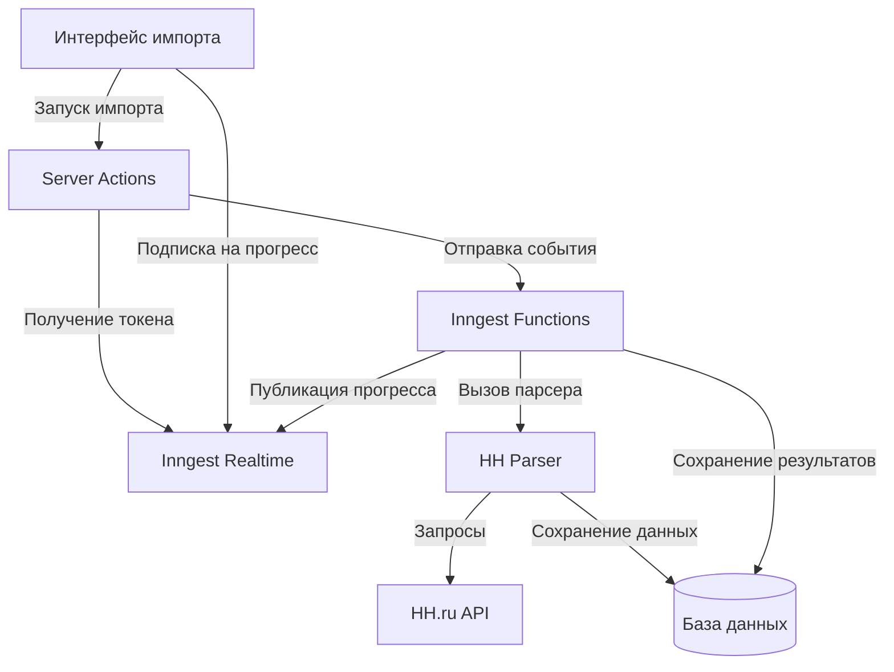

# Проектирование функционала импорта вакансий

## Обзор

Функционал импорта вакансий предоставляет рекрутерам три способа загрузки вакансий из внешних источников (hh.ru):

1. **Массовый импорт новых вакансий** - загрузка всех активных вакансий
2. **Массовый импорт архивных вакансий** - загрузка всех закрытых вакансий
3. **Импорт по ссылке** - загрузка одной конкретной вакансии

Все операции выполняются асинхронно через Inngest с отображением прогресса в реальном времени через Inngest Realtime. Интерфейс спроектирован для рекрутеров без технических знаний.

## Архитектура

### Компоненты системы



### Поток данных

1. **Инициация импорта**
   - Пользователь нажимает кнопку в UI
   - UI вызывает Server Action
   - Server Action отправляет событие в Inngest
   - Server Action получает токен подписки для Realtime
   - UI подключается к Realtime каналу

2. **Выполнение импорта**
   - Inngest Function получает событие
   - Function запускает соответствующий парсер
   - Парсер получает данные из HH.ru
   - Парсер валидирует и сохраняет вакансии
   - Function публикует прогресс в Realtime канал

3. **Отображение прогресса**
   - UI получает события прогресса
   - Обновляется прогресс-бар
   - Отображаются текущие действия
   - Показывается финальный результат

## Компоненты и интерфейсы

### 1. Server Actions

**Файл:** `apps/app/src/actions/vacancy-import.ts`

```typescript
/**
 * Server action для получения токена подписки на канал импорта новых вакансий
 */
export async function fetchImportNewVacanciesToken(workspaceId: string): Promise<string>

/**
 * Server action для получения токена подписки на канал импорта архивных вакансий
 */
export async function fetchImportArchivedVacanciesToken(workspaceId: string): Promise<string>

/**
 * Server action для получения токена подписки на канал импорта по ссылке
 */
export async function fetchImportVacancyByUrlToken(workspaceId: string): Promise<string>

/**
 * Server action для запуска импорта новых вакансий
 */
export async function triggerImportNewVacancies(workspaceId: string): Promise<void>

/**
 * Server action для запуска импорта архивных вакансий
 */
export async function triggerImportArchivedVacancies(workspaceId: string): Promise<void>

/**
 * Server action для запуска импорта вакансии по ссылке
 */
export async function triggerImportVacancyByUrl(
  workspaceId: string,
  url: string
): Promise<void>
```

### 2. Inngest Channels

**Файл:** `packages/jobs/src/inngest/channels/client.ts`

```typescript
/**
 * Канал для отслеживания прогресса импорта новых вакансий
 */
export const importNewVacanciesChannel = channel(
  (workspaceId: string) => `import-new-vacancies:${workspaceId}`
)
  .addTopic(
    topic("progress").schema(
      z.object({
        workspaceId: z.string(),
        status: z.enum(["started", "processing", "completed", "error"]),
        message: z.string(),
        total: z.number().optional(),
        processed: z.number().optional(),
        failed: z.number().optional(),
      })
    )
  )
  .addTopic(
    topic("result").schema(
      z.object({
        workspaceId: z.string(),
        success: z.boolean(),
        imported: z.number(),
        updated: z.number(),
        failed: z.number(),
      })
    )
  );

/**
 * Канал для отслеживания прогресса импорта архивных вакансий
 */
export const importArchivedVacanciesChannel = channel(
  (workspaceId: string) => `import-archived-vacancies:${workspaceId}`
)
  .addTopic(
    topic("progress").schema(
      z.object({
        workspaceId: z.string(),
        status: z.enum(["started", "processing", "completed", "error"]),
        message: z.string(),
        total: z.number().optional(),
        processed: z.number().optional(),
        failed: z.number().optional(),
      })
    )
  )
  .addTopic(
    topic("result").schema(
      z.object({
        workspaceId: z.string(),
        success: z.boolean(),
        imported: z.number(),
        updated: z.number(),
        failed: z.number(),
      })
    )
  );

/**
 * Канал для отслеживания прогресса импорта вакансии по ссылке
 */
export const importVacancyByUrlChannel = channel(
  (workspaceId: string, requestId: string) => 
    `import-vacancy-by-url:${workspaceId}:${requestId}`
)
  .addTopic(
    topic("progress").schema(
      z.object({
        workspaceId: z.string(),
        requestId: z.string(),
        status: z.enum(["started", "validating", "fetching", "saving", "completed", "error"]),
        message: z.string(),
      })
    )
  )
  .addTopic(
    topic("result").schema(
      z.object({
        workspaceId: z.string(),
        requestId: z.string(),
        success: z.boolean(),
        vacancyId: z.string().optional(),
        error: z.string().optional(),
      })
    )
  );
```

### 3. Inngest Functions

**Файл:** `packages/jobs/src/inngest/functions/vacancy/import-new.ts`

```typescript
export const importNewVacanciesFunction = inngest.createFunction(
  {
    id: "import-new-vacancies",
    name: "Импорт новых вакансий",
    retries: 0,
    concurrency: 1,
  },
  { event: "vacancy/import.new" },
  async ({ event, step }) => {
    const { workspaceId } = event.data;
    
    // Публикация начала импорта
    // Вызов парсера
    // Публикация прогресса
    // Публикация результата
  }
);
```

**Файл:** `packages/jobs/src/inngest/functions/vacancy/import-archived.ts`

```typescript
export const importArchivedVacanciesFunction = inngest.createFunction(
  {
    id: "import-archived-vacancies",
    name: "Импорт архивных вакансий",
    retries: 0,
    concurrency: 1,
  },
  { event: "vacancy/import.archived" },
  async ({ event, step }) => {
    const { workspaceId } = event.data;
    
    // Аналогично importNewVacanciesFunction
  }
);
```

**Файл:** `packages/jobs/src/inngest/functions/vacancy/import-by-url.ts`

```typescript
export const importVacancyByUrlFunction = inngest.createFunction(
  {
    id: "import-vacancy-by-url",
    name: "Импорт вакансии по ссылке",
    retries: 1,
    concurrency: 5,
  },
  { event: "vacancy/import.by-url" },
  async ({ event, step }) => {
    const { workspaceId, url, requestId } = event.data;
    
    // Валидация URL
    // Извлечение externalId из URL
    // Вызов парсера для одной вакансии
    // Публикация результата
  }
);
```

### 4. Парсеры

**Расширение существующего:** `packages/jobs/src/parsers/hh/runner.ts`

Добавить новую функцию:

```typescript
/**
 * Импортирует одну вакансию по её externalId
 */
export async function importSingleVacancy(
  workspaceId: string,
  externalId: string
): Promise<{ vacancyId: string; isNew: boolean }>
```

**Расширение существующего:** `packages/jobs/src/parsers/hh/vacancy-parser.ts`

Добавить функцию для парсинга одной вакансии:

```typescript
/**
 * Парсит одну вакансию по её ID
 */
export async function parseSingleVacancy(
  page: Page,
  externalId: string,
  workspaceId: string
): Promise<{ vacancyId: string; isNew: boolean }>
```

### 5. UI Компоненты

**Файл:** `apps/app/src/components/vacancy/import-section.tsx`

```typescript
export function VacancyImportSection() {
  // Три кнопки для разных типов импорта
  // Модальное окно для импорта по ссылке
  // Прогресс-бары для каждой операции
  // Отображение результатов
}
```

**Файл:** `apps/app/src/components/vacancy/import-progress.tsx`

```typescript
interface ImportProgressProps {
  channel: ReturnType<typeof channel>;
  token: string;
  onComplete: (result: any) => void;
}

export function ImportProgress({ channel, token, onComplete }: ImportProgressProps) {
  // Подключение к Realtime каналу
  // Отображение прогресс-бара
  // Обработка событий прогресса
  // Отображение результата
}
```

## Модели данных

### Схема вакансии

Используется существующая таблица `vacancies` из `packages/db/src/schema/vacancy/vacancy.ts`.

Ключевые поля для импорта:
- `workspaceId` - изоляция по рабочим пространствам
- `source` - источник вакансии (всегда "HH" для импорта)
- `externalId` - уникальный идентификатор на HH.ru
- `title` - название вакансии
- `description` - описание вакансии
- `url` - ссылка на вакансию
- `isActive` - статус вакансии (false для архивных)
- `createdBy` - пользователь, запустивший импорт
- `ownerId` - владелец вакансии (по умолчанию = createdBy)

### Валидация данных

**Схема для импорта по ссылке:**

```typescript
const ImportByUrlSchema = z.object({
  url: z.string()
    .url("Введите корректную ссылку")
    .refine(
      (url) => url.includes("hh.ru/vacancy/"),
      "Ссылка должна быть на вакансию с hh.ru"
    ),
});
```

**Схема для извлечения externalId:**

```typescript
function extractExternalIdFromUrl(url: string): string | null {
  const match = url.match(/hh\.ru\/vacancy\/(\d+)/);
  return match ? match[1] : null;
}
```

### Логика предотвращения дублирования

При импорте вакансии система проверяет наличие записи с таким же `source` и `externalId` в рамках `workspaceId`:

```typescript
const existingVacancy = await db.query.vacancy.findFirst({
  where: and(
    eq(vacancy.workspaceId, workspaceId),
    eq(vacancy.source, "HH"),
    eq(vacancy.externalId, externalId)
  ),
});

if (existingVacancy) {
  // Обновить существующую вакансию
  await db.update(vacancy)
    .set({
      title: newData.title,
      description: newData.description,
      url: newData.url,
      isActive: newData.isActive,
      updatedAt: new Date(),
    })
    .where(eq(vacancy.id, existingVacancy.id));
  
  return { vacancyId: existingVacancy.id, isNew: false };
} else {
  // Создать новую вакансию
  const [newVacancy] = await db.insert(vacancy)
    .values({
      workspaceId,
      source: "HH",
      externalId,
      title: newData.title,
      description: newData.description,
      url: newData.url,
      isActive: newData.isActive,
      createdBy: userId,
      ownerId: userId,
    })
    .returning();
  
  return { vacancyId: newVacancy.id, isNew: true };
}
```

## Обработка ошибок

### Типы ошибок

1. **Ошибки аутентификации**
   - Отсутствие учётных данных HH.ru
   - Невалидные учётные данные
   - Истёкшая сессия

2. **Ошибки валидации**
   - Невалидный формат URL
   - Отсутствие обязательных полей в данных вакансии
   - Некорректные типы данных

3. **Ошибки сети**
   - Недоступность HH.ru
   - Таймаут запроса
   - Ошибки парсинга HTML

4. **Ошибки базы данных**
   - Ошибки сохранения
   - Нарушение ограничений
   - Проблемы с транзакциями

### Стратегии обработки

```typescript
// Обработка ошибок аутентификации
try {
  const credentials = await getIntegrationCredentials(db, "hh", workspaceId);
  if (!credentials?.email || !credentials?.password) {
    throw new Error("AUTH_MISSING");
  }
} catch (error) {
  await publish(channel.progress({
    status: "error",
    message: "Проверьте настройки доступа к hh.ru",
  }));
  return;
}

// Обработка ошибок валидации
const validationResult = ImportByUrlSchema.safeParse({ url });
if (!validationResult.success) {
  await publish(channel.result({
    success: false,
    error: "Введите корректную ссылку на вакансию с hh.ru",
  }));
  return;
}

// Обработка ошибок сети
try {
  await page.goto(url, { timeout: 30000 });
} catch (error) {
  await publish(channel.progress({
    status: "error",
    message: "Не удалось подключиться к hh.ru. Попробуйте позже.",
  }));
  throw error;
}

// Обработка ошибок базы данных
try {
  await db.insert(vacancy).values(data);
} catch (error) {
  console.error("Ошибка сохранения вакансии:", error);
  // Продолжить импорт остальных вакансий
  failedCount++;
}
```

### Сообщения для пользователей

Все сообщения об ошибках должны быть понятны рекрутерам:

- ❌ "Не удалось подключиться к hh.ru" вместо "Network timeout"
- ❌ "Проверьте настройки доступа к hh.ru" вместо "Authentication failed"
- ❌ "Введите корректную ссылку на вакансию" вместо "Invalid URL format"
- ✅ "Загружено 15 из 20 вакансий" вместо "75% success rate"

## Стратегия тестирования

### Unit-тесты

1. **Валидация URL**
   - Тест корректных URL с hh.ru
   - Тест некорректных URL
   - Тест извлечения externalId

2. **Обработка дублирования**
   - Тест создания новой вакансии
   - Тест обновления существующей вакансии
   - Тест подсчёта новых и обновлённых

3. **Валидация данных вакансии**
   - Тест обязательных полей
   - Тест опциональных полей
   - Тест некорректных типов данных

### Property-based тесты

Будут определены после анализа критериев приемки в следующей секции.

### Интеграционные тесты

1. **Тест полного цикла импорта новых вакансий**
   - Запуск импорта
   - Проверка создания Inngest события
   - Проверка публикации прогресса
   - Проверка сохранения вакансий в БД

2. **Тест полного цикла импорта по ссылке**
   - Отправка валидной ссылки
   - Проверка валидации
   - Проверка парсинга
   - Проверка сохранения

3. **Тест Realtime подписки**
   - Получение токена
   - Подключение к каналу
   - Получение событий прогресса
   - Отключение от канала


## Correctness Properties

*Свойство корректности (correctness property) - это характеристика или поведение, которое должно выполняться для всех валидных выполнений системы. По сути, это формальное утверждение о том, что система должна делать. Свойства служат мостом между человекочитаемыми спецификациями и машинно-проверяемыми гарантиями корректности.*

### Property 1: Сохранение всех импортированных вакансий

*Для любого* списка вакансий, полученных из внешнего источника, все валидные вакансии должны быть сохранены в базе данных с правильным workspaceId.

**Validates: Requirements 1.3, 2.3, 3.4, 7.2**

### Property 2: Сохранение всех полей вакансии

*Для любой* вакансии, при сохранении в базу данных все основные поля (title, description, url, externalId, source, isActive) должны быть корректно записаны и доступны при чтении.

**Validates: Requirements 1.4, 2.4**

### Property 3: Корректный подсчёт результатов импорта

*Для любого* завершённого импорта, сумма количества новых, обновлённых и неудачных операций должна равняться общему количеству обработанных вакансий.

**Validates: Requirements 1.5, 2.5, 5.5, 8.5**

### Property 4: Валидация URL вакансий

*Для любой* строки, переданной как URL вакансии, валидация должна принимать только ссылки формата `https://hh.ru/vacancy/{число}` и отклонять все остальные.

**Validates: Requirements 3.1, 3.5**

### Property 5: Получение токена подписки для всех операций

*Для любой* операции импорта (новые, архивные, по ссылке), система должна вернуть валидный токен подписки для Inngest Realtime канала.

**Validates: Requirements 4.1**

### Property 6: Публикация прогресса при изменении состояния

*Для любого* изменения состояния импорта (started, processing, completed, error), событие прогресса должно быть опубликовано в соответствующий Realtime канал.

**Validates: Requirements 4.3**

### Property 7: Обновление UI при получении событий прогресса

*Для любого* события прогресса, полученного из Realtime канала, UI должен обновить отображение прогресс-бара с новым состоянием.

**Validates: Requirements 4.4**

### Property 8: Продолжение импорта при ошибках отдельных вакансий

*Для любого* списка вакансий, если одна вакансия не прошла валидацию или не сохранилась, импорт остальных вакансий должен продолжиться.

**Validates: Requirements 5.3, 5.4**

### Property 9: Валидация обязательных полей

*Для любой* вакансии без обязательных полей (title или description), валидация должна отклонить вакансию и записать ошибку.

**Validates: Requirements 6.1, 6.2**

### Property 10: Валидация типов данных

*Для любой* вакансии с некорректными типами данных (зарплата не число, дата не в формате ISO), валидация должна отклонить вакансию.

**Validates: Requirements 6.3, 6.4**

### Property 11: Изоляция вакансий по рабочим пространствам

*Для любой* импортированной вакансии, она должна быть связана с workspaceId пользователя, запустившего импорт, и быть видна только в запросах с этим workspaceId.

**Validates: Requirements 7.1, 7.2, 7.3, 7.5**

### Property 12: Обновление существующих вакансий вместо дублирования

*Для любой* вакансии с externalId, который уже существует в рамках workspaceId, система должна обновить существующую запись вместо создания новой, сохранив все новые данные и обновив updatedAt.

**Validates: Requirements 8.1, 8.2, 8.3, 8.4**

### Property 13: Round-trip для токенов подписки

*Для любого* полученного токена подписки, подключение к Realtime каналу с этим токеном должно быть успешным и позволять получать события.

**Validates: Requirements 4.2**
