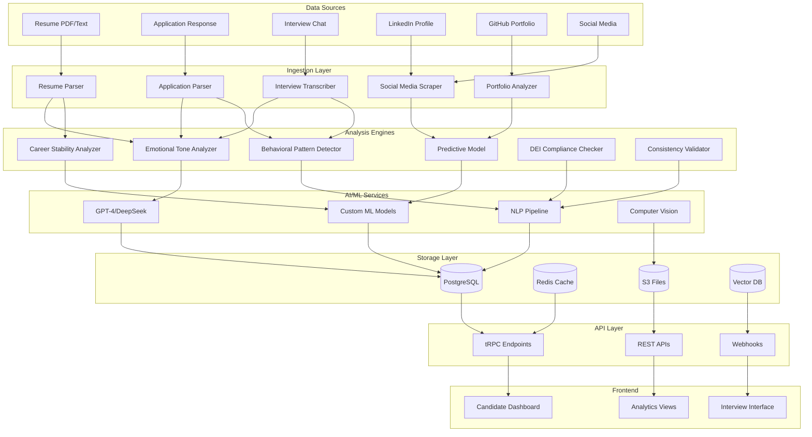

# Архитектурный план улучшений анализа кандидатов

## Обзор улучшений

На основе анализа текущей функциональности QBS Автонайм, предлагается расширить систему анализа кандидатов следующими направлениями:

1. **Расширенный AI-анализ** - эмоциональный тон, карьерная стабильность, предиктивные метрики
2. **Новые источники данных** - LinkedIn, GitHub, portfolio анализ
3. **Поведенческий анализ** - временные паттерны, consistency, engagement
4. **DEI метрики** - диверсификация, bias detection
5. **Улучшенные инструменты интервью** - learning agility, background checks

## Архитектурная диаграмма



## Детальный план реализации

### 1. Расширение схемы БД

#### Новые поля в `response_columns.ts`

```typescript
// Эмоциональный анализ
export const emotionalAnalysisColumns = {
  emotionalTone: jsonb("emotional_tone").$type<{
    enthusiasm: number;      // 0-100
    confidence: number;     // 0-100
    stressLevel: number;    // 0-100
    authenticity: number;   // 0-100
  }>(),
  sentimentAnalysis: jsonb("sentiment_analysis").$type<{
    overall: 'positive' | 'neutral' | 'negative';
    scores: { positive: number; negative: number; neutral: number };
  }>(),
};

// Карьерная стабильность
export const careerStabilityColumns = {
  careerStability: jsonb("career_stability").$type<{
    jobTenure: number;      // средняя продолжительность работы (месяцы)
    growthRate: number;     // скорость роста зарплаты/позиций
    riskFactors: string[];  // факторы риска (частые увольнения и т.д.)
    stabilityScore: number; // 0-100
  }>(),
};

// Предиктивные метрики
export const predictiveMetricsColumns = {
  predictiveMetrics: jsonb("predictive_metrics").$type<{
    retentionProbability: number;    // вероятность удержания (0-100)
    performanceScore: number;        // предсказанная производительность (0-100)
    culturalFitScore: number;        // соответствие культуре (0-100)
    growthPotential: number;         // потенциал роста (0-100)
  }>(),
};

// Поведенческий анализ
export const behavioralAnalysisColumns = {
  behavioralPatterns: jsonb("behavioral_patterns").$type<{
    responseTimePattern: {
      averageResponseTime: number;   // среднее время ответа (сек)
      consistency: number;           // consistency в скорости (0-100)
      aiSuspicionLevel: number;      // уровень подозрения AI (0-100)
    };
    engagementMetrics: {
      messageCount: number;
      questionDepth: number;         // глубина вопросов
      followUpRate: number;          // процент follow-up вопросов
    };
    communicationStyle: {
      formality: number;             // формальность (0-100)
      clarity: number;               // ясность (0-100)
      persuasiveness: number;        // убедительность (0-100)
    };
  }>(),
};

// DEI метрики
export const deiMetricsColumns = {
  deiMetrics: jsonb("dei_metrics").$type<{
    diversity: {
      gender: 'male' | 'female' | 'other' | 'unknown';
      ageGroup: string;
      ethnicity: string;
      geography: string;
    };
    biasDetection: {
      detectedBiases: string[];      // выявленные biases
      fairnessScore: number;         // оценка fairness (0-100)
      recommendations: string[];     // рекомендации по улучшению
    };
  }>(),
};

// Внешние источники
export const externalSourcesColumns = {
  linkedInData: jsonb("linkedin_data").$type<{
    profileUrl: string;
    connections: number;
    endorsements: any[];
    experience: any[];
    recommendations: any[];
  }>(),
  githubData: jsonb("github_data").$type<{
    profileUrl: string;
    repositories: any[];
    contributions: number;
    languages: any[];
    activity: any[];
  }>(),
  portfolioAnalysis: jsonb("portfolio_analysis").$type<{
    quality: number;                 // качество работ (0-100)
    relevance: number;               // релевантность (0-100)
    technicalSkills: string[];       // выявленные навыки
    creativity: number;              // креативность (0-100)
  }>(),
};
```

### 2. Новые AI инструменты

#### Emotional Tone Analyzer Tool

```typescript
export function createEmotionalToneAnalyzer(sessionId: string) {
  return tool({
    description: "Анализирует эмоциональный тон текста кандидата",
    inputSchema: z.object({
      text: z.string(),
      context: z.enum(['resume', 'application', 'interview'])
    }),
    execute: async ({ text, context }) => {
      const analysis = await analyzeEmotionalTone(text, context);
      return {
        enthusiasm: analysis.enthusiasm,
        confidence: analysis.confidence,
        stressLevel: analysis.stressLevel,
        authenticity: analysis.authenticity,
        reasoning: analysis.reasoning
      };
    }
  });
}
```

#### Career Stability Analyzer Tool

```typescript
export function createCareerStabilityAnalyzer(sessionId: string) {
  return tool({
    description: "Анализирует карьерную стабильность кандидата",
    inputSchema: z.object({
      experience: z.array(z.object({
        company: z.string(),
        position: z.string(),
        startDate: z.string(),
        endDate: z.string().optional(),
        reasonForLeaving: z.string().optional()
      }))
    }),
    execute: async ({ experience }) => {
      const analysis = await analyzeCareerStability(experience);
      return {
        jobTenure: analysis.averageTenure,
        growthRate: analysis.growthRate,
        riskFactors: analysis.riskFactors,
        stabilityScore: analysis.score
      };
    }
  });
}
```

#### Predictive Model Tool

```typescript
export function createPredictiveModelTool(sessionId: string) {
  return tool({
    description: "Предсказывает метрики успеха кандидата",
    inputSchema: z.object({
      candidateData: z.object({
        experience: z.any(),
        skills: z.any(),
        interviewPerformance: z.any(),
        behavioralData: z.any()
      })
    }),
    execute: async ({ candidateData }) => {
      const predictions = await runPredictiveModel(candidateData);
      return {
        retentionProbability: predictions.retention,
        performanceScore: predictions.performance,
        culturalFitScore: predictions.cultureFit,
        growthPotential: predictions.growth
      };
    }
  });
}
```

### 3. Интеграция с внешними источниками

#### LinkedIn Integration

```typescript
// packages/api/src/routers/freelance-platforms/linkedin/
export const linkedinRouter = {
  analyzeProfile: protectedProcedure
    .input(z.object({ profileUrl: z.string() }))
    .mutation(async ({ input, ctx }) => {
      const profileData = await scrapeLinkedInProfile(input.profileUrl);
      const analysis = await analyzeLinkedInData(profileData);

      return {
        connections: analysis.connections,
        endorsements: analysis.endorsements,
        experience: analysis.experience,
        recommendations: analysis.recommendations
      };
    }),

  getProfileInsights: protectedProcedure
    .input(z.object({ candidateId: z.string() }))
    .query(async ({ input, ctx }) => {
      // Получить и проанализировать LinkedIn данные
    })
};
```

#### GitHub Integration

```typescript
export const githubRouter = {
  analyzePortfolio: protectedProcedure
    .input(z.object({ username: z.string() }))
    .mutation(async ({ input, ctx }) => {
      const repos = await fetchGitHubRepos(input.username);
      const analysis = await analyzeGitHubPortfolio(repos);

      return {
        repositories: analysis.repos,
        contributions: analysis.contributions,
        languages: analysis.languages,
        activity: analysis.activity
      };
    })
};
```

### 4. Расширенные инструменты интервью

#### Learning Agility Assessment

```typescript
export function createLearningAgilityTool(sessionId: string) {
  return tool({
    description: "Оценивает способность кандидата к обучению",
    inputSchema: z.object({
      responses: z.array(z.object({
        question: z.string(),
        answer: z.string(),
        context: z.string()
      }))
    }),
    execute: async ({ responses }) => {
      const assessment = await assessLearningAgility(responses);
      return {
        adaptability: assessment.adaptability,
        curiosity: assessment.curiosity,
        growthMindset: assessment.growthMindset,
        learningScore: assessment.score
      };
    }
  });
}
```

#### Background Check Tool

```typescript
export function createBackgroundCheckTool(sessionId: string) {
  return tool({
    description: "Проверяет background кандидата",
    inputSchema: z.object({
      candidateInfo: z.object({
        name: z.string(),
        email: z.string(),
        phone: z.string(),
        previousCompanies: z.array(z.string())
      })
    }),
    execute: async ({ candidateInfo }) => {
      const check = await performBackgroundCheck(candidateInfo);
      return {
        verificationStatus: check.status,
        redFlags: check.redFlags,
        recommendations: check.recommendations
      };
    }
  });
}
```

### 5. Обновление рубрики оценки интервью

```typescript
// Расширенная рубрика для vacancy
const vacancyCriteria = [
  // Существующие критерии
  {
    key: "completeness",
    title: "Полнота ответов",
    weight: 0.15,
  },
  {
    key: "relevance",
    title: "Релевантность опыта",
    weight: 0.25,
  },
  {
    key: "motivation",
    title: "Мотивация",
    weight: 0.15,
  },
  {
    key: "communication",
    title: "Коммуникация",
    weight: 0.15,
  },
  // Новые критерии
  {
    key: "emotional_intelligence",
    title: "Эмоциональный интеллект",
    description: "Способность к эмпатии, саморефлексии, управлению эмоциями",
    weight: 0.1,
  },
  {
    key: "learning_agility",
    title: "Способность к обучению",
    description: "Адаптивность, любопытство, growth mindset",
    weight: 0.1,
  },
  {
    key: "cultural_fit",
    title: "Культурное соответствие",
    description: "Совпадение ценностей и стиля работы с компанией",
    weight: 0.1,
  },
];
```

### 6. Обновление промптов AI

#### Extended Interview Prompt

```
Ты проводишь глубокий анализ кандидата. Дополнительно оценивай:

ЭМОЦИОНАЛЬНЫЙ ИНТЕЛЛЕКТ:
- Эмпатия в ответах
- Саморефлексия
- Управление эмоциями под давлением

СПОСОБНОСТЬ К ОБУЧЕНИЮ:
- Любопытство к новым концепциям
- Адаптация к неожиданным вопросам
- Growth mindset в ответах

КУЛЬТУРНОЕ СООТВЕТСТВИЕ:
- Совпадение ценностей
- Стиль коммуникации
- Подход к командной работе

ВРЕМЕННЫЕ ПАТТЕРНЫ:
- Скорость ответов на разные типы вопросов
- Consistency в качестве ответов
- Реакция на сложность вопросов
```

### 7. Новые API эндпоинты

#### Analytics API

```typescript
// packages/api/src/routers/analytics/
export const analyticsRouter = {
  getCandidateInsights: protectedProcedure
    .input(z.object({ candidateId: z.string() }))
    .query(async ({ input, ctx }) => {
      const insights = await generateCandidateInsights(input.candidateId);
      return {
        emotionalProfile: insights.emotional,
        careerStability: insights.stability,
        predictiveMetrics: insights.predictive,
        behavioralPatterns: insights.behavioral,
        deiMetrics: insights.dei
      };
    }),

  getHiringBiasReport: protectedProcedure
    .input(z.object({ workspaceId: z.string(), period: z.string() }))
    .query(async ({ input, ctx }) => {
      const report = await generateBiasReport(input.workspaceId, input.period);
      return {
        detectedBiases: report.biases,
        fairnessScore: report.fairness,
        recommendations: report.recommendations
      };
    })
};
```

### 8. Обновление UI

#### Candidate Profile Enhancement

```tsx
// apps/web/src/components/candidate-profile/
const CandidateInsights = ({ candidateId }: { candidateId: string }) => {
  const { data: insights } = trpc.analytics.getCandidateInsights.useQuery({
    candidateId
  });

  return (
    <div className="grid grid-cols-1 md:grid-cols-2 lg:grid-cols-3 gap-6">
      <EmotionalProfileCard data={insights?.emotionalProfile} />
      <CareerStabilityCard data={insights?.careerStability} />
      <PredictiveMetricsCard data={insights?.predictiveMetrics} />
      <BehavioralPatternsCard data={insights?.behavioralPatterns} />
      <DEIMetricsCard data={insights?.deiMetrics} />
    </div>
  );
};
```

### 9. Тестирование

#### Unit Tests

```typescript
// apps/playwright/tests/analytics/
describe('Candidate Insights', () => {
  test('should analyze emotional tone correctly', async () => {
    // Test emotional tone analyzer
  });

  test('should calculate career stability metrics', async () => {
    // Test career stability analyzer
  });

  test('should generate predictive metrics', async () => {
    // Test predictive model
  });
});
```

#### Integration Tests

```typescript
describe('External Data Integration', () => {
  test('should scrape LinkedIn profile', async () => {
    // Test LinkedIn integration
  });

  test('should analyze GitHub portfolio', async () => {
    // Test GitHub integration
  });
});
```

## Порядок реализации

1. **Фаза 1**: Расширение схемы БД и базовых структур данных
2. **Фаза 2**: Реализация core AI инструментов (emotional tone, career stability)
3. **Фаза 3**: Интеграция внешних источников (LinkedIn, GitHub)
4. **Фаза 4**: Поведенческий анализ и временные паттерны
5. **Фаза 5**: DEI метрики и compliance
6. **Фаза 6**: Обновление UI и API
7. **Фаза 7**: Тестирование и оптимизация

## Риски и mitigation

- **Производительность**: Кэширование результатов анализа, асинхронная обработка
- **Приватность**: Анонимизация данных, compliance с GDPR
- **Точность AI**: Регулярная валидация моделей, human oversight
- **Сложность**: Модульная архитектура, постепенное внедрение

## Метрики успеха

- Увеличение точности предсказания retention на 15%
- Снижение bias в найме на 20%
- Повышение качества кандидатов на 25%
- Сокращение time-to-hire на 30%